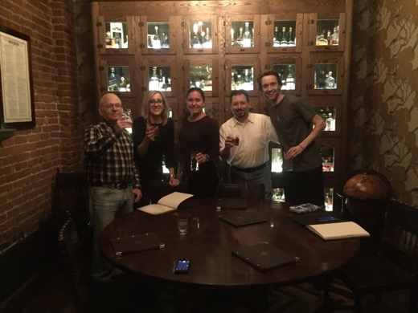

"We were all amateurs," recalls Guido van Rossum. In the early years of the Python Software Foundation, its founders were more interested in writing code than running a nonprofit. Guido says they only loosely tracked who had access to the bank account and who was responsible for filing paperwork on time. There were some close calls, and the foundation nearly missed some deadlines. That changed when Kurt Kaiser became treasurer, ten years ago. "Kurt straightened all that out." When Kaiser took over the job, the PSF was a small foundation giving out a few thousand dollars a year in grants. The accounting was handed over to him without much explanation or support; he learned the system and grew it to what it is today. The PSF now awards [dozens of grants a year](https://www.python.org/psf/grants/) totalling over a quarter million dollars. The foundation accepts money from [PSF sponsors](https://www.python.org/psf/sponsorship/sponsors/), [PyCon sponsors](https://us.pycon.org/2015/sponsors/), members, and [donors](http://legacy.python.org/psf/donations/); it provides financial aid to hundreds of conference attendees, [covers Meetup.com fees](http://pyfound.blogspot.ca/2012/03/user-groups-psf-can-help-cover-your.html), and acts as a fiscal sponsor to groups like PyLadies, lending its nonprofit status to these smaller organizations. Kaiser manages all these transactions. When processes become routine, he automates them with code. Board member Diana Clarke says, "He's more than just your typical treasurer; he's a developer plus treasurer." Kurt Kaiser was a physicist throughout his career, and picked up Python as a hobby. His first great contribution was the code he wrote for IDLE, the development GUI that comes bundled with Python. At first he was a user and contributor to the project, but that changed in the wake of conflicts among its maintainers. "After the combatants of the IDLE war withdrew," says Guido, "Kurt became a lead developer. He had a much smoother personality." When the PSF needed a new treasurer, Kaiser was entrusted with the role. "He just got so into the cause," says Director of Operations Ewa Jodlowska. "He believed he was helping the greater good by helping the PSF." This year alone, through the end of October, the PSF has awarded $260,000 to more than 50 entities. Kaiser administers this swelling [stream of grants](https://www.python.org/psf/records/board/resolutions/). The work is not all routine: a recent grant to PyCon CZ, for example, required special handling, because Czech bank account IDs have a different format than American accounts. Some grants pose extraordinary hurdles, like the PSF's support for a PyCon in Zimbabwe. Kaiser researched the United States' financial embargo of Zimbabwe, and the PSF concluded it could not sponsor the conference, but it could still lend support by sending a keynote speaker. Each year, a new Board of Directors brings new ideas for funding Python advocacy, but these ideas can raise knotty questions about financial rules. According to Diana Clarke, it is tempting to balk at these complexities and simply say no, but Kaiser is always willing to research new options that meet the community's changing needs. [The PSF's mission](http://legacy.python.org/psf/mission/) is to advance the Python language, and increasingly it uses Python as a vehicle for promoting access to computer science for women, minorities, and members of underserved groups. For example, the PSF collects money on behalf of PyLadies, which allows them to operate under the PSF's nonprofit umbrella without going through all the paperwork. Clarke says, "The PyLadies auction raises money and then turns that around in the form of scholarships, and Kurt is the one who enables that. It's a nontrivial amount of work and it's very important." [The PyCon Financial Aid program](https://us.pycon.org/2017/financial-assistance/) is another way the PSF spends money to promote access to computer science. Guido van Rossum says, "What better use of that money, than to pay for people to come to the conference who couldn't otherwise come, people who are a good investment for the community?" The PSF awards $100,000 in scholarships to help people come to PyCon from all over the world. Kaiser administers these scholarships one-on-one: he disburses money, collects receipts, and receives conference write-ups from recipients. When Diana Clarke worked with Kaiser at PyCon, she was struck at his singular role in the conference. He has to carry a briefcase of cash, and he manually writes hundreds of checks to ensure attendees receive their awards. Instead of being free to attend talks, Kaiser often sits in the hallway to be available when scholarship recipients need to pick up their money. Kurt Kaiser is among the PSF's longest-serving officers. As Diana Clarke says, "He does so much for us, and most people don't have a lot of insight into what he does." On his tenth anniversary as treasurer, the PSF congratulates him and thanks him. From its early years as a small foundation through today, Kaiser has been a consistent and reliable steward of the organization's finances. "For a long time Kurt was the only stable point," says Guido. "We know that Kurt doesn't drop the ball."

<table align="center" cellpadding="0" cellspacing="0"><tbody><tr><td></td></tr><tr><td> From left: Kurt Kaiser, Ewa Jodlowska, Meagan Sneeringer, Doug Napoleone, Hannes Hapke at The Multnomah Whiskey Library in Portland OR, PyCon 2016</td></tr></tbody></table>
