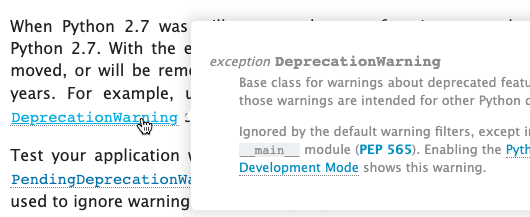

## Zac Hatfield-Dodds

# Teaching Python with Errors

  

  
  
When a new coder begins learning Python, the first Python feature they usually see is `SyntaxError`. In Zac Hatfield-Dodds's experience, novices meet these errors practically as soon as they start typing, and they will spend most of their time over the following months struggling with them. Since experienced programmers rarely encounter syntax errors and easily fix them, the core team has not built very good tooling for them, and the [official Python tutorial](https://docs.python.org/3/tutorial/errors.html#syntax-errors) doesn't cover errors until Section 8. In any case, documentation is not the place to fix novices' user experience, since they don't know where to look for help. The only place to fix it is in CPython. [Read more 2020 Python Language Summit coverage](https://pyfound.blogspot.com/2020/04/the-2020-python-language-summit.html).  

* * *

`SyntaxError` does little to help a beginner. It directs their attention to the spot *after* the token that caused the error. In this example from the tutorial, the caret points at the last letter of `print`, but the coder's mistake was omitting a colon after `True`:  

\>>> while True print('Hello world')
  File "<stdin>", line 1
    while True print('Hello world')
                   ^
SyntaxError: invalid syntax

Hatfield-Dodds proposed more precise errors that tell users about mismatched parentheses, unterminated string literals, missing commas and colons, and so on. Pablo Galindo Salgado said, via Zoom chat, that Python 3.8 has improved some error messages, for example:  

\>>> (1+3+4))
  File "<stdin>", line 1
    (1+3+4))
           ^
SyntaxError: unmatched ')'

The [new parser for 3.9](https://pyfound.blogspot.com/2020/04/replacing-cpythons-parser-python.html) might improve error messages further, although in the short term [it requires more work just to bring it to parity with the current parser](https://github.com/we-like-parsers/cpython/issues/84). Hatfield-Dodds suggested CPython could implement "did you mean..." for both SyntaxErrors and NameErrors, by fuzzily searching for replacements for typos. Incremental improvements to SyntaxError could be funded by educational institutions, he guessed, and would make a good project for contributors from outside the core team, if the core developers are willing to guide them. "I care a lot about this," said Hatfield-Dodds, and paused to let out a big exhale. "If people's first exposure to errors in Python is an error that tells them what the problem is and how to fix it, we might even convince them to read error messages in the future, which would be magical."

## Jim Baker

# State of Jython

  

  
  
"We are not dead yet!" said Jim Baker to the Language Summit. He admitted that "this is something I've said many times about Jython in the past." The project is certainly behind CPython—it has just published a bugfix release of 2.7, and Python 3 support is far off—but it is making progress nevertheless. "And again," said Baker, "our apologies." Jython's previous bugfix release was nearly two years ago; the main topics of the latest version, Jython 2.7.2, were an overhaul Jython's PyJavaType objects, and solutions to deep race conditions. Baker said there is still an active user base for Jython based on the response to Jython's recent betas, but "capacity in the project is low." The project is currently led by Jeff Allen with two other regular contributors, none devoted to Jython full-time. Emeritus developers chip in occasionally. Baker hopes there will be more interest once Jython 3 ships, but he wrote in his slides, "the journey is unpredictable and resources are few." There are several Python 3 implementations on the JVM, but none is ready to use. Isaiah Peng made [a solo attempt at implementing Jython 3](https://github.com/jython/jython3/tree/py3k) in 2016-2017. It is too late now to resume this work, because Peng's branch didn't pull changes from the main Jython repository and they have now diverged too far. Baker said Jython should copy ideas from this prototype and credit Peng's work. Since 2016, Jeff Allen has been writing the [Very Slow Jython Project](https://the-very-slow-jython-project.readthedocs.io/en/latest/), "a project to re-think implementation choices in the Jython core, through the gradual, narrated evolution of a toy implementation." Independently of the Jython team, Oracle is actively building [an experimental Python 3 implementation](https://github.com/graalvm/graalpython) on the Graal (pronounced "grail") JVM. "It's fantastic," said Baker, but unlike Jython "it doesn't do this beautiful subclassing of Java classes with Python classes." The plan for Jython is to target the Python 3.8 language, including type hints. Baker has prototyped [code to generate Python type hints from Java classes](http://github.com/jimbaker/jstubgen). The team will overhaul the core implementation using modern Java features, and continue to emphasize Jython's strengths: convenient integration with Java libraries, speed equal to CPython or better, and high concurrency (unlike CPython). Baker speculated that Jython 3.8's asyncio module could be built on the high-performance [Netty](https://netty.io/) library. He hopes that the new [HPy](https://pyfound.blogspot.com/2020/04/hpy-future-proof-way-of-extending.html) API will take off, because it would simplify supporting C extensions from Jython.

## Eric Holscher

# Read the Docs features of interest

  

  
  
Holscher's presentation was an advertisement for nifty additions to [ReadTheDocs](https://readthedocs.org/), and an enticement to move CPython's documentation there. ReadTheDocs recently added the [hoverxref](https://sphinx-hoverxref.readthedocs.io/en/latest/) feature; when a reader hovers their cursor over a link in a documentation page, a tooltip shows the content of the linked section. Holscher has [forked the CPython docs](https://cpython-ericholscher.readthedocs.io/en/sphinx-hoverxref/whatsnew/3.9.html) to host them on ReadTheDocs and demonstrate this feature's utility.  
ReadTheDocs also has nicer pull request integration than the CPython repository does. Currently, when contributors offer pull requests to CPython, the patched documentation is available for download as a zip archive of HTML files. ReadTheDocs goes one better; [its PR builder publishes the patched docs to the web for review](https://blog.readthedocs.com/building-docs-for-pull-requests/). Search engines are blocked from indexing these docs, and each page displays a warning that it was created from a pull request. (After the Summit, at the core developers' request, the ReadTheDocs team enabled this feature for pull requests to the [Python Developer Guide](https://github.com/python/devguide), which is hosted on ReadTheDocs.) Finally, Holscher claimed that ReadTheDocs's text search is better than what CPython uses, which is generated by [Sphinx](http://sphinx-doc.org/). ReadTheDocs's search results include direct links to pages' subsections, and they provide [search-as-you-type](https://blog.readthedocs.com/improved-search-and-search-as-you-type/). Sanyam Khurana commented via Zoom chat, "This looks very promising and amazing!" Pablo Galindo Salgado suggested hosting the PEPs on ReadTheDocs as well. "Some of this is beta," said Holscher. Nevertheless, it's exciting to consider how much better the reader experience would be if CPython migrated. He argued that CPython should benefit from future improvements in ReadTheDocs, and ReadTheDocs should benefit from the attention of CPython developers. "We’ve talked about this in the past, there were blockers," he said, but the ReadTheDocs team has now addressed them.

## Mariatta Wijaya

# Make your life happier (with Zapier)

  

  
  
"I want you all to do more automation in your lives," said Mariatta Wijaya. She acknowledged that Zapier is her employer, but her intention was pure. "I know you're volunteering for open source. You should use more automation and save time." For a demonstration, Wijaya showed the Zapier workflow she had used to invite attendees to the Language Summit. "You all received calendar invites for this event," she said. "I did not send them by going to Google Calendar." Instead, she collected names and email addresses in a Google spreadsheet. For each attendee, once she obtained a recording waiver and consent to the code of conduct, she put a "y" in the attendee's row in the spreadsheet. Her [Zap](https://zapier.com/learn/getting-started-guide/what-is-zapier/) then sent the invite automatically.

  
  
Earlier in the summit, some core developers had complained about [the firehose of Discourse emails](https://pyfound.blogspot.com/2020/05/core-workflow-updates-python-language.html). Zapier has a Discourse integration that can manage this torrent. A user can create a "Zap" that takes new Discourse messages, filters them according to keywords or other attributes the user chooses, then triggers an email, Slack notification, or some other action. Wijaya also described how Zapier automates onboarding new PyLadies organizers.

# Conclusion

"Well, we made it," said Łukasz Langa at the end of the second day of the videoconference. "I'm sorry it was not what a real Python Language Summit could have been, but I hope it was better than nothing." His co-organizer Mariatta Wijaya congratulated attendees from all over the globe for staying up. "I know this is past bed time for many of you." It was 8pm Pacific Time, the middle of the night for attendees in Europe and Africa, and the morning of the next day in Asia. She thanked the PSF and PyCon staff, and MongoDB for sponsoring the Summit. Victor Stinner added, "Thanks TCP/IP for making this possible." Sumana Harihareswara said, "This was real to me."
