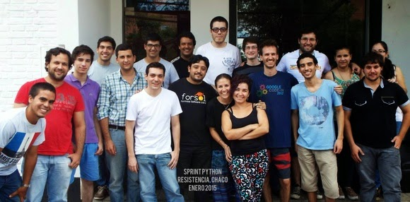

Several recent blog posts have focused on Python-related and PSF-funded activities in Africa and the Middle East. But the Python community is truly global, and it has been exciting to witness its continued growth. New groups of people are being introduced to Python and to programming so frequently that it’s difficult to keep up with the news. Not only that, but the scope and lasting impact of work being accomplished by Pythonistas with very modest financial assistance from the PSF is astonishing. One example is the recent work in South America by [Manuel Kaufmann](https://www.youtube.com/watch?v=eNQ9O_3ySs8). Manuel’s project is to promote the use of Python “to solve daily issues for common users." His choice of Python as the best language to achieve this end is due to his commitment to "the Software Libre philosophy,” in particular, collaboration rather than competition, as well as Python's ability "to develop powerful and complex software in an easy way." Toward this end, one year ago, Manuel began his own project, spending his own money and giving his own time, traveling to various South American cities by car (again, his own), organizing meet-ups, tutorials, sprints, and other events to spread the word about Python and its potential to solve everyday problems (see *[Argentina en Python](http://elblogdehumitos.com.ar/pages/argentina-en-python-en/))*. This definitely got the PSF's attention, so in January 2015, the PSF awarded him a $3,000 (USD) grant. With this award, Manuel has been able to continue his work, conducting events that have established new groups that are currently expanding further. This ripple effect of a small investment is something that the PSF has seen over and over again. On January 17, Resistencia, Argentina was the setting for its first-ever Python Sprint. It was a fairly low-key affair, held at a pub/restaurant “with good internet access.” There were approximately 20 attendees (including 4 young women), who were for the most part beginners. After a general introduction, they broke into 2 work groups, with Manuel leading the beginners' group (see [Resistencia, Chaco Sprint](http://elblogdehumitos.com.ar/posts/primer-sprint-de-python-en-resistencia-chaco/)), by guiding them through some introductory materials and tutorials (e.g., [Learning Python from PyAr's wiki](http://python.org.ar/AprendiendoPython)).  Foto grupal con todos los asistentes (group photo of all attendees).  
Photo credit: Manuel Kaufmann As can happen, momentum built, and the Sprint was followed by a Meet-up on January 30 to consolidate gains and to begin to build a local community. The Meet-up's group of 15 spent the time exploring the capabilities of Python, Brython, Javascript, Django, PHP, OpenStreet Map, and more, in relation to needed projects, and a new Python community was born (see [Meetup at Resistencia, Chaco](http://www.meetup.com/Python-NEA/events/219942458/)). The next event in Argentina, the province of Formosa's first official Python gathering, was held on February 14. According to Manuel, it was a great success, attended by around 50 people. The day was structured to have more time for free discussion, which allowed for more interaction and exchange of ideas. In Manuel’s opinion, this structure really helped to forge and strengthen the community. The explicit focus on real world applications, with discussion of a Python/Django software application developed for and currently in use at Formosa’s Tourist Information Office, was especially compelling and of great interest to the attendees. See [PyDay Formosa](http://pyday.forsol.org.ar/) and for pictures, see [PyDay Pics](https://www.facebook.com/media/set/?set=a.406067639560390.1073741831.215088101991679&type=1). It looks as though these successes are just the beginning: Manuel has many more events scheduled:

-   28 Mar - PyDay at Asunción ([Gran Asunción, Paraguay](http://pyday.pythonpy.org/) and [PyDay Asuncion](http://proyectosbeta.net/2015/03/se-viene-el-pyday-asuncion-2015/)); Manuel reports that registration for this event has already exceeded 100 people, after only 3 days of opening. In addition, the event organizers are working to establish a permanent “Python Paraguay” community!
-   7 May - [PyDay at Apóstoles, Misiones](http://pydayapostoles.info/);
-   20-22 May - Educational Track for secondary students at SciPy LA 2015, Posadas, Misiones, Argentina ([SciPy LA](http://scipyla.org/conf/2015/) and [Educational Track](http://elblogdehumitos.com.ar/pages/argentina-en-python/track-teen-scipy-la-2015/)); and
-   30 May - PyDay at Encarnación, Itapúa, Paraguay.

You can learn more and follow Manuel’s project at the links provided and at [Twitter](https://twitter.com/argenpython). And stay tuned to this blog, because I plan to cover more of his exciting journey to bring Python, open source, and coding empowerment to many more South Americans. *I would love to hear from readers. Please send feedback, comments, or blog ideas to me at [msushi@gnosis.cx](mailto:msushi@gnosis.cx).*
