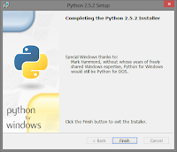
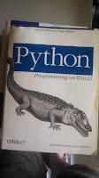

Like other community-based open source software, volunteers from around the world are to thank for Python's existence. When it comes to Python on Windows, the crew overseeing it are much smaller in number than those involved in other platforms, and one person in particular stands out among them with contributions that have helped shape Python's existence on Windows: Mark Hammond. Mark's efforts in supporting the Microsoft platform have been so influential that the CPython Windows installer contained a message thanking him in several versions in the 2.x series of releases. It is my pleasure to announce that Mark has been chosen to receive our [Distinguished Service Award](https://www.python.org/community/awards/psf-distinguished-awards/#id1) for his contributions to our community.  Not only have Mark's efforts been seen within CPython itself, from the winreg and os modules to the [PEP 397](https://www.python.org/dev/peps/pep-0397/) "Python launcher for Windows" and other areas, but also outside of it through his creation and maintenance of the [pywin32](http://sourceforge.net/projects/pywin32/) package. That project has made so many things possible for developers building software on Windows. If it weren't for pywin32 and its ability to manipulate Excel spreadsheets, one of my first jobs would have went a very different way than it did. The ability to easily take care of those tasks meant I was able to move on and explore different things both within the products I was working on as well as Python itself, and it's because of this productivity that I was able to shift my focus and ultimately take on what turned out to be a better career path for me. I've talked to several others who have shared this same experience, and have seen it around the web for years.  Mark also authored "Python Programming on Win32" in 2000, a book I stole from my dad and still have to this day, despite it being warped and actually slightly moldy from being in a flooded basement. The book states "Python is growing in popularity; based on download statistics, there are now over 450,000 people using Python, and more than 150,000 people using Python on Windows." It's hard to know exactly how those numbers were discovered, but I was able to pull off of the old website infrastructure that in 2013, Windows installers for Python were downloaded nearly 35 million times. Although you can't really compare the two numbers, we know that Python has experienced a huge amount of growth over the last 15 years, and it's thanks in part to contributors like Mark. On behalf of the Python Software Foundation: thank you Mark!
