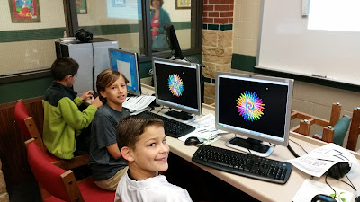
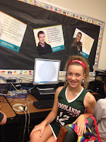

As we all know, one of the PSF’s main purposes is to educate and advocate for the use of Python. What makes us so successful in this area is the enthusiasm with which the community is willing to share its time and knowledge. For me, hearing these stories is the best part of working with the PSF. We have recently heard from an educator in Texas who is seriously changing students' lives by teaching them to code with Python. She is Fifth Grade Science Teacher, Melissa Dylag, of Coulson Tough Elementary School, a K - 6th school in South East Texas. Melissa’s adventure started in 2013 when she was approached by a parent who urged her to introduce her students to the world of coding and computer science. Using the non-profit [Code.org](https://code.org/about) tutorial, ["Hour of Code,"](https://hourofcode.com/us) Melissa taught each of her fifth grade classes for three days. Melissa inspired Technology teachers Noreen Reid and Shelley Moya, who in turn taught other students; by last year, almost every student in the school (about 1000) had completed an hour of computer science instruction via the free website.

<table align="center" cellpadding="0" cellspacing="0"><tbody><tr><td></td></tr><tr><td>Coulson Tough Python Club</td></tr></tbody></table>

The students' response was fantastic, so Melissa wanted to do more to empower her students. She recruited the help of her son (a recent computer science graduate and now a Silicon Valley software engineer) to develop a full intro course using Python. According to Melissa, Python was a good choice because it offers my students everything to build a proper foundation for future computer science instruction. Melissa, along with helpers Noreen and Shelley, are learning Python as they go. They teach about 30 students, an approximately equal mix of boys and girls in 4th, 5th and 6th grades, every Wednesday morning before the regular school day. Kids and teachers in the Python Club are loving it–they’re even making T-shirts. Children are coming to school over 45 minutes early in the morning to code. We have a line of cars at 6:50 in the morning for students that can’t wait to come in to code. PYTHON is a huge success and I am turning children away because we don’t have enough computers in the lab to accommodate them all. Melissa shared with us some of her recent [Python Club lessons](https://docs.google.com/presentation/d/1Htg3y8i1QanhRWaR1U7oh0EYCaVYj8vyvTIt3BnGZG8/edit?usp=sharing) lessons. Please take a look--I think they're terrific. (I was especially impressed with the wisdom of one of her early slides: The biggest challenge in coding is to learn how to make changes and how to recover if the changes fail.)

<table cellpadding="0" cellspacing="0"><tbody><tr><td></td></tr><tr><td>6th grader Payton Gwynn</td></tr></tbody></table>

The parents are also thrilled. One parent emailed that her 6th grade daughter …has really enjoyed learning programming. She takes a picture of what she does on Wednesday mornings and can’t wait to show me what she has created…. I love that this club is exposing girls to programming. Melissa plans to expand to offer two classes next year: an advanced class so that this year’s students can continue, and another introductory one. She needs to get approval from her administration, but she is enthusiastic and determined. I want to do what is best for the children. We all love PYTHON and we are thrilled to share what we are learning… We are pumped to be a PYTHON school. Please join me in thanking Melissa, her helpers, students, and all the teachers like her. We are pumped to have them as part of our community! *I would love to hear from readers. Please send feedback, comments, or blog ideas to me at [msushi@gnosis.cx](mailto:msushi@gnosis.cx).*
