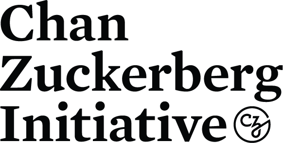

The Python Software Foundation is receiving $407,000 USD to support [work](https://wiki.python.org/psf/Pip2020DonorFundedRoadmap) on [pip](https://pip.pypa.io/) in 2020. Thank you to [Mozilla (through its Mozilla Open Source Support Awards)](https://www.mozilla.org/en-US/moss/) and to the [Chan Zuckerberg Initiative](https://chanzuckerberg.com/eoss/) for this funding! This foundational, transformational work will release Python developers and users to concentrate on the tools they're making and using, instead of troubleshooting dependency conflicts. Specifically, CZI and Mozilla are funding user experience, communications/publicity, and testing work (including developing robust testing infrastructure) as well as core feature development and review.

### 

### What we're doing with the money

Computers need to know the right order to install pieces of software ("to install *x*, you need to install *y* first"). So, when programmers share software, we have to precisely describe those installation prerequisites, and our installation tools need to navigate tricky situations where they're getting conflicting instructions. This project will make pip, a package installer for Python, better at handling that tricky logic, and easier for people to use and troubleshoot. Millions of people and organizations use tools written in Python, and nearly the entire ecosystem of Python software projects depends on pip. Our project will help everyone more easily install software, diagnose and fix problems, and maintain infrastructure. The Chan Zuckerberg Initiative funding is, in particular, aimed at improving [Essential Open Source Software for Science](https://chanzuckerberg.com/eoss/). Scientists use many tools written in Python -- [many of CZI's awardees in this round are written in Python](https://chanzuckerberg.com/newsroom/chan-zuckerberg-initiative-awards-5-million-for-open-source-software-projects-essential-to-science/) -- but, also, researchers often want to write tools and share them with each other to help science advance faster. Our work will include research and improvements so the installation process will be easier to use and understand, which will enable researchers to build better applications and compose complex toolchains more easily. We've laid out a detailed three-phase work plan on [our pip 2020 Donor-funded Roadmap wiki page](https://wiki.python.org/psf/Pip2020DonorFundedRoadmap). To summarize:

-   **Mozilla** is awarding PSF a [Mozilla Open Source Support Award](https://mozilla.org/moss) ([Track I: Foundational Technology](https://www.mozilla.org/en-US/moss/foundational-technology/)) for $207,000, which is paying for 5 months of:

-   **Python development work**: Reviewing and responding to open issues and pull requests, refactoring build logic, collaborating with downstream projects and users about config flags and transition schedules, working on the dependency resolver itself and fixing bugs.

-   **Initial user experience research and design work**: Reading existing bug reports and posts about Python package management confusion, interviewing users and running user tests, developing user journey maps and workflows, and working with maintainers to write documentation and help messages and to design resolver user experience.

-   **CZI** is giving PSF an [Essential Open Source Software for Science](https://chanzuckerberg.com/eoss/) grant for $200,000, which is paying for:

-   12 months of **Python development, test infrastructure, and project maintenance**: Triaging bugs and reviewing pull requests, writing test cases, testing lead developers' work, building test infrastructure, investigating and fixing bugs, and writing the raw material for documentation to help future maintainers onboard better.

-   4 months of **Phase III user experience research and design work**: Training maintainers in UX design, doing further user tests on the new pip, developing a checklist for developing new features, and making templates for commands, error messages, output, documentation, and config files.
-   **Travel** for initial developer onboarding and for some contributors to attend [PyCon North America](https://us.pycon.org/2020/).

-   And both CZI and Mozilla are paying for **project management** (planning, testing, editing, coordinating, communicating with stakeholders, announcing, reporting to funders, and getting obstacles out of everyone's way) and **PSF administrative work** (recruiting and overseeing contractors, project oversight, and financial processing).

The Packaging Working Group is [currently selecting contractors for the programming parts of this work](https://github.com/python/request-for/blob/master/2020-pip/RFP.md). The other two contractors have already been selected:  

-   *[Simply Secure](https://simplysecure.org/)* is "an educational nonprofit 501(c)3 that supports practitioners in designing ethically-informed, values-driven technology that protects human rights." As experts in open source user experience, Simply Secure will bring UX research and design skills to the command-line experience of Python package management.
-   *[Changeset Consulting, LLC](https://changeset.nyc/)*, providing project management, is a returning contractor, having previously worked on [the PyPI rewrite launch](http://pyfound.blogspot.com/2017/11/the-psf-awarded-moss-grant-pypi.html) and [improvements to PyPI's accessibility, security, and internationalization](https://pyfound.blogspot.com/2019/03/commencing-security-accessibility-and.html). Changeset lead Sumana Harihareswara was also the lead grantwriter for these funding proposals.

### Why this and why now?

We're partway through a next-generation rewrite of pip's dependency resolver. The project ran into massive technical debt, but the refactoring is nearly finished and prototype functionality is in alpha now. We need to finish the resolver [because many other packaging improvements are blocked on it, it'll fix many dependency issues for Python users, and it'll fix installation problems for conda, certbot, WebSocket, and many other projects](https://wiki.python.org/psf/Fundable%20Packaging%20Improvements#Finish_dependency_resolver_for_pip). And we need to improve pip's UX [by providing better error messages and prompts, logs, output, and reporting, consistently across features, to fit users' mental models better, make hairy problems easier to untangle, and reduce unintended data loss](https://wiki.python.org/psf/Fundable%20Packaging%20Improvements#Improve_pip_user_experience). The [Packaging Working Group](https://wiki.python.org/psf/PackagingWG) looks for [potential improvements in Python packaging and distribution that are well-scoped, have community consensus, and could be expedited through funding](https://wiki.python.org/psf/Fundable%20Packaging%20Improvements). In the past three years, the Packaging WG has received funding for [several improvements to PyPI](https://wiki.python.org/psf/PackagingWG#Past%20projects) -- $170,000 from Mozilla, $80,000 from OTF, and $100,000 from Facebook -- and is seeking to help other packaging tools. In June, [pip maintainers and Packaging Working Group members discussed the importance and difficulty of rolling out the new resolver](https://github.com/pypa/pip/issues/6536). We worked together to write and submit proposals to Mozilla and the Chan Zuckerberg Initiative.  

### What's next?

This work will start by early January 2020. Day-to-day work will mostly happen in [pip's GitHub repository](https://github.com/pypa/pip/) and [the Python developers' Zulip livechat](https://python.zulipchat.com/). You can check for regular reports at [the Python Insider blog](https://blog.python.org/) and [the Packaging category of Python's Discourse developer forum](https://discuss.python.org/c/packaging), archived at [the Packaging WG's wiki page](https://wiki.python.org/psf/PackagingWG). And we'll publicize calls for volunteers, especially for user interviews and tests, on this blog, on [community mailing lists](https://www.python.org/community/lists/), and on [Twitter](https://twitter.com/ThePSF). The Packaging WG will continue to seek funding for [future improvements in pip, manylinux, setuptools, the Python Packaging User Guide, PyPI, etc.](https://wiki.python.org/psf/Fundable%20Packaging%20Improvements#Packaging_improvements_that_could_be_funded)  

### Thanks

This award continues our relationship with Mozilla, which supported Python packaging tools with [a Mozilla Open Source Support Award in 2017 for Warehouse](https://pyfound.blogspot.com/2017/11/the-psf-awarded-moss-grant-pypi.html). Thank you, Mozilla! (MOSS has a number of types of awards, which are open to different sorts of open source/free software projects. If your project is looking for financial support, do check [the MOSS website](https://mozilla.org/moss) to see if you qualify.) This is new funding from the Chan Zuckerberg Initiative. This project is being made possible in part by a grant from the Chan Zuckerberg Initiative DAF, an advised fund of Silicon Valley Community Foundation. Thank you, CZI! (If your free software/open source project is used by biology researchers, check [the Essential Open Source Software for Science Request for Applications](https://chanzuckerberg.com/rfa/essential-open-source-software-for-science/) and consider applying for the next round). Thank you to the pip and [PyPA](https://www.pypa.io/) maintainers, to the PSF and the Packaging WG, and to all the contributors and volunteers who work on or use Python packaging tools.
