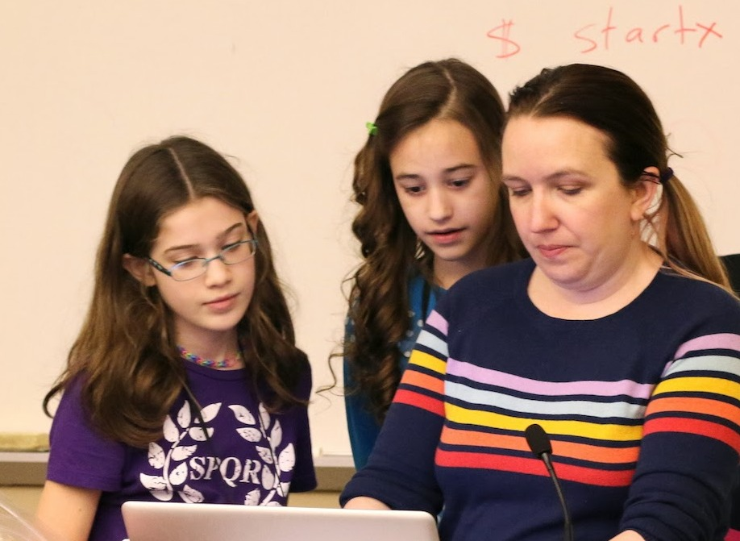

Last week at PyCon, I had the pleasure of talking with Katie Cunningham at a dinner party hosted by O'Reilly. Katie is well-known in the Python community. The author of Python in 24 Hours, 2nd edition (Pearson 2013), Accessibility Handbook (O'Reilly 2012), and a video series [Python Guide for the Total Beginner LiveLessons](http://www.informit.com/store/python-guide-for-the-total-beginner-livelessons-video-9780133359114) (Pearson 2013), she has also given talks and presentations at a number of conferences. Last year the PSF honored her with its Community Service Award in recognition for her work in founding and providing the Young Coders tutorial (along with co-recipient Barbara Shaurette). Imagine a room filled with pre-teens and teenagers eager to learn to code. Pretty daunting, huh? That’s the challenge Katie has taken on with Young Coders. This one-day tutorial covers basic Python by starting with simple concepts and then building up. Using Raspberry Pis, Katie says, helps to “demystify the computer,” and by the end of the day, students are doing fairly complex work with loops, and reading others' code. Last week at PyCon Montreal, 41 students attended one of the classes.  
You can check out Katie and Barbara’s 2014 [PyCon talk about Young Coders](http://pyvideo.org/video/2570/the-young-coder-lets-learn-python).  Katie teaching Young Coders As we conversed about Python, teaching, and writing, I observed first-hand those qualities that make Katie an effective teacher—passion, clarity, perceptiveness, wit, and humor. With a degree in Psychology, she “stumbled into technology” and found that it paid well. “It’s hard to say ‘no’ to money when the alternative is to get an MA degree and make $40K,” she explained. But I believe that Katie is a natural teacher, so I’m not surprised that once in tech—she’s worked for NASA and Cox Media—she pioneered ways of making it more accessible to others and easier to learn. Her current professional position combines her technological prowess and her pedagogical talents as Senior Applications Developer and Director of Technology at [Speak Agent](http://www.speakagent.com/about/), a provider of customized interactive content for language teachers. Some of Katie’s teaching philosophy and techniques come from her experience as a mother. She told me that her kids had access to their own computers at the age of three, in large part because she wanted them to stay away from her computer. The result is that her kids are very fluent—if you give them a computer, they can figure out immediately what to do with it. It’s not, according to Katie, that her seven year old daughter is so smart; rather she’s had four years of informal training. But of course many kids don’t have that advantage—they’ve grown up in homes where there was no computer, or maybe only one, but it was too precious to allow the kids to use it. Katie wants to be able to formalize the informal training—to teach kids such basic ideas as how to generally find something on the computer, or the differences between an email application, a web browser, and the internet (some kids, and even adults, confuse them). So Katie finds that using concrete metaphors and teaching basic vocabulary are extremely important in getting kids to understand coding. For example, Katie teaches the logic of `and`/`or` by reference to pet stores; in Virginia, in order to buy a fish, a person needs to be at least 18 years old, AND have money to pay for it, AND promise to put it in an aquarium and not into the river (apparently, this was a problem)—all of these conditions must be true. But when paying, you can use cash OR credit OR a data card OR a gift card. She says that her students respond well to these kinds of examples. Teaching this way is not only effective, but it “brings the humanity back into tech”—it shows that these are things that humans do, rather than abstract relations between a person and a machine. In the future, Katie would like to teach coding to younger children. Since the Young Coders track is restricted to ages 12 and older, Katie sees this as a real need. We have younger kids coming to PyCon, as more attendees bring their kids and want a class for them. But putting very young kids in a class with older learners doesn’t work well. Their needs and learning styles are quite different. For example, five year olds don’t have the physical control or dexterity to type or to sit still for long. Katie would like to develop a teaching track that is “more kinetic.” Basic concepts, like the logic of `if`/`elif`/`else` could be taught by having the kids get in one line IF their shirt is red, ELSE IF green, get in another; or ELSE, yet another. I’m happy to report that these and other great ideas are going to be available in Katie’s next book, Kids Code (current working title). It will be an O'Reilly interactive book that has a dual purpose:

> \[It\] … not only teaches the student how to program, but teaches the mentor how to teach. Through carefully laid and interactive chapters, the student is guided not only through the basics of programming, but all the way up to game development and creating websites. At the same time, the mentor is coached in how to help their student solve problems, warned about where students often have trouble, and explains why lessons are structured in a certain way” (see [LinkedIn](https://www.linkedin.com/in/kcunning)).

The book sounds like a wonderful tool for teachers and learners (of all ages) and I’m looking forward to reading it. Thank you Katie, for sharing your expertise and insight with the rest of us. Your work is a huge part of what makes the Python community a living, growing, exciting, and powerful entity of awesomeness. *I would love to hear from readers. Please send feedback, comments, or blog ideas to me at msushi@gnosis.cx.*
