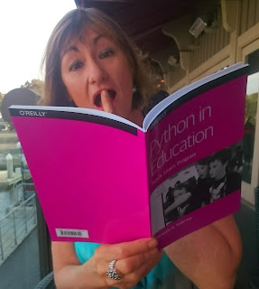

As many of you know, the use of Python in education has grown tremendously in the past several years (see [PSF Newsblog](http://pyfound.blogspot.com/2015/03/world-domination-one-student-at-time.html)). The Python community celebrates this trend, and continues to strengthen our connections to the world of education. PyCon’s first education summit at PyCon 2013, initiated by Naomi Cedar (who was recently elected to the PSF *[Board of Directors](http://pyfound.blogspot.com/2015_06_01_archive.html)*), has been followed globally by many Python conferences holding education tracks and getting involved with community teachers and education leaders. Recently [PyCon UK](http://www.pyconuk.org/education/) and [EuroPython](https://ep2015.europython.eu/en/events/educational-summit/) announced their upcoming education tracks. After attending the Education Summit at [PyCon2015 in Montreal](https://us.pycon.org/2015/events/edusummit/), I was inspired to read Nicholas Tollervey’s wonderful booklet, *Python in Education*.  (MAS reading and learning) Here Tollervey summarizes and explains Python’s use in education, recounts the history of the Python programming language, provides a case study of the amazing *Raspberry Pi*, and describes the important role played by the Python community in the language’s popularity and ability to meet and adapt to users' needs. After reading his booklet, I had some questions for Nicholas: Q: What was your motivation for writing this book?

> NT: during my 20s I was a senior secondary school teacher in the UK - I taught music to teenagers growing up in areas of great poverty and deprivation. As a result I’m passionate about teaching and learning - especially as a vehicle for emancipation. Unsurprisingly, I see programming and technical literacy as such vehicles. This is reinforced because I also have three school aged children.

Q: How long were you thinking about and/or writing the book?

> NT: I’ve been thinking about programming and Python in education for quite a number of years. Given all that’s happening regarding computing education in the UK at the moment, I’ve also had a lot of opportunity to discuss the subject with a large number of teachers and developers and develop my outlook as a result (a process that is ongoing). The first draft of the report only took a weekend to write - although I made time during the following weeks for tidying up and editing (re-reading with fresh eyes is such a useful thing to do).

Q: Did you have the book’s contents in mind or did you discover it via research?

> NT: The philosophical outlook was very much the result of the discussions mentioned in the previous point. I also spent a day at Raspberry Pi Towerschatting with Eben, Carrie Anne and Ben \[*Editor’s Note: Eben Upton, Carrie Anne Philbin, and Ben Nuttall of the Raspberry Pi Foundation; Carrie Anne was recently elected to the PSF [Board of Directors](http://pyfound.blogspot.com/2015_06_01_archive.html)*\]. The case study in the second section is the result. The rest of the book just wrote itself (as it were) and I, of course, was very careful to ensure I was reporting the correct information while referencing others.

Q: Can you tell us a bit about your background in Python in education?

> NT: I was a senior teacher. I also have an MA in Philosophy of Education and a PGCE (Post Graduate Certificate in Education). For the last 4-5 years I’ve organised the PyconUK education track: last year we had 50 teachers and 90 kids turn up. This year will be bigger still. I also founded and help to run the London Python Code Dojo where developers come together to teach and learn from each other (see: [http://ntoll.org/article/how-to-run-an-awesome-code-dojo](http://ntoll.org/article/how-to-run-an-awesome-code-dojo) for details of what a dojo is). I also collaborate with teachers on an ad hoc basis - for example, tomorrow I’m at a school in Nottinghamshire to help teach teachers to teach programming. This will be followed by some practical workshops helping a bunch of kids take their first steps as the tame programmer in the room along with all these hopefully newly enthused teachers. ;-)

Q: Anything else…?

> NT: YES! I always try to imagine who I’m writing for. In this case it was programmers who need an easy to remember source of arguments in favour of Python in education and teachers, students, parents and school board types (i.e. policy makers) who know nothing about computing but who need information in an easy to digest format. I wanted to write a kind of manifesto (but without explicitly calling it one because that has all sorts of connotations) that would expose all the amazing work and progress the Python community has made in the world of education. It’s all about helping people join the dots, make connections and collaborate. By the end of the book I want the reader to want to teach and learn Python. ;-)

An e-copy of Nicholas’s book can be obtained for free from [O'Reilly](http://www.oreilly.com/programming/free/python-in-education.csp). I highly recommend reading it, giving it to others as an introduction to this increasingly important topic, and getting involved in the education tracks at PyCons and in CS education activities in your communities. *I would love to hear from readers. Please send feedback, comments, or blog ideas to me at [msushi@gnosis.cx](mailto:msushi@gnosis.cx).*
