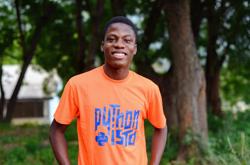

  

[Noah Alorwu](https://twitter.com/PlasmaDray), software developer and co-organizer of [PyCon Africa](https://africa.pycon.org/), has been awarded the Python Software Foundation 2020 Q2 Community Service Award.

  

Noah is the CTO of [Cradx](https://cradx.com/) and has been involved with the Python community since 2017.

  

  

> **RESOLVED, that the Python Software Foundation award the 2020 Q2 Community Service Award to Noah Alorwu for his contributions to the growth of Python Ghana community, being an executive member of PyCon Africa and also organizing Django Girls workshop to bridge the gender gaps in tech.**
> 
> **In 2019, he played an active role in organizing the first PyCon Africa and was chair of the talk committee.**
> 
> **Noah is also one of the founders of DjangoCon Africa, the upcoming inaugural conference for Django developers on the continent. He has spoken at several Python conferences including DjangoCon Europe.**
> 
> **Noah is a consistent force for good, particularly in the African Python community.**

And as part of this PSF Community Service Award announcement, we interviewed Noah Alorwu to give us some insight into his work with the Python community in Ghana and Africa.

Featured also in this interview is Rosina Carr, a mentee of Noah, who talked about Noah's influence in her life.

### Origin Story

**Can you tell us about your origin story? Like how you got into tech and your earliest involvement with the Python community?**

My journey in tech started at an early age.

At 7 years old, I visited my cousins nearby who were privileged to have a desktop computer. They played computer games and had fun as I watched them with keen interest. I asked myself how all the events were happening.

As I had no chance to feed my curisity, I have since been finding answers to the questions, to the extent that I had to open my mum's Cathode Ray TV to look for the people in the TV. An action I received some serious beatings for.

I love tech to the core that I have to use part of my school fees to purchase an internet modem while in Junior High school to access the internet. I am currently the CTO at [Cradx](https://www.cradx.com/) of which Python is one of our core stacks.

I have been involved in the Python community since 2017. I have helped organize workshops for women, organize the first PyCon Ghana and PyCon Africa.

  

The love for the community is one of a kind.

  

### Community Involvement - the driving force

**What drives/inspires you into doing all that you do for the Python community?**

My commitment to the Python community s influenced by two things:

1.  The community.
2.  What drives me the most is that I can positively affect many who love to code but find it difficult. Many great developers aren't discovered yet because they live in underprivileged societies. I want to one day lead the crusade of getting them discovered.

**How has your involvement within the community helped your career?**Time management, the ability to work with diverse people, and collaborate on open source projects are some of the things the Python community has brought to my career.

### Getting more developers involved in the community

**How do you think we can get more developers to be involved in the Python community in Africa?**

-   Nurture the technical talents of the devs so they can be super competitive in the market (on a global front and even locally).

-   Another way is to host cross-collaboration programs with other tech communities, hubs, and the likes across Africa. But of course, it has to start locally before it's scaled to that level. For example, partnering with hubs to host sprints and the likes. This would create more visibility of the Python communities amongst developers.

-   The Python community should connect developers to various parts of Africa, and also developers in the West with developers in Africa for cultural exchange and build support networks that would hopefully last throughout their professional lives.

-   A website can be created to celebrate or document the successes of devs in the community, not just awards.

-   Developers would surely be drawn to a community that values them and their work to the extent of providing them with a platform to showcase it. This exposure will be so helpful to the devs in that, they would get constructive criticism from even the perspectives of a non-techie (which would be helpful to whatever project it is they are working on). A lot of them would even learn how to 'explain' their products/projects. Above all, it would serve as a database for the Python community. Think about it. Curating works from developers across Africa. That would be something else.

### Impact Story

Rosina Carr attended a Django girls event in October 2017, where Noah was a coach. She became a mentee and friend of Noah after the event. Rosina shares some of the personal impact Noah has had on her life and the community. Noah is a developer who is always willing to help others. He has organized some Django Girls events, PyCon Ghana and PyCon Africa. His friendly and interesting personality makes him very easy to talk to and work with. I quite remember the first Django Girls event I went for in October 2017. It was fun and interactive.

The coach I was assigned to, couldn't make it, so Noah decided to coach my group alongisde his. And he coordinated it so well, that we did not feel left out.

Though we couldn't finish out websites at the event, he coached me after the event so I could get it done. He was always available when I needed him and oh, he is very patient.

This was just the beginning of Noah's mentorship. Noah continued to mentor me and encouraged me to coach other girls. Through Noah's help, I have coached some women at three Django Girls events. I am naturally reserved but he has helped me learn how to make friends at events like PyCon Ghana and PyCon Africa.

There are a lot of women out there that have been helped by Noah to develop a passion for programming, especially Python.

### Conclusion

'The Python Software Foundation congratulates and celebrates the amazing work and contributions of [Noah Alorwu](https://twitter.com/PlasmaDray) to the Ghana Python community and the larger Python Africa community.
