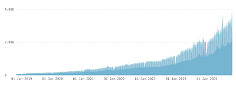

In September, the Python Software Foundation (PSF) co-signed the [Open Infrastructure is Not Free: A Joint Statement on Sustainable Stewardship Letter](https://openssf.org/blog/2025/09/23/open-infrastructure-is-not-free-a-joint-statement-on-sustainable-stewardship/) published by the [Open Source Security Foundation](https://openssf.org) (OpenSSF) as a steward of the [Python Package Index](https://pypi.org) (PyPI). As a follow up, I would like to share a bit more about the concerns expressed in this letter as they relate to our community and the PSF.  

## History and Current Conditions

PyPI (and Python) have continued to experience effectively exponential growth in usage over the past decade, from October 2018 to the present. This is clear in our telemetry:

 *Daily requests over time for PyPI's services, showing a trend line starting in 2018 in the millions, reaching 2-3 billion per day at present.*

This growth has been met with persistent and growing investment by the PSF. Starting with the hire of a full-time Director of Infrastructure in June 2018, as well as ongoing costs associated with operating PyPI and managing relationships, grants, and sponsorships that support it. At present, the PSF employs personnel and pays operational costs to keep PyPI online, reliable, secure, and supported to meet the [modern expectations](https://openssf.org/blog/2025/09/23/open-infrastructure-is-not-free-a-joint-statement-on-sustainable-stewardship/#:~:text=Modern%20Expectations,%20Real%20Infrastructure) of the Python community globally. While we are very fortunate to have long-term partnerships with [Fastly](https://www.fastly.com/fast-forward), [Amazon Web Services](https://aws.amazon.com/opensource/), [Google Cloud](https://opensource.google), [Datadog](https://opensource.datadoghq.com), [Sentry](https://open.sentry.io), [depot](https://depot.dev/changelog), and [PagerDuty](https://www.pagerduty.com/impact-hub/) that help us to develop, test, host, operate, monitor, and respond to incidents for PyPI, we still pay monthly fees for things like our support inboxes and other infrastructure. The largest cost for the PSF is staffing. The PSF staff who support PyPI include:

-   Ee Durbin (myself), Director of Infrastructure
-   Jacob Coffee, Infrastructure Engineer
-   Maria Ashna, PyPI Support Specialist
-   Mike Fiedler, PyPI Safety and Security Engineer

While our Safety and Security Engineer role is funded via a grant from [The Linux Foundation’s](https://www.linuxfoundation.org) [Alpha-Omega](https://alpha-omega.dev/grants/grantrecipients/) project, all others are paid for from the PSF’s general fund, which comes from our [sponsorship program](https://www.python.org/sponsors/application/) and [individual contributions](https://psfmember.org/civicrm/contribute/transact/?reset=1&id=2). These roles ensure that the expectations of our community are met when it comes to reliability and availability of the infrastructure and systems that run PyPI. They also ensure responsiveness to both critical support concerns, such as account recovery and project ownership, and to security incidents and malware, as well as continuing improvements to PyPI’s security stance overall. We fulfill these roles and operate PyPI as a free resource for Python developers to find, install, and publish their open source projects in pursuit of our mission. This will not change, but we do believe that there are concrete ways that our community can help to support us. We also believe that there are changes that we can make to help guide PyPI and the PSF to long-term sustainability, commensurate with the value and usage of for-profit companies. While we echo the statement from the open letter, “*This is not (yet) a crisis.*”, we also believe that “*it is a critical inflection point*” as we look to the future of the sustainability of PyPI and the PSF.  

## What Needs to Change

We are aligned with the OpenSSF letter on their three key points, but would like to say more about how they relate to PyPI:  

### Commercial and institutional partnerships

In 2024, the PSF and [Fastly](https://www.fastly.com/fast-forward) signed and [announced](https://fosstodon.org/@ThePSF/112456715341751673) a five-year agreement under Fastly’s [Fast Forward program](https://www.fastly.com/fast-forward). This is a fundamentally different kind of commitment from others that we rely on to operate PyPI (and the rest of the Python Software Foundation infrastructure). We feel very fortunate to have long-term recurring partnerships with other providers, but the annual renewal cycles do come with overhead and risk. While we work incredibly hard to use donated credits and services as efficiently as possible1, a critical in-kind sponsor choosing not to renew would require precious engineering resources to prepare for and complete a migration to another provider or cost the PSF tens of thousands of dollars a month during an interim period to pay outright. As an organization, we will seek to establish similar long-term agreements with our infrastructure partners.  

### Value-added capabilities & tiered access models

Having users pay for PyPI usage is something we cannot, and will not do. As we stated when we originally [announced PyPI Organizations](https://blog.pypi.org/posts/2023-04-23-introducing-pypi-organizations/), paid features must remain opt-in, and core features for publishing and installing projects will remain free. However, we do recognize that corporate publishers have been a large driver of the growth in the resources needed to serve PyPI. As we continue to develop PyPI Organizations features, providing these publishers with higher quotas will allow for the usage they drive by publishing large files to PyPI to be paid for. In general, our roadmap for PyPI Organizations will focus on value-added features that benefit Companies as well as Community projects alike, while continuing to provide those features to Community organizations at no cost.  

## How You Can Help

If you or your team install from PyPI for development, continuous integration testing, or deployment, please take time to review the ways in which your tooling utilizes caching, and implement as much of it as possible when installing from free package repositories. PyPI itself heavily utilizes caching when installing our own dependencies, leveraging [Docker cache mounts and pip’s internal caching](https://github.com/pypi/warehouse/blob/691680fa603cce2375505b3b265fe72c0e5ca451/Dockerfile#L93-L101) to reduce usage and increase speed of builds, not only for our Python dependencies but [npm](https://github.com/pypi/warehouse/blob/691680fa603cce2375505b3b265fe72c0e5ca451/Dockerfile#L18-L19) and [apt](https://github.com/pypi/warehouse/blob/691680fa603cce2375505b3b265fe72c0e5ca451/Dockerfile#L46-L68) as well. This shared responsibility for usage is one that we all should bear, rather than treating package repositories as a limitless resource. Just as we intend to seek longer-term agreements with the providers we rely on to operate PyPI, we ask members of the community in organizations that provide such support to champion for similar long-term agreements with open source foundations and projects that rely on them for operations. If your company publishes projects to PyPI, consider signing up for [PyPI Organizations](https://pypi.org/manage/organizations/). The recurring revenue generated by Organizations is a key way that we hope to build a reliable and sustainable base for PyPI moving forward. Even if any of those do not apply to you or your company, but you rely on PyPI, you can always:

-   **[Become a Member](https://psfmember.org/civicrm/contribute/transact/?reset=1&id=1):** When you sign up as a Supporting Member of the PSF, you become a part of the PSF. You’re eligible to vote in PSF elections, using your voice to guide our future direction, and you help us sustain what we do with your annual support.
-   **[Donate](https://psfmember.org/civicrm/contribute/transact/?reset=1&id=2):** Your donation makes it possible to continue our work supporting Python and its community, year after year.
-   **[Sponsor](https://www.python.org/sponsors/application/):** If your company uses Python and isn’t yet a sponsor, send them our [sponsorship page](https://www.python.org/sponsors/application/) or reach out to sponsors@python.org today. The PSF is ever grateful for our sponsors, past and current, and we do everything we can to make their sponsorships beneficial and rewarding.

1\. Fun Fact: The Python Software Foundation’s AWS Open Source Credits usage has only grown 25% over the past 8 years, despite the explosive growth in usage of our services.
