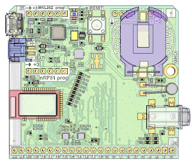

As many of you will know, the PSF has been a partner in the British Broadcasting Corporation's (BBC) [micro:bit project](https://pyfound.blogspot.co.uk/2016/03/a-million-children.html). A million devices capable of running [MicroPython](http://micropython.org/) have been distributed to every 11 and 12 year old in the UK. Those of you lucky enough to attend [EuroPython](https://europython.eu/) and [PyCon UK](http://2016.pyconuk.org) will have also been given a device to take home.

The PSF wouldn't be involved if the project were not open source, and **it has always been the intention that all the software *and hardware designs* should be released under open licenses so that anyone can recreate the project themselves**.

We're very pleased to continue our association with the project as a partner with the new [MicroBit Foundation](http://microbit.org/) ~ a charity tasked to promote and develop the project now that the BBC is stepping away. (It was always the intention of the BBC to step back once the UK "drop" of devices was complete.)

A few days ago they revealed their website and the final piece of the jigsaw was revealed: the hardware schematics.

If you're interested in learning more, [check out the hardware page](http://tech.microbit.org/hardware/), [learn about MicroPython](https://microbit-micropython.readthedocs.io/en/latest/) on the micro:bit, [join the Slack channel](http://tech.microbit.org/get-involved/where-to-find/) and [take a look around the wider project](http://tech.microbit.org/).

It's a very cool device and puts Python firmly in the world of embedded hardware and Internet of Things. It's also a great complementary device to the Raspberry Pi: the skills children learn on the micro:bit transfer to the Raspberry Pi and vice versa. That there is progression from complete beginner to professional software developer is one of Python's great strengths.

Python is for everyone, no matter their age or ability. Having open embedded hardware that runs MicroPython makes Python all the more available to enterprising people all over the world.

Have fun!
