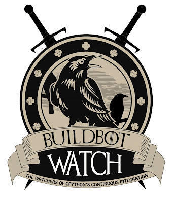
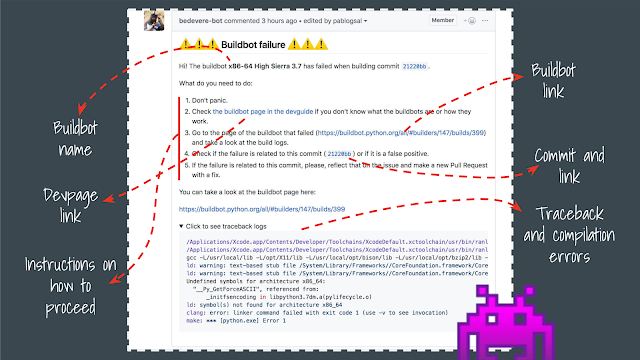
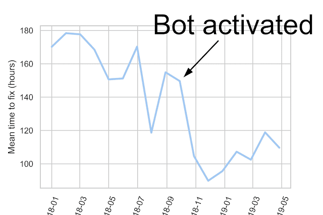
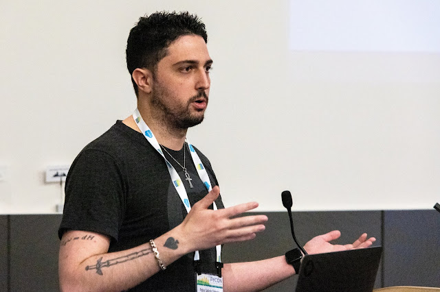

  
Python is tested on a menagerie of “buildbot” machines with different OSes and architectures, to ensure all Python users have the same experience on all platforms. As Pablo Galindo Salgado told the Language Summit, the bugs revealed by multi-platform tests are “Lovecraftian horrors”: race conditions, bugs specific to particular architectures or compiler versions, and so on. The core team had to confront these horrors with few good weapons, until now. **[Read more 2019 Python Language Summit coverage](https://pyfound.blogspot.com/2019/05/the-2019-python-language-summit.html).**

# The Solemn Duty of Bug Triage

  
When a test fails, the core developer who triages the failure follows an arduous process. “It's not glamorous by any means,” said Galindo, “but someone needs to do it.” Galindo, Victor Stinner, and Zachary Ware are the main bug triagers, and they all follow a similar sequence: read the failure email, search for duplicate failures, read the voluminous logs to characterize the problem, and file a bug with a detailed description. Then, optionally, they try to reproduce the problem. Since failures are often specific to one buildbot, the triagers must contact the buildbot’s owner and get permission to ssh into it and debug. According to Galindo, typical test failures are “really, really complicated,” so the triage team takes a firm stance about reverting changes. If they suspect that a change has broken a test, its author has one day to follow up with a fix or the change will be reverted. “Nobody likes their commits to be reverted,” he told the Language Summit. But test failures can cause cascading failures later on, so the team must be ruthless.

# New Tools for Squashing Bugs

  
A pull request is not tested by the buildbots until after it is merged, so the author does not immediately know if they have broken any tests. Galindo and his colleagues have written a bot which reacts to a test failure by commenting on the merged pull request that caused it, with reassuring instructions to help the panicked author respond. “We have some arcane magic,” he said, to distinguish compiler errors from tracebacks and neatly format them into the message, so the author get begin diagnosing immediately.   
Since the bot was deployed in September, the mean time to fix a test failure has fallen dramatically. When Galindo showed this chart, the core developers broke into applause.   
Nevertheless, there are still severe problems with Python’s tests. Flaky tests break about 40% of the builds; the system is programmed to retry a failure and consider it successful if the second run passes, but this is clearly just a stopgap. Galindo urged the core team to reduce flaky tests by eliminating race conditions and sleeps. He also asked for help writing a tool that would analyze which flaky tests fail most often, and a tool to detect and merge duplicate test failures. Finally, Galindo proposed allowing contributors to test their pull requests on the buildbots before merging. This feature should be implemented cautiously. “The buildbots are very delicate,” he said. They cannot safely run arbitrary code like on Travis or other commercial test infrastructures. Still, it would be worth the effort, if contributors could catch mistakes before they are merged. 
