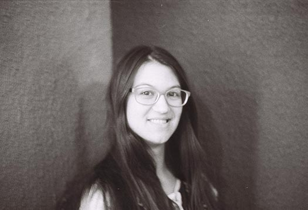

  
Next week Ana Balica will give her first keynote, but she isn't nervous. At least, not yet. "I definitely will be before going on stage," she says. "That’s a natural response; you can’t help it." Balica is a Django Developer at Potato, a web agency in London. Although she is only two years out of university, she's making a name for herself as a programmer, community leader, and conference speaker. This month at [PyCon CZ in Brno, Czech Republic](https://cz.pycon.org/2016/), she presents "Humanizing Among Coders," a talk that describes five aspects of effective communication. "I hope it will get people talking about how they communicate, and believing they can make a difference by being empathetic." Python and Ana Balica first met while she was studying software engineering at the Technical University of Moldova. Although the school focuses on C and C++, she tried out Python as a sort of snack on the side, and got hooked. After she graduated she spent her "gap year" enjoying two adventures at once. The first adventure was traveling Asia and Europe. Since she felt free of any responsibility, she went on a second adventure concurrently, expanding her skills with the "Learn IT Girl" mentorship program online. Her project for [Learn IT Girl](https://www.learnitgirl.com/) was an alphabet game for children that ran on Android phones. She built the first prototype with Kivy so she could write more Python.  

## A Shared Network for Women in Computing

  
Balica was a Google Summer of Code participant twice as a student and once as a mentor. Her project for GSoC was to create a new online platform for Systers. Systers is a community of over 3,000 women in tech, the largest such group in the world. Anita Borg founded Systers in 1987 as an email list for women in “systems”, but it has grown and diversified into a dozen subgroups such as Latinas in Computing, Black Women in Computing, and many others. In 2014 Balica began building a [Systers Portal](https://github.com/systers/portal/) with Python and Django to give all these members and subgroups a unified platform to share news. During her gap year, Balica continued to hack on the portal. "While I was traveling I had plenty of free time, so I was constantly doing something, improving things, adding new features." She returned to GSoC the following summer to mentor students who joined the project. Systers leader Rose Robinson was the portal's guiding visionary; she says Balica's coding ability is exceptional, and her leadership was crucial to the project's success. "When teams are in four different time zones, challenges are heightened, but Ana was never phased."  

## The Launch of a Speaking Career

  
Balica's first conference talk was at DjangoCon Europe, in Wales in June 2015. At first, she didn't intend to speak at the conference. She was filling out the registration form when she noticed the offer of [free mentorship for new speakers](http://2015.djangocon.eu/proposals/speaker-mentors/). She could get help inventing a topic or structuring her talk. The DjangoCon organizers wrote on the site, "We don’t want to be proud because we had a lot of superstar speakers at our conference. We want to be proud because we were the conference where you began your superstar speaking career." [Ola Sitarska](https://twitter.com/olasitarska) was Balica's mentor for her proposal. Sitarska says, "I was impressed with the level of detail she went into, and only advised about what the organizers might be looking for, as she didn't need much help!" Balica says about Sitarska, "I wrote her a couple of paragraphs and her response was three times longer, with a lot of encouragement a lot of little tips." Balica's [talk on Django mixins](http://reinout.vanrees.org/weblog/2015/06/03/10-mixins.html) was accepted and she had a blast presenting it to the audience. Ever since that talk, Balica's speaking career has been accelerating. She attributes it to a snowball effect; she'd never intended to give so many talks. PSF director Anna Ossowski saw her speak at DjangoCon the following year, about testing with mocks. "It was excellent to see her on stage. She had a Shakespeare theme and it was more like an acting performance than giving a talk."  

## Code and Compassion

  
At PyCon CZ next week, Balica will give her first keynote, "Humanizing Among Coders," about making teams welcoming and productive for everyone. She'll offer five methods to improve our interactions, each illustrated with a story. Her talk begins with beginners. How do we make them comfortable and mentor them? "Being a good mentor takes energy and it’s very, very complicated," she says, "and sometimes open source is not even the safest playground for beginners." When we join a company or a large project, inevitably we confront a challenge that school did not prepare us for: legacy code. Balica says, "I want to talk about how people throw around criticism like, 'Oh, Mark wrote that. That was horrible.'" Blaming past coders is easy, and it excuses us from making the effort to understand why they made the choices they did. If we resist that temptation, we gain the power to understand the past and build a better future. According to Balica, direct communication is the best way to build a culture of trust. "Being passive-aggressive is terrible," she says. In her keynote she'll illustrate direct communication with a parable, about a veteran coder named Mărioara reviewing a patch from a new contributor, Özlem. (Balica favors Eastern European names for the people in her parables.) When the veteran Mărioara sees flaws in the novice Özlem's patch, she fixes them herself before merging it, rather than telling Özlem what must be improved. Özlem is discouraged. She worries she isn't contributing to the project. It would be better, in Balica's view, if Mărioara asked Özlem why she made the choices she did, and told her frankly how she needs to amend her code. Özlem is still in charge of her patch, in this scenario, and she gains insights about her craft that will ultimately make her a master engineer. The final insight Ana Balica will share is the power of the word "we." Whether discussing a bug, an outage, a great new feature, or a punctual release, she advises us to attribute it to the team. "Simply use the 'we' pronoun. Slight difference, but it works." By her friends' and colleagues' accounts, Balica herself is a role model for humanizing coding. Ola Sitarska works with her now at Potato in London. She says, "Ana is so friendly the room starts to shine whenever she enters it. She leaves people lovely handwritten notes on their desks." Anna Ossowski adds, "When I see her at a conference, she always comes right up to give me a hug and ask how I’m doing." It might sound like Balica has empathetic coding all figured out, but her keynote won't offer pat answers. "I don't want just to give beautiful quotes on slides," she says. "I'm making the audience think deeper and come to their own conclusions."

* * *

  
Learn more about Ana Balica:  

-   [Ana Balica's Blog](https://ana-balica.github.io/)
-   [Your Django Story: Meet Ana Balica](http://blog.djangogirls.org/post/124569551358/your-django-story-meet-ana-balica)
