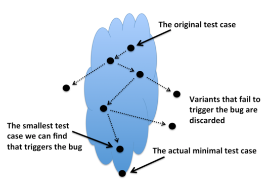

  
Zac Hatfield-Dodds opened his presentation with a paraphrase of the economist Thomas Schelling:  

> *No matter how rigorous her analysis or heroic his imagination, no person can write a test case that would never occur to them.*

Hatfield-Dodds told the Language Summit, handwritten tests are "fantastic for testing particular edge cases, they're great regression tests," but they're limited by the developer's understanding of the system under test. "We can't write tests for bugs we don't know could occur." We can overcome this limit with *exhaustive testing*, checking our code's behavior with every possible input; if that is impractical, *coverage-guided fuzz testing* can generate random inputs and evolve them, trying to explore every branch in the code under test. Fuzzers are very good at finding inputs that crash a program, but they're not as well suited for finding other kinds of bugs. [Read more 2020 Python Language Summit coverage](https://pyfound.blogspot.com/2020/04/the-2020-python-language-summit.html).  

* * *

For testing the Python standard library, Hatfield-Dodds proposed a different technique: *property-based testing*. (He is one of the leaders of the [Hypothesis property-based testing project](https://hypothesis.readthedocs.io/).) A property-based test framework doesn't generate totally random input like a fuzzer; it can generate structured inputs such as lists of numbers, or only sorted lists, or instances of a certain object. Unlike handwritten tests, which usually assert that a particular input produces one exact output, property-based tests assert *properties* of a function, for example that its output is sorted, or that a function is idempotent or commutative. Hatfield-Dodds presented the following Hypothesis test of a JSON codec:  

@given(
    value=st.recursive(
        st.none() | st.booleans() | st.floats() | st.text(),
        lambda x: st.lists(x) | st.dictionaries(st.text(), x),
    )
)
def test\_record\_json\_roundtrip(value):
    assume(value == value)
    assert value == json.loads(json.dumps(value))

The `recursive` input generator can create None, booleans, floats, text, or lists or dictionaries that contain such values, and so on recursively. Within the test function, the `assume` statement checks that the input is equal to itself, to avoid inputs with `nan`, which is not. The heart of the test is the `assert` statement. (The above example still has troubles with `nan`, [see Hatfield-Dodds' PyCon Australia talk](https://zhd.dev/sufficiently/).) Hypothesis searches for bugs by randomizing the input, or trying interesting values that tend to trigger edge cases, or retrying inputs that triggered bugs in previous runs. When Hypothesis finds a bug, it evolves the input, searching for the simplest input that reproduces the same bug.  
  
"I want you all to write property-based tests for CPython, for builtins, for PyPy, for everything," said Hatfield-Dodds. He proposed to write new tests, or port existing ones to a property-based test framework, run them in CPython's continuous integration suite, and share them among the Python implementations. These tests could use Hypothesis; they could also be integrated with the [AFL fuzzer](https://github.com/google/AFL) or used in [Google's OSS-Fuzz](https://github.com/google/oss-fuzz) project. He presented a [repository of tests](https://github.com/Zac-HD/stdlib-property-tests) demonstrating the technique for standard library modules such as `gzip`, `re`, and `datetime`. There is even [a test that can generate random, valid Python code](https://github.com/Zac-HD/stdlib-property-tests/blob/master/tests/test_source_code.py) to fuzz-test the Python parser. Łukasz Langa mentioned that [David MacIver had used Hypothesis to test a Python code formatter](https://www.drmaciver.com/2015/03/27-bugs-in-24-hours/) and found dozens of bugs. Paul Ganssle told the Summit that he used property-based testing for his implementation of [datetime.fromisoformat](https://docs.python.org/3/library/datetime.html#datetime.date.fromisoformat). When the function was merged into the standard library the property-based tests were not. In subsequent development Ganssle introduced a segfault bug that "almost certainly would have been caught" if the original tests had still been running. He strongly endorsed Hatfield-Dodds's idea. He added that property-based testing is especially good at checking that two implementations of a module, one written in Python and one in C, are equivalent.
