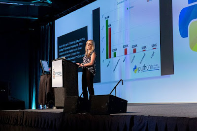

Ewa Jodlowska, former PSF Executive Director and Board Member, has been recognized with the PSF’s Distinguished Service Award. For over a decade, Ewa played a pivotal role in transforming the PSF from a volunteer-driven group into a thriving, professional organization. Thanks to her hard work and vision, the PSF now has paid staff, solid funding, and the ability to support the global Python community like never before.

The PSF’s Distinguished Service Award ([DSA](https://www.python.org/community/awards/psf-distinguished-awards/)) is granted to individuals who make sustained exemplary contributions to the Python community. Each award is voted on by the PSF Board and they are looking for people whose impact has positively and significantly shaped the Python world. Ewa’s work with the Python community very much exemplifies the ethos of “build the community you want to see.”

After receiving the award, Ewa shared, “Reflecting on the many years I've dedicated to working with the Python community, I am filled with fond memories and a deep sense of accomplishment. The relationships built and the collaborative efforts made over these years have been invaluable. Knowing that my contributions have played a foundational role in the PSF’s ongoing success is incredibly gratifying.”

Today, the PSF can hire developers, manage a vital grants program, and oversee the infrastructure that keeps Python (and its vast library ecosystem) freely accessible to everyone worldwide. Ewa’s leadership has left an incredible mark on the PSF’s history, and her work has set us up for a future that once felt unimaginable.

Curious about previous recipients of the DSA or wondering how to nominate someone? Check out the [PSF’s Distinguished Service Awards page](https://www.python.org/community/awards/psf-distinguished-awards/). The PSF also bestows Community Service Awards to recognize outstanding community members– if you’d like to learn more about CSAs and how they differ from DSAs, check out our [Service Awards given by the PSF: what are they and how they differ blog post](https://pyfound.blogspot.com/2024/09/service-awards-given-by-psf-what-are.html).
