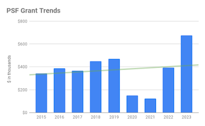

The PSF’s Grants Program is a key plank in our charitable mission to promote, protect, and advance the Python programming language, and to support and facilitate the growth of a diverse and international community of Python programmers. After much research, input, and analysis, we are pleased to share a PSF Grants Program 2022 & 2023 Transparency Report. The report includes context, numbers, analysis, and a proposed path forward. It also includes a supplemental analysis of several specific grant applications for which we were requested to share more information. We feel it is important to acknowledge that Pythonistas, regional communities, and the broader community are behind these statistics and commentary. Our community called for this report to be created. While the report is focused on data and outcomes, we also feel it is important to acknowledge in this introduction the concerns and frustrations that brought us here, explained further in the ‘Setting context’ section below. We hope that this report, along with many other steps, helps to remediate this. This report reflects the outcome of thousands of hours of PSF and volunteer efforts over 2022 and 2023 by the Grants Working Group, the PSF Board, Python organizers, and PSF Staff worldwide. We truly value this opportunity to share information on the last two years of increasing grants to the community and to improve our Grants Program while honoring the hard work of everyone involved in making the Program and our mission possible. This report was compiled by PSF Staff and reviewed by the PSF Board and Grants Working Group. If you have questions, comments, or feedback about the Grants Program or this report, please email [grants@pyfound.org](mailto:grants@pyfound.org).  

## Setting context

In December of 2023, we received an [open letter](https://pythonafrica.blogspot.com/2023/12/an-open-letter-to-python-software_5.html) from a coalition of organizers from the pan-African Python community asking the PSF to address concerns and frustrations around our Grants Program. Before receiving the letter, the PSF Board was aware of the Grant application that spurred this letter and published a [transparency blog post](https://pyfound.blogspot.com/2023/10/september-october-board-votes.html) regarding the September and October 2023 Board votes concerning that application. PSF Staff were aware of a need for a refresh of Grants Program documentation and processes and worked on these updates time allowing. Since receiving the letter in December, the PSF Board and Staff have:  

-   Spent time listening during many discussions with the letter writers and other community members.
-   Re-prioritized reviewing and rewriting Grant-related documentation and processes, including revisiting the Grants Working Group Charter.
-   Established monthly [Grants Program Office Hours](https://pyfound.blogspot.com/2024/02/introducing-psf-grants-office-hours.html).
-   Contracted Carol Willing to perform a [DjangoCon Africa Grants Process Retrospective](https://pyfound.blogspot.com/2024/03/djangocon-africa-grant-process.html) which is now available on the PSF Blog.

For a high-level idea of the scope of our Grants Program, we are happy to share:  

-   The PSF distributed $393K in Grants during 2022 and $623K during 2023 for the Grants Program and the PyCon US Travel Grants Program combined.
-   The Grants Program distributed $215K in Grants during 2022 and $393K during 2023.
-   *Noting this Transparency Report is focused on the Grants Program only. If you want to learn more about travel grants check out the [Travel Grants Process for PyCon US 2024 blog post](https://pycon.blogspot.com/2024/03/TravelGrantsReport2024.html) on the PyCon US blog.*  
    

The growth we saw from 2022 to 2023 is exciting to reflect on, and we’re looking forward to what 2024 and beyond has in store for our Grants Program!  

## The numbers (in graph form)  

*Thanks to Tania Allard for helping improve the readability and accessibility of the graphs provided in this report.*

## Our analysis

#### General Trends, Observations, & Notes

-   In 2022, Grants requests were not at “full capacity” as our community was still recovering from the impact of COVID-19 on events, initiatives, and collective burnout.
-   The increase in total grant applications we received from 2023 over 2022 is encouraging. The program grew in 2023 as we began to return to in-person and hybrid events, and we anticipate more applications coming in throughout 2024 and beyond.

#### Number of Total Grant Applications by Continent

-   In both 2022 & 2023, we received the most number of applications from Africa and Europe, with South America not far behind.

#### Percentage of Grants Approved

-   The percentage of approved vs. declined applications is reasonable. Some reasons applications were denied include:

-   Unable to meet PSF Grants Program criteria
-   Unclear benefit to funding the application
-   Not Python related
-   Spam

#### Percentage of Grant Applications by Continent

-   The percentages across continents are reasonably balanced, with fewer applications from Asia, North America, and Oceania. Based on the distribution of populations globally, the percentage of applications from Asia is lower than expected. After receiving input on this directly from PyCon organizers from Asia, we have come to understand that this is based on an approach focused on sustainability. PyCon organizers in Asia are focused on local sponsorship, fiscal responsibility, and independence. We absolutely commend this approach, and at the same time, we urge organizers from Asia to request Grant funding to supplement and enhance their events.
-   Additionally, note that we cannot award Grants to certain countries in Asia due to OFAC and our status as a US-based 501c3 non-profit.

#### Approved & Declined Grant Applications by Continent

-   The number of declined applications from Africa shows an area for improvement. Our conclusion is that our documentation is not clear enough on the requirements for a grant to be awarded and that results in applications that will not pass.

#### Dollar Amount Granted by Continent & Percentage of Money Granted by Continent

-   This graph appears to show that Europe received disproportionate funding. On further review, we believe this is because the grant applications we got from Europe were for conferences. In contrast, a large number of the grant applications from other regions were for meetups and workshops, including many Django Girls events. Conferences typically cost significantly more than meetups. Here’s a breakdown:

| Continent | Applications Received in 2022 | Granted in 2022 | Applications Received in 2023 | Granted in 2023 |
| --- | --- | --- | --- | --- |
| Africa | 4 conferences, 7 meetups | 3 conferences, 7 meetups | 7 Conferences, 16 meetups | 5 conferences, 13 meetups |
| Europe | 12 conferences, 1 meetup | 11 conferences, 1 meetup | 15 conferences, 2 meetups | 15 conferences, 2 meetups |

.table { display: block; overflow-y: hidden; overflow-x: auto; scroll-behavior: smooth; } .table thead { display: table-header-group; vertical-align: middle; border-color: inherit; color: white; background: darkcyan; } tr { display: table-row; vertical-align: inherit; border-color: inherit; } table th { padding: 16px; text-align: inherit; border-bottom: 1px solid black; color:white!important; } tbody { display: table-row-group; vertical-align: middle; border-color: inherit; } table:not(.tr-caption-container) { min-width: 100%; border-radius: 3px; }

-   We are encouraged to see the dollar amount granted to the Africa region rise significantly between 2022 and 2023.

#### Average Amount Granted by Continent

-   Oceania is an outlier; the PSF received one application in 2022 and two in 2023 from Oceania. Many more grants were awarded to other regions, which caused their average dollar amount to be lower. With that in mind, we feel the average is reasonable. It means that we are receiving both large and small grant applications!
-   Africa and South America received less on average than other regions. This is another example of the typical types of grant requests we are receiving from different regions (workshops and meetups vs. large conferences).

#### Grant Decision Times in Weeks by Number & Percentage of Applications

-   The majority of the average grant review period is 4 weeks, which we feel is reasonable based on the process and load of grant applications we receive.
-   When we reviewed applications that took longer than 4 weeks to decide, we found a couple of scenarios.
-   One of the main reasons for longer decision times is that applications are sometimes submitted without crucial information, and there is significant time spent on communications between applicants, PSF Staff, and the Grants Working Group. Once requested, there are often delays in receiving the required information back from applicants.
-   The grant application was escalated to the Board who meet on a monthly basis. Grants can be escalated to the Board either because the amount requested is greater than $10,000 or because the Grants Working Group cannot reach a consensus on a decision.

#### Grant Program Average Days to Decide by Continent

-   This graph also shows Oceania as an outlier, and, again, it is skewed because we received only one application in 2022 and only two in 2023 applications from that region.
-   In 2023, applications from Asia took longer to reach decisions. When we looked into this further, we found that the reasons for delays were that applications were submitted without the required information and that significant time was spent on communications between applicants, PSF Staff, and the Grants Working Group.
-   We are pleased to see that the average number of days is very close across most regions.

  

## Supplemental information on specific grant requests

The [open letter](https://pythonafrica.blogspot.com/2023/12/an-open-letter-to-python-software_5.html) we received from the pan-African Python community asked us to specifically review the process and share information about several older grant applications from 2018, 2019, and 2022. We want to share as much information as possible while noting that some of these requests were managed by folks who have since moved on from the PSF and Grants Working Group (GWG).  

#### Introducing Python and related technologies to more high schools in Uganda (2018)

-   Grant request submitted January 2nd, 2018
-   Requesting funding for four events in different schools for the 7-9 February, 12-14 February, 19-21 February, 26 Feb-1 March, of 2018.
-   GWG Chair forwarded request to the GWG January 4th
-   GWG reviewed and needed more information
-   GWG Chair requested more information and forwarded that to GWG on January 12th
-   GWG Chair acknowledged to the GWG on February 7th that the request was dropped
-   No further comments added or actions taken

#### PyLadies Fest in Kampala, Uganda (2019)

-   Grant request submitted February 21st, 2019
-   Requesting funding for a five day event starting on May 6th, 2019
-   GWG Chair requested more information
-   GWG Chair forwarded request and additional information to the GWG on March 25th
-   GWG reviewed and needed more information
-   GWG Chair requested more information and forwarded a reply to GWG on April 26th saying the grant requestor was working on solidifying the necessary information
-   GWG Chair forwarded additional information to the GWG on July 10th and advised the GWG the event was rescheduled for September 16th
-   No further comments added or actions taken

#### PyLadies Kampala Open Source Workshop (2022)

-   Grant request submitted September 20, 2022
-   Requesting funding for a one day event for November 26th, 2022.
-   GWG Chair requested more information, which was provided on September 26th
-   GWG Chair forwarded request to GWG on October 20th
-   GWG reviewed and no one objected
-   GWG Chair moved the request to a vote on October 31st
-   Board Member contacted PSF Staff for an update on November 2nd
-   GWG approved the request and the GWG Chair sent the Resolution to the grant requester on November 3rd

#### Our comments

We do not have many insights into the administration of these Grant requests outside of what exists on the GWG mailing list, including any off list emails or in-person conversations that might have occurred. The PSF Staff administering the GWG for the grant requests from 2018 and 2019 are no longer on the team. The request from 2022, which was approved, was 2 days over our goal of 6 week turnaround time for decisions on grant applications. While our staff roster is currently small, it was **even** smaller in 2018 and 2019. We realized some time ago that as our grant requests increased having a solo administrator for the GWG was tough- it was hard for our staff to catch a break! When we put out a call for a Community Communications Manager in June of 2023, we planned for whoever stepped into that role to be a second administrator for the GWG to always have a stopgap at the ready. Our current administration for the GWG now includes two PSF Staff members. This is done purposefully to avoid situations where applications get dropped because a critical piece of information comes just as someone is scheduled to be out of the office or an emergency happens.

  

## A path forward

Some of our goals:  

-   Review, rewrite, and improve the Grants Working Group Charter, including exploring various decision-making options and criteria.
-   Review, rewrite, and improve documentation so that:
-   Applicants can be confident that their application meets the Grants Program criteria before submitting.
-   Reduce the need for follow-ups for additional information that can cause delays.
-   Continue to host the PSF Grants Program Office Hours to increase ongoing transparency, support grant applicants, and understand the gaps in our documentation.
-   Analyze and deliberate on the equity of designating grant funding allocated by region.
-   Explore ways that the PSF could regularly support the organization of large-scale events in underserved regional communities.
-   Examine and update our processes regarding timeframes, including escalating grant applications after 4 weeks of review to avoid 8-week review periods.
-   We’d like to receive more applications in the future by continuing to publicize the opportunity and providing support during our Office Hours.
-   Revisit the effectiveness and sustainability of the Grants Program yearly.

## A final note

We hope this transparency report will help our community understand the state of our Grants Program over the last two years. It has been instructive to the Board, the Grants Working Group, and our staff who administer the program to understand where our strengths and weaknesses lay. This report will inform our efforts as we progress with improvements to the Grants Program. We also feel this exercise will continue to be helpful year over year, to both monitor the health of and analyze how our improvement efforts have impacted the success of the Grants Program. If you have any questions, comments, or feedback, please email [grants@pyfound.org](mailto:grants@pyfound.org).
