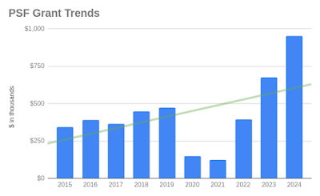

The PSF’s Grants Program is a key plank in our charitable [mission](https://www.python.org/psf/mission/) to promote, protect, and advance the Python programming language and to support and facilitate the growth of a diverse and international community of Python programmers. After much research, input, and analysis, the PSF is pleased to share the PSF Grants Program 2024 Transparency Report. The report includes context, numbers, analysis, and next steps for the Program. Similar to our [PSF Grants Program 2022 & 2023 Transparency Report](https://pyfound.blogspot.com/2024/05/psf-grants-program-2022-2023.html), this 2024 report reflects the outcome of a significant amount of work. There are some differences in the position we are in as we approached the development of this report:  

-   The 2022 & 2023 report provided concrete areas for improvement
-   During 2024, a notable amount of focused PSF Staff time was dedicated to improving our Grants Program and the processes
-   The PSF received and awarded a record-breaking amount of grants in 2024, which resulted in the need to re-evaluate the Program’s goals and sustainability

The data from 2024 was truly wonderful to see (many WOW’s and 🥳🥳 were shared among PSF Staff)– and we are so happy to share it with the community. The PSF is also excited to share that we achieved many of the goals we listed in the 2022 & 2023 report and believe this is a reflection of the focused work we undertook in 2024. Even with these wins, the PSF recognizes multiple opportunities to continue to improve the Program. We are also aware that our recent sustainability-focused changes to the Program will likely result in the need for additional improvements and adjustments. The PSF continues to feel it is important to acknowledge that individual Pythonistas, regional communities, and the broader community are behind these statistics and commentaries. This report reflects the outcome of thousands of hours of efforts over 2024, 2023, and 2022 by the Grants Workgroup, the PSF Board, Python organizers, and PSF Staff worldwide. The PSF truly values this opportunity to share information on the success and challenges of our Grants Program, all while honoring the hard work of everyone involved in making the program and our mission possible. This report was compiled by PSF Staff and reviewed by the PSF Board and Grants Workgroup. If you have questions, comments, or feedback about the Grants Program or this report, please email grants@python.org or attend a session of the [Grants Program Office Hours](https://pyfound.blogspot.com/2024/02/introducing-psf-grants-office-hours.html) on the [PSF Discord](https://discord.gg/7rthGF3BBe).

## Setting Context

The PSF has been working to improve our Grants Program since receiving [a call from our community](https://pythonafrica.blogspot.com/2023/12/an-open-letter-to-python-software_5.html) to address concerns and frustrations in December 2023. Our 2022 & 2023 report listed the actions the PSF has taken since we first received the call, and we are happy to share that since publishing our last report, the PSF Board, Grants Workgroup, and Staff have:  

-   Held monthly [Grants Program Office Hours](https://pyfound.blogspot.com/2024/02/introducing-psf-grants-office-hours.html) (now past its 1st anniversary) with much success and active participation at every session, and we plan to continue these indefinitely!
-   Strategized at the [PSF Board retreat](https://pyfound.blogspot.com/2024/11/psf-board-retreat-2024.html), which resulted in [Guiding Principles](https://www.python.org/psf/grants/#guiding-principles) for the Grants Program
-   Evaluated the Grants Program expenditure using grant data to conduct scenario analysis and ensure long-term program and foundation sustainability.
-   Updated the Grants Workgroup Charter twice:

-   The first update was focused on process improvements ([part 1](https://pyfound.blogspot.com/2024/11/psf-grants-program-updates-part1.html), [part 2](https://pyfound.blogspot.com/2024/11/psf-grants-program-updates-part2.html)).
-   The second update was focused on sustainability ([TLDR](https://pyfound.blogspot.com/2024/12/psf-grants-program-charter-updates-tldr.html), [part 1](https://pyfound.blogspot.com/2024/12/psf-grants-program-charter-updates-part-1.html), [part 2](https://pyfound.blogspot.com/2024/12/psf-grants-program-charter-updates-part-2.html), [part 3](https://pyfound.blogspot.com/2024/12/12psf-grants-program-charter-updates-part-3.html)).

-   Ensured active Grants Workgroup engagement by conducting a confirmation of the workgroup memberships.
-   Updated the [main documentation page](https://www.python.org/psf/grants/) for the Grants Program to improve clarity around the program’s processes, requirements, and what applicants can expect.
-   Updated the [Grants Program application form](https://psfmember.org/grant-proposals/) to clarify questions that caused confusion, and added more questions to help us better review applications and perform additional grant data analysis in the future.
-   Revamped the former virtual events resource page to be an [Event Organizer Resource Library](https://www.python.org/psf/grants/free-resources/) to include more types of resources and information for grant applicants.

  
For a high-level idea of the scope of our Grants Program, the PSF is happy to share:  

-   The PSF distributed $952K in Grants during 2024 for the Grants and PyCon US Travel Grants Programs combined, an increase of over 50% over 2023’s total.
-   The Grants Program distributed $637K In Grants during 2024.

  
A couple of additional notes:  

-   This transparency report is focused on the Grants Program only. If you want to learn more about travel grants check out the [Travel Grants Process for PyCon US 2025](https://pycon.blogspot.com/2025/03/travelgrants2025.html) blog post on the PyCon US blog.
-   Across this report and our communications about grants, “distributed” means funds that were paid, and “awarded” means funds that were resolved to be distributed. While a subtle difference, there can be discrepancies between “awarded” and “distributed” figures for several reasons, such as grant recipients that never claim their awards, or grants that were awarded at the end of December but weren’t paid until January.
-   We discovered a corner case on applications and how data is gathered for this report; applications that were received in 2023 but weren’t voted on until 2024 were not included in the 2022 & 2023 report. Those are included in this report. The following report will be on the 119 grants that the PSF reviewed during the year 2024.

  
Again, the growth the PSF Grants Program has seen from 2022 to 2024 (and over the years) is exciting to reflect on because of what it means– you, the community, are wonderfully thriving and active! The PSF can’t wait to see what 2025 has in store for our Grants Program and the Python community.

  

## The numbers (in graph form)  

*Thanks to Tania Allard for helping improve the readability and accessibility of the graphs provided in this report.*

## Our Analysis

#### General Trends, Observations, & Notes

-   The increase in total grant applications we received from 2024 over 2023, and again over 2022, is exciting! We anticipated more applications coming in throughout 2024 and we were correct. With the recent changes to our Grants Program, the trends we’ve seen in Q1 of 2025, and the funding crunch in the tech sector, we anticipate receiving even more applications in 2025.
-   Beyond just more applications, we had more of a lot; more successful grant applications, more funds awarded, more communications, more changes to the Program, and more dedicated PSF Staff time!

#### Number of Total Grant Applications by Continent

-   Similar to last year’s report, we received the most number of applications from Africa and Europe, with South America not far behind.
-   The number of grant applications from almost all continents have continued to increase 2024 over 2023, and have more than doubled over the total number of applications we received in 2022.

#### Percentage of Grants Approved

-   The percentage of approved applications increased 2024 over 2023. We feel this increase can be attributed to the direct line of communications applicants have to program administrators via the PSF Grants Program Office Hours.
-   Some reasons applications were denied include:

-   Unable to meet PSF Grants Program criteria
-   Unclear benefit to funding the application
-   Not Python related
-   Spam

#### Percentage of Grant Applications by Continent

-   Again in 2024, we received fewer applications from Asia, North America, and Oceania. Oceania is an outlier. Based on the distribution of populations globally, the percentage of applications from Asia is lower than expected. While we want to note that we cannot award Grants to certain countries due to United States OFAC restrictions that US-based 501(c)(3)s must follow, we again urge organizers from Asia to request Grant funding to supplement and enhance their events.
-   While the number of applications we’ve received have continued to increase, the distribution of grant applications across continents has remained relatively stable from 2022-2024. We do want to note a small but steady increase in the percentage of grant applications from Africa and North America, and a small decrease in applications from South America.

#### Approved & Declined Grant Applications by Continent

-   The ratio of approved to declined grant applications (87.5% approved, 12.5% declined in 2024) from Africa is positive, as this was a stated area for improvement in last year’s report (68% approved, 32% declined in 2023). We believe this can be at least partially attributed to the PSF Grants Program Office Hours, plus more communications regarding how the Program works and the changes occurring around it.

#### Dollar Amount Granted by Continent & Percentage of Money Granted by Continent

-   The amount granted to Africa more than doubled 2024 over 2023, and more than 14 times the amount granted to Africa in 2022! As we also received the most grant applications from Africa in 2024, we feel this outcome is positive.
-   Comparing the percentages of grant applications by continent versus the percentages of money granted by continent, we feel it is positive that these percentages closely match (i.e. awarding of funds is roughly equivalent to the percentage of applications across continents) with a couple points of difference.
-   The total amount of funds granted doubled 2023 over 2022 and again almost doubled 2024 over 2023. This continued dramatic increase resulted in our recent changes to the Grants Program to ensure the program’s sustainability.
-   The amount of funds awarded to Asia and South America are low compared to other continents taking into account global population distributions. While this aligns with the number of applications we received from these regions (i.e. the percentage of funds awarded and percentage of accepted applications for these regions are close), we would like to understand if the low number of applications is due to activity level, lack of awareness, or other factors.

#### Average Amount Granted by Continent

-   Oceania continues to be an outlier; the PSF received one application in 2022, two in 2023, and two in 2024 from Oceania. Many more grants were awarded to other regions, which caused their average dollar amounts to be lower.
-   The average dollar amount across the rest of the continents are reasonably close, and we are pleased to see the average amount granted to Africa has risen.
-   Asia and South America are still lagging behind, which could be attributed to the type of grant requests we receive from that region (such as Django Girls workshop versus PyCons) and the amounts being requested. And the reverse side of that– grant applications from North America tend to be for conferences and not workshops or small events, hence the larger average amount granted.

#### Grant Decision Times in Weeks by Number & Percentage of Applications

-   We are pleased to see that the majority of the grant review period falls around 4 and 5 weeks, which is reasonable based on the process and load of grant applications we received.
-   When we reviewed applications that took longer than 6-8 weeks to decide, we found one scenario in particular continues to arise. Applications are sometimes submitted without crucial information, and there is significant time spent on communications between applicants, PSF Staff, and the Grants Workgroup. Once requested, there are can be delays in receiving the required information back from applicants.

#### Grants Program Average Days to Decide by Continent

-   The average days to decide across continents is generally similar, with a few exceptions for Asia and Oceania being shorter. This graph also shows Oceania as an outlier, and, again, it is skewed because we received only two applications in 2024 from that region. The average number of days to decide for grant applications for Asia was high in 2023 at 45 days, and we are pleased to see that decrease significantly in 2024 to 25 days.
-   We are pleased to see the average number of days to come to a decision regarding grant applications has decreased to 28 days in 2024 over 32 days in 2023. We feel this can be attributed to process improvements, Grants Workgroup engagement, and more dedicated time from PSF Staff.

## Next steps and a final note

As the PSF reflects on all the successes of the Grants Program in 2024, we are preparing ourselves for even more adjustments to come with the updated Program and Grants Workgroup Charter. Some of our goals for 2025 include:  

-   Continue building the [Event Organizer Resource Library](https://www.python.org/psf/grants/free-resources/).
-   Continue hosting the Grants Program Office Hours to increase ongoing transparency, support grant applicants, and identify and close any gaps in our updated documentation.
-   Monitor and evaluate the Grants Program awards on a quarterly, bi-annual, and yearly basis to ensure Program and Foundation sustainability.
-   Revisit the effectiveness and sustainability of the Grants Program yearly.
-   Continue to analyze, discuss, and compare the actual state of our Grants Program against the Guiding Principles for the program.
-   Work to first understand why we are receiving a proportionately lower number of applications from Asia and South America.

  
The PSF hopes this transparency report will help our community understand the state of our Grants Program in 2024, and the previous two years. Again, the process has been instructive to the Board, the Grants Workgroup, and the PSF Staff who administer the Program to understand where our efforts paid off, and where we can continue to improve. This report will inform our future efforts as we continue to make adjustments and improvements to the program. The PSF looks forward to continuing to serve the Python community with grants in 2025! If you have any questions, comments, or feedback, please email grants@python.org. We also welcome you to attend a session of the [Grants Program Office Hours](https://pyfound.blogspot.com/2024/02/introducing-psf-grants-office-hours.html) on the [PSF Discord](https://discord.gg/7rthGF3BBe) (the next session is Tuesday, May 20th, at 9 AM Eastern, 1 PM UTC!).
