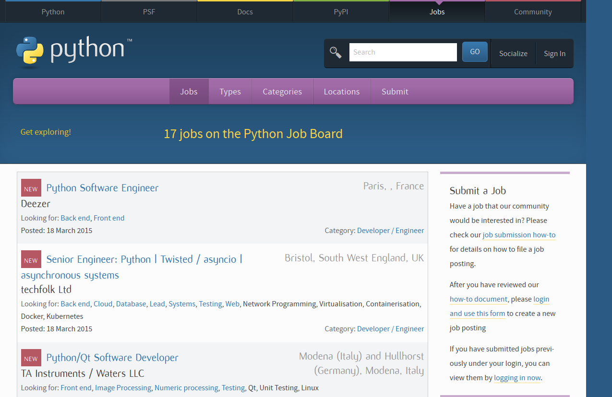

  

**[Announcing: the brand new PSF Python Job Board](https://www.python.org/jobs/)**  
We are happy to announce that **we have successfully relaunched the PSF Python Job Board**. After almost one year of development and lots of work by our volunteers and contractors, we are now live with the new Python job board system.

### New modern system

  
The new system is fully integrated into the python.org website. Job submitters can create an account on the system, log in and directly submit their job posting for approval by the PSF Job Board Team. The team can then review the postings, check them against our submission criteria, possibly fixing some formatting, and then approve or reject the postings directly through a web interface. No more sending dozens of emails back and forth to get the job template fixed and adding jobs to the website by hand.

### Thank you to our volunteers

  
The new system was a major effort for all of us and I'd like to say thank you from the PSF to everyone who helped make this happen (in alphabetical order):  

#### Reviewers:

-   Simon Hayward
-   Melanie Jutras
-   Marc-Andre Lemburg
-   Giles Thomas

#### Developers:

-   Wiktor Bachnik
-   James Bennett
-   Jacob Burch
-   Jon Clements
-   Gil Gonçalves
-   Simon Hayward
-   Sarah Kuchinsky
-   Marc-Andre Lemburg
-   Berker Peksag
-   Benjamin Peterson
-   Frank Wiles

Plus everyone I forgot in this list (sorry; mail me and I'll have you added). We'd also like to thank to **Martin Thomas** and **Chris Withers**, who each ran the Python Job Board for several years by email before the job board team was set up.

### Job submitters

  
If you want to submit a job, please visit the [how-to page](https://www.python.org/community/jobs/howto/) which describes the process. **Submissions are free**, but we'd appreciate a thank you in form of a [donation to the PSF](https://www.python.org/psf/donations/).

### Job seekers

  
You can click through the jobs on the [jobs listing](https://www.python.org/jobs/) or subscribe to the [RSS feed](https://www.python.org/jobs/feed/rss/) we have for the listings. Please note that **we do not post CVs** on the site. You will have to contact the companies directly. *Good luck with finding a new job !*

### Brand new bugs for free

  
As with every new system, there are still some bugs left. If you find something, please report it on the [Github issue tracker](https://github.com/python/pythondotorg/issues).

### More information

  
More information on the PSF Python Job Board and the relaunch project is available on our project page:  

-   **[PSF Python Job Board](https://wiki.python.org/moin/PSF%20Python%20Job%20Board/)**

  
If you have questions, please write to [jobs@python.org](mailto:jobs@python.org). Enjoy,  
\--  
*[Marc-Andre Lemburg](mailto:mal@python.org)  
Director, Python Software Foundation*
