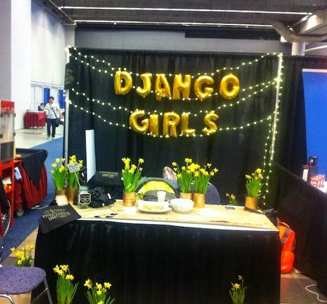

A couple of posts ago, I wrote about the PSF’s funding of the upcoming Plone Conference in Bucharest as an example of how the PSF supports Python development for the web (see [Plone](http://pyfound.blogspot.com/2015/04/psf-to-sponsor-plone-bucharest-2015.html)). Another web framework the PSF has been supporting is, of course, Django, and with the upsurge of Django Girls activities, support for Django Girls simultaneously allows the PSF to make progress on its commitment to diversity. For those not familiar with Django Girls, they are a non-profit organization that provides free one-day programming workshops to women. They began in Berlin in 2014 as a workshop at EuroPython given by Ola Sitarska and Ola Sendecka. Since then, they have spread all over the world. Just since the start of this year, the PSF has sponsored Django Girls workshops in the following cities:

-   $1,500 to Django Girls New York;
-   $1200 to Django Girls Athens;
-   $1800 to Django Girls London;
-   $730 to Django Girls Cardiff;
-   $600 to Django Girls Mbarara on April 18th.

In 2014, the PSF supported such Django activities as DjangoCon Europe, Django Carrots Workshops, Django Weekend, Django Under the Hood, DjangoVillage, along with Django Girls workshops in Warsaw, Krakow, Budapest, Lodz, Kampala, Edinburgh, Kenya, and Mbale. The PSF was also delighted to see Django Girls last week at PyCon in Montreal:  
 [Django girls Booth at PyCon](https://pbs.twimg.com/media/CCU1m98WYAA2Xbd.jpg:large). By providing free one-day workshops, Django Girls has had great success in bringing woman into programming and tech. Their workshops take participants through a tutorial that uses HTML, Django, Python, and CSS, allowing each participant to build her own website by the end of the day. Django Girls' philosophy, one which was echoed over and over at PyCon 2015 in Montreal, and which is wholeheartedly endorsed by the PSF, is stated on their website [Django Girls](http://djangogirls.org/),

> *We believe that IT industry will benefit greatly from bringing more women into technology. We want to give you an opportunity to learn how to program and become one of us - female programmers!*

Django Girls' commitment to teaching programming extends beyond the workshops they provide to teaching resources that can be used by others–either for their own learning or to conduct and organize other workshops. These resources include the tutorial they use for their free one-day workshop, an organizers' guide, coaching manual, and tutorial extensions. All their resources are freely available at [Django Girls](http://djangogirls.org/resources/). See the Django Girls blog for success stories of individual women who have benefitted from their workshops at [Django Blog](http://blog.djangogirls.org/). As was pointed out by Jacob Kaplan-Moss' wonderful [keynote at PyCon 2015](https://youtu.be/hIJdFxYlEKE), it is predicted that by 2020, there will be a shortage of about 1.5 million qualified tech workers to fill industry demand. So the need to recruit women and other under represented peoples into tech is urgent. And, of course, it is also an opportunity to further spread the use and culture of Python, open source, and free software. Our hats are off to Django Girls for being a major force toward that end. *I would love to hear from readers. Please send feedback, comments, or blog ideas to me at [msushi@gnosis.cx](mailto:msushi@gnosis.cx).*
