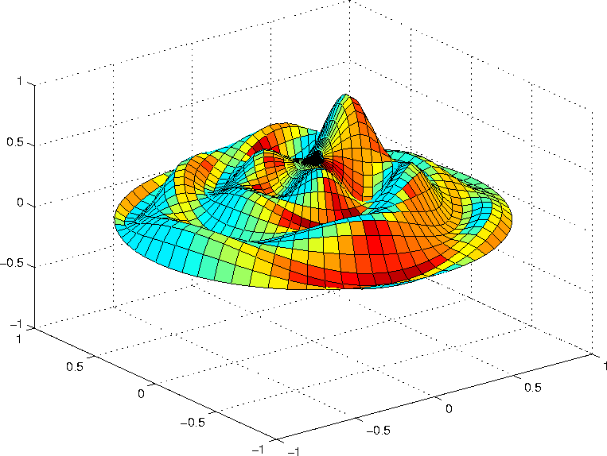

For the first time ever, the PSF has joined forces with another open source organization, [NumFOCUS](http://numfocus.org/), to create a collaborative working group to make decisions on allocating grants or sponsorships for Scientific Python projects, conferences, etc. [NumFOCUS](http://numfocus.org/), based in Austin Texas, has been promoting and funding open source computing resources for scientific research since 2012. Their core projects include *AstroPi*, *Data Carpentry*, *IPython*, *Julia*, *SimPy*, *NumPy*, and *SciPy*, *Matplotlib*, *Cython*, *PyTables*, and more. This new joint working group was spearheaded by PSF Director David Mertz, who will co-chair along with mathematician and Python evangelist Tim Couper. The PSF has recently pledged initial annual support in the amount of of US$25,000, and agreed to match any amount NumFOCUS contributes beyond $25,000, up to $50,000 contributed by the PSF, during the PSF Board meeting on 4/28/15 (for combined funding up to $100,000).  Image credit: engineering.dartmouth.edu In forming the Working Group, David reached out via the PSF members' list to call for volunteers. As he wrote,

> This note is a call for volunteers … The work needed … \[is\] keeping in mind a finite budget, and evaluating and discussing requests that come in for grants or sponsorship relative to this budget. In the best case, people connected to scientific communities will also do some outreach to let groups know that funds are potentially available, but it’s also necessary just to weigh requests that come to us independently.

The call for volunteers led to an extremely impressive group representing a range of scientific expertise and interests. The PSF is confident in the group’s ability to make capable evaluations of grant requests that will ensure a judicious use of limited funds. Here are the WG members' biographies: David Mertz: Ph.D. in Political Philosophy, gone astray into computer theory, with a stint in computational biochemistry. He has been a Fellow of the PSF since 2008, and a Director since 2009. He is author of Text Processing in Python (Addison Wesley) and the series Charming Python (IBM developerWorks). Tim Couper: Oxford D.Phil. in Mathematics. Python evangelist and consultant for 16 years, now based in Scotland. Extensive python experience with organisations of all sizes from startups to large retail, pharmaceuticals & finance (banking & hedge funds). Anthony Scopatz: Computational Physicist and avid Python developer since 2002 and PSF Fellow since 2013. He is coauthor of Effective Computation in Physics (O'Reilly). He will be joining the University of South Carolina as a tenure-track faculty member in Mechanical Engineering in August 2015. Stéfan van der Walt: Assistant Researcher at the Berkeley Institute for Data Science and a senior lecturer in applied mathematics at Stellenbosch University, South Africa. He has been an active member of the scientific Python community since 2006, and frequently teaches Python at workshops and conferences. He is the founder of scikit-image and a contributor to numpy, scipy and dipy. Travis Oliphant: Ph.D. in Biomedical Engineering from Mayo Clinic; professor of Electrical and Computer Engineering at BYU 2001 to 2007 with research in inverse problems and biomedical imaging; creator of SciPy, author of NumPy; founder of Numba, PyData, NumFOCUS, and Continuum Analytics. Currently CEO of Continuum. Leah Silen: Executive Director of NumFOCUS, Leah has been involved daily in the support of the Python scientific computing community since NumFOCUS began three years ago. She has worked with the board of directors to initiate and carry out fiscal sponsorship, fellowship and grant programs funding both projects and individuals. She has also worked through the organization of PyData events to further support the community as well as on scholarship review committees of multiple conferences. Dana Bauer: Geographer, Pythonista, open data enthusiast, mom to a future robot programmer. Dana has over 54 repositories at GitHub and works as a developer at Rackspace. Kurt Kaiser is the Treasurer of the Python Software Foundation. Congratulations to the organizers and members and best of luck in your important work. We look forward to hearing about your activities.  
*I would love to hear from readers. Please send feedback, comments, or blog ideas to me at msushi@gnosis.cx.*
