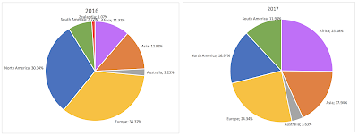

Last week Monday, October 16th, the Python Software Foundation held its first in-person director meeting outside of PyCon. We were able to get 9 directors together and address a hefty agenda. Each section below summarizes a major topic that we addressed during the meeting.  

<table align="center" cellpadding="0" cellspacing="0"><tbody><tr><td></td></tr><tr><td><i>PSF Directors and friends having dinner in Chicago the night before the meeting</i></td></tr></tbody></table>

**Fiscal Sponsorship** We started the day with a discussion on [fiscal sponsorship](https://en.wikipedia.org/wiki/Fiscal_sponsorship). From a community perspective, a broader fiscal sponsorship program would allow greater opportunities for corporate funding of key Python projects. Van Lindberg, PSF's General Counsel, gave directors an explanation of what it meant and we discussed the risks and benefits involved in such a program. While the PSF currently has a limited fiscal sponsorship program, we are considering expanding the range of our sponsorships to include Python dev projects such as PyPy. Van is creating a new template contract to use in such agreements, with additional research required to identify the legal implications of fiscally sponsoring organizations that are located outside of the United States. Another necessary change to accommodate the broader fiscal sponsorship requires the PSF's financial staff, Kurt B. Kaiser and Phyllis Dobbs, to document a workflow for how payments/reimbursements will be made in these arrangements.  
**Official Board Meeting** Our second session of the day was an official board meeting where we began by approving September's meeting minutes. A subsequent discussion began on how we can use the python.org/jobs page to enhance our fundraising efforts. PSF employee, Betsy Waliszewski, will contact the python.org/jobs volunteer group to solicit feedback on how we can tie in their work with fundraising more directly. Another item decided at the board meeting includes the PSF IT Manager, Mark Mangoba, beginning to produce periodic reports for the board on PSF infrastructure traffic. Lastly, Director Eric Holscher and I gave a status update on the Python Packaging Work Group's recent receipt of Mozilla's MOSS Grant. A blog will be written on this topic once more details are confirmed.  
**PyCon's "Everyone contributes"** The third session of the day continued with Ernest W. Durbin III, PyCon Conference Chair, joining us via phone to discuss various PyCon items. A significant part of the conversation tackled the "Everyone pays" policy that PyCon has historically maintained. Responsibilities have increased over time so that phrase no longer applies. For example, the PSF employs two full-time employees to execute PyCon in addition to all of the volunteer work that happens. Additionally, volunteer appreciation has evolved. Due to changes like this, we have agreed to change the phrase to "Everyone contributes." Since everyone that attends contributes their time and/or money, we found that to be a more suitable phrase to use.  
**PyCon's Speaker Financial Support** Recently we heard from our community that PyCon's speaker financial support could be improved. Ernest recently made a change in our process that will help financial support easier on behalf of both the PSF and PyCon speakers. The change Ernest made lives on the speaker profile page [us.pycon.org](http://us.pycon.org/). When potential speakers are completing their speaker profiles, they can check the "I require a speaker grant if my proposal is accepted" option, and the speaker will receive financial support needed if their talk is accepted. Another suggestion came from PSF Director Trey Hunner. Trey pointed out various conferences around the world the PSF can learn from. Furthermore, we discussed that we need to be more transparent about the availability of speaker grants. An option considered was the possibility of providing all speakers free registration to PyCon. Ultimately we decided on PyCon providing speaker financial assistance to anyone that requests it. The reasoning behind that decision is that PyCon profits help fund the Python Software Foundation's global community giving. Given the significant impact that PyCon profits have, we encourage those that can to pay for their conference registrations. In 2016, the PSF gave out $292,471 in grants worldwide thanks to the revenue generated through PyCon. So far this year (up to Q3), we have given $221,763 and we anticipate to give more than $300,000 in grants next year.  
The below graphs show that PSF international support is increasing. For example in 2017 we increased support in Africa by 13.86% and the year is not over yet. Everyone who contributes to PyCon financially helps us make a global difference.

<table align="center" cellpadding="0" cellspacing="0"><tbody><tr><td></td></tr><tr><td><i>PSF Grant spending by continent. <a href="https://www.dropbox.com/s/lakaqwemmc03x24/2016_2017.png?dl=0" target="_blank">A clearer view is available here.</a></i> </td></tr></tbody></table>

**Trademark for PyPI** The next agenda item the board discussed pertained to filing a PyPI trademark. One of the core missions of the PSF is the protection of the Python community – including the safeguarding of Python’s intellectual property. An increasingly important part of Python’s intellectual property are the trademarks and logos we use to identify Python and its associated services to the world. Given the increasing importance of PyPI, the board decided that it would be wise to officially register some PyPI-related trademarks in various places around the world. We discussed the various ways we can file trademark requests and we also reviewed financial quotes from three law firms. We decided to file the logo trademark and also the word mark "PyPI". Van Lindberg will continue working on that process.  
**Grant Accountability** Since the PSF has continued to fund more grants each year, we discussed the idea of grant accountability. One of our directors, Paul Hildebrandt, is working on an event report template to help us better understand and track the benefit that our grant giving is having on communities that we sponsor. We will report on this issue further as it develops.  
**Alternative Ways of Giving Money** During this agenda item we discussed the benefits that matching grants may have for the PSF. Eric Holscher brought up the idea that matching grant agreements can help improve PSF's marketing, along with helping the grantee generate more total revenue. Additionally, we discussed the possibility of being proactive with soliciting specific grant types. For example, this would be useful if we wanted to zone in on specific support for Python development work and/or to support Python educators. Jacqueline Kazil, PSF Director, suggested that we make some improvements to our [grant policy page](https://www.python.org/psf/grants/) by including more reference points for improved guidance. Work on this will continue remotely. We also decided to work on slides we can provide to PSF-funded events that will inform the public about what the PSF does.  
**Board Role in Fundraising** As part of her efforts to help the foundation mature, PSF Chair Naomi Ceder started a discussion on how board members can more directly help the PSF’s overall financial standing through supporting PSF fundraising efforts. No concrete plans were made, but the board will continue exploring its role under Naomi’s leadership.  
**Multi-lingual Blog/Documentation/Website** The PSF's Communication Chair, Lorena Mesa, gathered input from the group on how we can improve our community support by improving our translations efforts. The next step will be to list all of the community assets that could be translated, prioritize them, and get a work group started to help with the efforts. As a part of this effort Lorena is seeking community input on assets of particular importance and community priorities in translation efforts.  
**Strategic Planning** The last two hours of the day were dedicated to high-level strategizing, particularly in discussing the future of the PSF. During this conversation, the PSF decided that, over time, the PSF needs to gradually rebuild and professionalize to permit better efficiency in supporting the global Python community.. Unfortunately we realized that two hours was not enough time to cover everything we would like to discuss.  
Some items we did get to discuss included determining what we wanted our financial reserve to be. Thomas Wouters, the PSF's Vice Chairperson, guided the discussion through various questions and comments pertaining to the types of risks we are facing and the types of things we can do with the financial reserve. We discussed the need to invest our reserve as well.  
Another item briefly addressed included ways the PSF can grow by connecting PyPI to our fundraising efforts. We discussed how we can collaborate with related groups to be more intentional with our grant giving.  
Aside from these future goals, we decided to arrange for nonprofit board training at PyCon 2018. This will help us with expectations and will strengthen the strategic planning process.  
**Executive Committee** The goal of the October 16th discussions was to begin the process of strategic planning. Even though we are still at the beginning of the process, we did create an Executive Committee to follow this through. Naomi Ceder, Van Lindberg, Thomas Wouters, and I met at the end of the day and decided our next step is to create an Executive Summary of the PSF. We need to have a better grasp of all PSF details before we continue. Our goal is to have it completed by PyCon 2018 so the board members can meet once again and continue the process of strategic planning.  
All in all, it was a very productive meeting and we will aim to hold these meetings annually. At future in-person meetings, we will try to have fewer items on the agenda to enable more conversation around each topic. It is surprising how fast an hour goes by when 10 people are contributing to the discussion. Since we don't meet in person often, we all have a lot to say!
