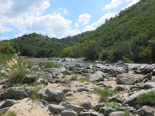
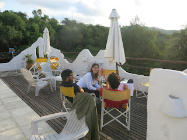
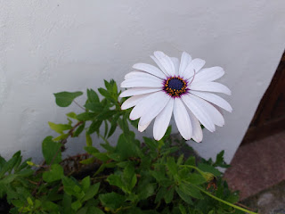
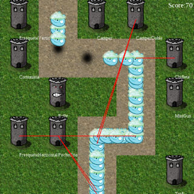

  
You settle into a deck chair in the sun. All around you are the hills, streams, and spectacular greenery of Cordoba Province, Argentina. You could take a nap, or a hike. But best of all, you can write code with friends. "There's a particular energy you can't find elsewhere. It comes from everybody working together, playing together, discussing ideas," says Facundo Batista. "You can devote your time to your community, because everything is taken care of. You spend all day programming, then take 40 steps to your bed." PyCamp is Argentina's annual outdoor code sprint. This year, Facundo Batista organized PyCamp in the small town of La Serranita. For four days, 24 coders hacked on a dozen open source projects, with the help of a $600 grant from the Python Software Foundation. "It's especially fruitful for newbies," says Batista. "You can be a 22-year-old with a couple years of college, and you are working on an open-source project side-by-side with someone with 25 years experience at big companies. The amount you can learn, it's awesome!"  

  
  
The idea for PyCamp arose from Argentina's Python community, beginning in 2008. The camp isn't really outdoors: there is a roof, walls, beds, bathrooms, even electricity and WiFi. But despite these amenities, the location is always abundantly green and rural. Batista used the PSF grant to bring several new coders, improving the group's diversity. One first-time participant, Ariel Ramos, says, "Thanks for the grant, I liked the experience a lot, and it was very useful to be there. I liked the openness to the newbies and the special attention to ensure they enjoyed the event and learned." Another participant, Pedro Nieto, says PyCamp "allowed me to participate in several interesting projects that normally I wouldn't have even known about. It gave me more confidence to program, and encouraged me to participate in the free software community."

  
  
PyCamp participants each arrive with one or two ideas, and the sprint begins with pitches to recruit contributors. "You end up working on 5 or 6 different projects," says Batista. "No attachments." At the end of the sprint, the teams [present their work in a series of lightning talks](https://www.youtube.com/watch?v=AQ_XtNsOF7E). Batista's favorite project this year was a tower defense game, built from scratch. Half the participating programmers wrote the game's core, and coded its UI using [pyglet](https://pyglet.readthedocs.org/), the Python OpenGL library. The other half invented an AI to play the game. With their responsibilities neatly divided, the teams were very productive: they completed a working game in four days. Inexperienced members were mixed in with experts on each team to accelerate their learning. "I actually knew only a little Python," says Agustín Curto. "I was just starting with the language, and it helped because I learned a lot by asking."

  

<table align="center" cellpadding="0" cellspacing="0"><tbody><tr><td></td></tr><tr><td>Tower defense game</td></tr></tbody></table>

By sponsoring new PyCamp coders, the PSF wasn't merely generous: it also made an investment in the future of the Python community in Argentina. José Luis Zanotti says, "It was such an incredible, fun, and educational experience that I decided to commit myself to be an active member of the community, working in their projects, and overall promoting the usage of Python in my geographic area." *Photos by Facundo Batista; [full gallery on Flickr](https://www.flickr.com/photos/54757453@N00/sets/72157666336865262).*
