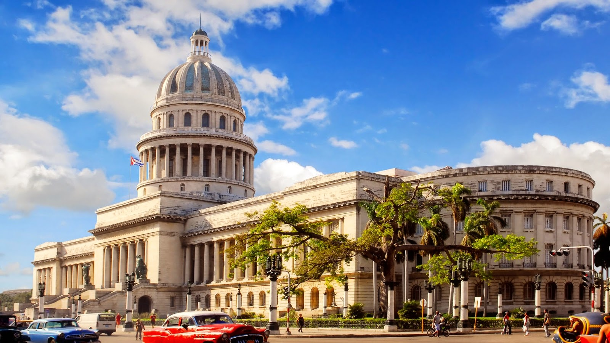

> *Hi everyone,*

> *The below post is an April Fools joke. It was written by PSF Blogger and Basic Member Mary Ann Sushinsky, with Director and Outreach & Education Chair David Mertz, to encourage, in a tongue-in-cheek way, more international cooperation in the Python world.*

> *It did this by poking fun at how the governments of various countries have hindered events like a hypothetical PyCon Cuba from happening. It touched on a political area where sensitivities are often high, and a number of people were hurt or offended by the post. That wasn't cool of us, and we apologize.* *The post remains below because we believe in acknowledging our error rather than just deleting it and pretending that it didn't happen.* *One positive thing that came out of this was a better understanding by many of us about what many people from Cuba have gone through, and it has strengthened our resolve to find ways to do good by them.*

> *We very much hope better to aid Cubans in coming to future Python events throughout the world, and are saddened to learn of financial and visa obstacles they have faced in the past and still. Moreover, discussion following this post makes us hopeful that a "PyCon Cuba" (under some name) may be a realistic possibility in the not-too-distant-future, an event the PSF would love to help create.*

> *\- The Python Software Foundation Board of Directors (including David Mertz) and Mary Ann Sushinsky*

With great excitement, the PSF wishes to announce the site for the subsequent two North American PyCons: the beautiful city of Havana, Cuba! Following our two years in Montréal, and anticipating a great 2016-2017 conference in Portland, Oregon, PyCon has truly become “PyCon North America.” With recent easing of travel restrictions from the United States, the possibility of going to Cuba was immediately embraced by the PSF and PyCon organizers. At last, we would be able to bring the joy and power of the Python community and coding skills to a nation that already has a deep understanding of the values of collaboration over competition, of community over individual achievement, of free and open availability of knowledge over corporate owned intellectual property. Not to mention its beautiful climate, palm trees, beaches, good food, music, and dancing. As many Python insiders know well, the Castro brothers, Fidel and Raúl, have long been fans of FLOSS and of Python in particular. According to a representative of the [Cuban Ministry of Science, Technology, and Environment](http://mipais.cuba.cu/cat_en.php?idcat=81&idpadre=6&nivel=2), upon being told that the PSF was looking at Havana as a possible PyCon site, President Raúl Castro replied:

> Lo práctico gana a la pureza. Los errores nunca deberían dejarse pasar silenciosamente. A menos que hayan sido silenciados explícitamente. Frente a la ambigüedad, rechaza la tentación de adivinar.

For an American perspective, we asked the Chair of the U.S. Senate [Subcommittee on Space, Science and Competitiveness](http://www.commerce.senate.gov/public/index.cfm?p=ScienceandSpace), Canadian-born Cuban-American Senator Ted Cruz (R-TX), about the Python language, so widely used by NASA and the scientific research he oversees. Cruz replied through a spokesperson,

> I’ve always stood for the core American principles of Free Enterprise, Free Software, and a Free Republic. It heartens me to see the largest conference about my favorite programming language held both in the nation of my birth, and now in the one where my father was born.

Havana is not new to hosting conferences—in fact many international organizations convene at such venues as the International Conference Center, the Catholic University of America, and the University of Havana.  Venue for PyCon 2018 In 2015 Havana will host PyCon sister conferences such as:

-   [International Convention of Anthropology](http://www.plenglish.com/index.php?option=com_content&task=view&id=3604451&Itemid=1)
-   [International Social and Multidisciplinary Focus for Quality Dentistry Congress](http://www.cubatoursandtravel.com/2015-events.html)
-   [World Series Boxing](http://www.worldseriesboxing.com/)
-   [International Conference on Law and Informatics](http://www.cubaheadlines.com/2009/05/30/17425/seventh_international_conference_law_and_informatics_taking_place_cuba.html)
-   [International Tropical Pig Industry Seminar 2015](https://www.pig333.com/calendar/vi-international-seminar-tropical-swine-production-2015_1140)

Looking forward to seeing you in Cuba in 2018. ¡Sí se puede! *I would love to hear from readers. Please send feedback, comments, or blog ideas to me at [msushi@gnosis.cx](mailto:msushi@gnosis.cx).*
