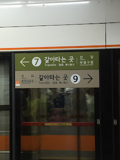
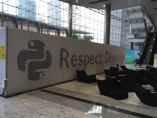
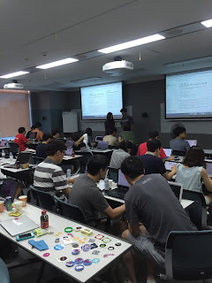

Two weekends ago I was lucky enough to get the chance to attend PyCon APAC 2016. This year the event was held in Seoul, South Korea at the COEX Convention Center within the Gangnam-gu district. PyCon APAC 2016 brought 1,500 Pythonistas together and it was organized by the PyCon Korea team. This was a very special trip for me as it was my first trip to Asia. The first day while we were figuring out the public transportation system, I did experience some brief challenges.  
 However, the following days at the conference settled my disorientation. Through this process, I realized that the same Python community qualities existed in South Korea as they do everywhere else in the world. We all may not have been able to communicate verbally, but the openness of the community still prevailed. The locals were welcoming, inclusive, and took the time to teach us Korean customs and culture. More than that, PyCon APAC 2016 stressed diversity of nationality and gender. One great way that the conference made everyone feel like they were part of the community was this sign that comprised all the names of the people who had pre-registered for the conference.  This meaningful sign had such a positive impact on the attendees as it acted as a constant reminder. I enjoyed watching attendees find their names in the sign, and all of the tweets that followed. Through experiencing PyCon APAC, I also learned that the organizers spend a great deal of effort making their community strong and open. At the conference I was invited to attend the PyCon APAC organizers' meetings. During this meeting, the organizers addressed important questions such as "Do we continue PyCon APAC even though many APAC countries organize their own PyCon?" and "How do we continue to increase diversity?" It was decided during the meeting that the purpose of PyCon APAC goes beyond regional conferences and should continue. It helps build diversity and brings forth positive influences from other parts of the world. The organizers decided that each location should attempt to have a small portion of their budget set aside to send some of their community members to other “Indo-Asia-Pacific” regional conferences, especially the yearly APAC conference itself. Hearing how the team of organizers valued such questions and discussions showed me that they valued our community and that is one reason why their conferences are so successful.

> Had the chance 2 contribute 2 powerful discussions. Met organizers from KR, HK, MY, PH, TW, VN, JP, SG [#pyconapac](https://twitter.com/hashtag/pyconapac?src=hash) [pic.twitter.com/3gMHjDzdsz](https://t.co/3gMHjDzdsz) — Ewa Jodlowska (@ewa\_jodlowska) [August 14, 2016](https://twitter.com/ewa_jodlowska/status/764958064176836608)

Beyond community importance, the conference brought us together to discuss core Python development. Some of the questions I heard at the PSF booth were, "[When will Python 2.7.x stop being supported?](https://www.youtube.com/watch?v=YgtL4S7Hrwo)" and "What will happen to those of us that use 2.7.x in a corporate setting?" Their questions were based on PEP 373 and PEP 494, and their worries were relevant ones. Many think that Python 3.5.x still needs a lot more work before developers no longer need Python 2. Those questions are hard, and no one has an absolute answer, no matter how strong their beliefs. But our discussions led to how we all need to work on making Python 3.x better, since it is the future of the language. We discussed the need to port packages from Python 2 to 3, and the need for corporate support.

> Constant reminders to use Python 3 for your wrist [#PyConAPAC](https://twitter.com/hashtag/PyConAPAC?src=hash) [pic.twitter.com/FG7kIc9TGZ](https://t.co/FG7kIc9TGZ) — Ian Lewis (@IanMLewis) [August 13, 2016](https://twitter.com/IanMLewis/status/764281662033108992)

Regardless of the PyCon 2 vs Python 3 debate, the attendees were excited to get coding during the PyCon APAC Sprints. This was the first time the PyCon Korea team held sprints, and they did not know how many sprinters to expect. They were overwhelmed when that day came and they had to book additional space to accommodate everyone. As an organizer, I can tell you that this is a good problem to have, especially when the organizers react properly and swiftly.   
During the Sprints/Tutorial day, Pythonistas attended a sprint about Pandas & PyData led by one of the creators of the pandas project, Wes McKinney. The picture above shows hands-on learning at the tutorial for DjangoCupcake. Others attended sessions about the Django Rest Framework, Write the Docs, Tox, Travis, and aiohttp led by Andrew Svetlov, a core Python developer. Establishing connections with Pythonistas from the APAC region and beyond made the long flights to and from Seoul worth every minute. I hope to attend future PyCon APACs and reconnect with all the wonderful people I met during the conference. Thank you, organizers and attendees, for a memorable conference!
