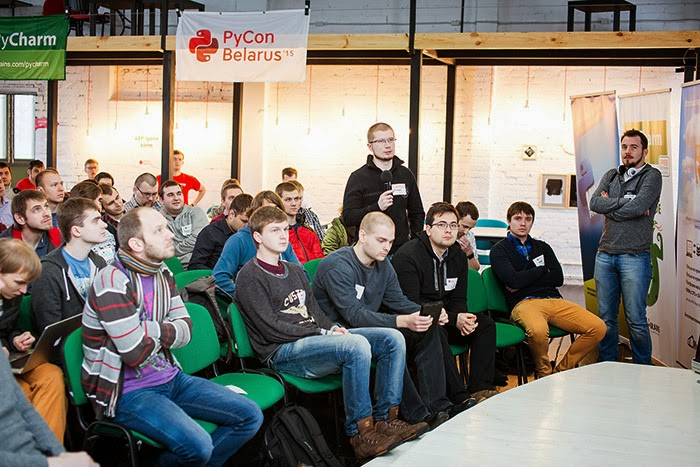

One function the PSF is happy to do is to send a PSF Director to *PyCons* in various parts of the world to give a talk and to provide information about and encourage membership in the PSF. Last week, PSF Director, David Mertz, attended *PyCon Belarus* in Minsk where he spoke about a new Python language feature *([Python's (future) type annotation system(s)](https://www.python.org/dev/peps/pep-0484/))* and met many amazing Python users.  
  
Along with David, the other invited keynote speaker was [Austin Bingham](https://www.pluralsight.com/author/austin-bingham), originally from Texas and currently co-owner and founder of [*Sixty North*](http://sixty-north.com/about.html) in Stavanger, Norway. Austin spoke on *Python refactoring with Rope and Traad.* According to David Mertz, having a PSF Director attend and participate at these conferences "allows us to support the PSF mission, to make new contacts outside the US, and to promote the new membership model." The January 31st conference, the first ever held in Belarus, was a one-day affair that took place at *EventSpace* located in central Minsk. Approximately 150 people attended. There were 14 talks, comprising two tracks; talks were given in either Russian or English. Many speakers and attendees came from Russia and Ukraine, both of which have had active recent *PyCons*. In the *PyCon* tradition, lively lightening talks were a popular feature. Austin's talk about w*hat the hell super() does behind the scenes* was particularly memorable (hint: see Michele Simionato's article [Python 2.3 Method Resolution Order](https://www.python.org/download/releases/2.3/mro/)). One of the corporate sponsors of *PyCon Belarus* was the Belorussian software company, [*Wargaming,*](http://wargaming.com/en/) developer of the hugely popular online multiplayer game [*World of Tanks*](https://worldoftanks.com/). *Wargaming* employs around 2000 people in Minsk, including 900 software developers. *Wargaming* also has offices in several other cities worldwide. About 90% of *Wargaming's* codebase is in Python. David Mertz visited at their invitation and reprised his conference talk. He also discussed performance concerns and optimization. Specifically, major tools allowing significant speed-ups include [*PyPy*](http://pypy.org/) and [*PyPy-STM*](http://pypy.readthedocs.org/en/latest/stm.html), [*Cython*](http://cython.org/), [*Numba*](http://numba.pydata.org/), as well as plain old C extension modules. David's video is available on [You Tube](https://www.youtube.com/watch?v=3SGsx-HZjNo&feature=youtu.be). Pictures of *PyCon Belarus* are available at [PyCon Belarus pics](http://by.pycon.org/english/). Videos of talks are at [PyCon Belarus youtube](https://www.youtube.com/watch?v=ajCLLdJYRUs&list=PLtAOYbbqpTmx_J13ChB6y1IDBlKdUfcjI). For a list of PyCons around the world go to the [PSF website](https://www.python.org/community/workshops/).
