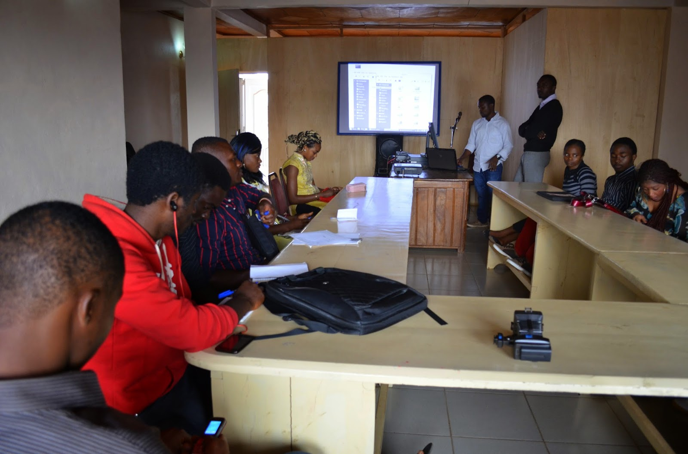

The PSF was delighted to hear recently from the organizers of two Python conferences held in Africa that we had helped sponsor. The first of them, Pycon Cameroon, is the subject of this blog. It was held in December at The Blue Pearl Hotel in the North West Region city of Bamenda. According to organizer Ngangsia Akumbo, the main purpose of this event was to generate awareness among young people, "especially to young girls in Nkwen – Bamenda – Cameroon on the importance of writing code using the python programming language."  Photo credit Ngangsia Akumbo Most of the attendees were brand-new to programming and had never heard of Python. Many of them did not have their own laptops. Although the event lasted for one day, its importance and impact as an early response to great need is huge. Although Cameroon is a nation that provides state-run public education to children, and the literacy rate is a fairly admirable 71%, these achievements are undercut by substantial child labor (over 50% of children work), poverty, and lack of access to health care. In addition, teachers are disproportionately located in the south, leaving northern schools understaffed and those students at an educational disadvantage. See [Wikipedia](http://en.wikipedia.org/wiki/Cameroon). The PSF is proud to have been a part of this early outreach effort and hopes to see a great many more in the future. Thanks so much to the organizers and presenters. We urge our readers to check out these websites to learn more: [PyCon Cameroon](http://pyconcameroon.org/) and for Conference videos, including one of Ngangsia's talk, see [You Tube Cameroon](https://www.youtube.com/watch?v=_Or-fGNJAbg) and [Cameroon video](https://www.youtube.com/watch?v=6zUxEzeb7Tw).
