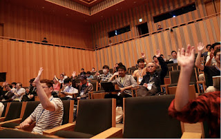

Last month PyCon Japan took place from October 9 - 12th at the Tokyo International Exchange Center Plaza Heisei. The PSF has recently received a report from the Chair, Takanori Suzuki, and it appears that the conference was a great success. As a bit of background, the first PyCon Japan was held in 2011. The conference was a one-day affair with talks comprising three tracks. 247 people attended. Each year since then, PyCon Japan has grown in size and complexity. Last month’s sold-out conference had 602 attendees, with 80 people attending tutorials, and more than 50 staying for a fourth day to participate in Sprints. There were 43 sponsors. Sponsoring at the Diamond level was the Japanese firm [MonotaRo](http://www.monotaro.com/). Other sponsors included PayPal, O'Reilly, CodeIQ, JetBrains, Nikkei, and the Japanese online marketplace, Curama. The PSF was happy to contribute as a Gold level sponsor. There were 32 talks–11 given in English and 21 in Japanese–covering a variety of topics, including Pandas, Data Analysis, Metrics, Grep, Asyncio, Translating code into non-English, Erlang, and more.  
 There were two keynotes–one in English by PSF Fellow, [Hynek Schlawack](https://hynek.me/about/), entitled [*Beyond Grep: Pragmatic Logging and Metrics*](https://speakerdeck.com/hynek/beyond-grep-pycon-jp\)); and one in Japanese by [Haruo Sato](http://b.hatena.ne.jp/nabinno/haruo-sato/), entitled [*Possibilities of Python*](https://www.youtube.com/watch?v=RJH8R9_OL8k\)), which was also the theme of the conference. There was also a panel discussion on Diversity and the Future of the Community. Due to outreach efforts, the Japanese Python community has become more diverse – more women are participating in programming, as was clear from the groups represented on the panel: Moderator, Makabi Love, of [*PyLadies Tokyo*](http://tokyo.pyladies.com/), was joined by representatives from *RailsGirls, Java Women, Django Girls*, and *Women Who Code* in a discussion about how to increase diversity.Rounding out the conference were a poster session, jobs fair, lightning talks, and a children’s workshop. An additional feature of the conference was an official [chat session](https://gitter.im/pyconjp/pyconjp2015-en), set up in both English and Japanese for participants to communicate with each other. Slides and videos from conference talks can be viewed [here](https://pycon.jp/2015/en/reports/slides/), and at [The Possibilities of Python](http://www.slideshare.net/takanory/pycon-jp-2015-closing-speech). For more photos, see [PyCon JP Photo Album](https://www.flickr.com/photos/pyconjp/albums). *I would love to hear from readers. Please send feedback, comments, or blog ideas to me at [msushi@gnosis.cx](mailto:msushi@gnosis.cx).*
