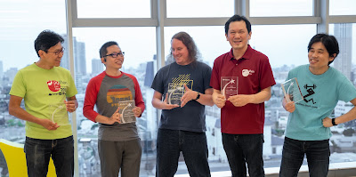

<table align="center" cellpadding="0" cellspacing="0"><tbody><tr><td></td></tr><tr><td>The PyCon JP Association team from left to right. Takayuki, Shunsuke, Jonas, Manabu, Takanori</td></tr></tbody></table>

  

The [PyCon JP Association](https://www.pycon.jp/committee/english.html) team was awarded the 2021 Q4 Community Service Award.

> > RESOLVED, that the Python Software Foundation award the 2021 Q4 Community Service Award to the following members of the PyCon JP Association for their work in organizing local and regional PyCons, the work of monitoring our trademarks, and in particular organizing the "PyCon JP Charity Talks" raising more than $25,000 USD in funds for the PSF: [Manabu Terada](https://twitter.com/terapyon), [Takanori Suzuki](https://twitter.com/takanory), [Takayuki Shimizukawa](https://twitter.com/shimizukawa), [Shunsuke Yoshida](https://twitter.com/koedoyoshida), [Jonas Obrist](https://twitter.com/ojiidotch).

We interviewed Jonas Obrist on behalf of the PyCon JP Association to learn more about their inspiration, their work with the Python community, and supporting the Python Software Foundation - PSF. [Débora Azevedo](https://twitter.com/pydebb) also contributed to this article, by sharing more light on the PyCon JP Association's efforts and commitment to the Python community.

### Jonas Obrist Speaks on the motivation behind the PyCon JP Association

**What inspired the PyCon JP Association team into raising funds to support the PSF?**We were inspired to raise funds after reading an announcement by the PSF about [the impact of the pandemic on the foundation and PyCon US](https://pyfound.blogspot.com/2020/09/the-python-software-foundation-re-opens.html). We could of course empathize with the struggle given that we have a similar situation, even if on a much smaller scale. We tried to think of a good way to help and either [Manabu](https://twitter.com/terapyon) or [Takanori](https://twitter.com/takanory) came up with the idea to host online events with presentations by members of the community with all proceeds going to the PSF. We held two such events so far with over a hundred attendees and even managed to gather some companies and individuals as sponsors. Thanks to the online nature, costs were kept very low and we were able to make a sizeable donation to the PSF, hopefully softening the financial blow of the pandemic a bit. **How do you think other Python communities can support the PSF?** I think other communities have various ways to support the PSF depending on each community's situation. We have the fortune to be well established with great support from the wider community and especially local companies, so we were able to make a [direct financial contribution](https://www.python.org/psf/donations/). Not all communities are this fortunate, but I think there are still other ways to contribute. One such way is simply to boost awareness of the Python programming language in the local developer community. ideally, this would eventually lead to companies adopting Python more widely, which in turn could lead to [direct support to the PSF](https://psfmember.org/civicrm/contribute/transact?reset=1&id=37), either via direct donations or support of [PyCon US](https://us.pycon.org/2022/about/what-is-pycon/) by these companies. Boosting local communities also leads to more Python developers in general, leading to a broader pool of people who could support the PSF in various ways. The most important thing is for each community to think about what they can do, even if it is just a small thing, given that we owe so much to the PSF.

### Débora Azevedo speaks about the impact and significance of the PyCon JP Association

One of the things I am most excited about is seeing the PyCon JP Association team receiving this CSA and realizing that the work being done outside the US-Europe countries is acknowledged. PyCon JP association has risen to the financial challenge that the PSF went through due to the pandemic and has organized [PyCon JP Charity Talks](https://pyconjp.connpass.com/event/218154/). Aiming to increase awareness within the industry about the importance of the PSF is so meaningful. The charity talks were initiatives by the PyCon JP association, and it was a significant effort on their part. Their work is such an outstanding work that shouldn't be overlooked. As part of the wider Python community, it warms my heart to see that there are many amazing people worldwide working so we can have a more sustainable Python community. Seeing local communities contributing to the global community, especially regarding this financial aspect, shows that the community feels the need to have different types of work done and understands the importance and impact of each one of them. And, as part of the Diversity and Inclusion workgroup and understanding the impact of seeing people from non-US-based communities being acknowledged for doing the work, it feels like we are being heard. The PyCon JP association's community work is outstanding and I am so grateful to them and for being in a community that values each contribution to its development and growth. The Python Software Foundation congratulates and celebrates the PyCon JP association team - [Manabu Terada](https://twitter.com/terapyon), [Takanori Suzuki](https://twitter.com/takanory), [Takayuki Shimizukawa](https://twitter.com/shimizukawa), [Shunsuke Yoshida](https://twitter.com/koedoyoshida), [Jonas Obrist](https://twitter.com/ojiidotch). You can learn more about making a [donation to the PSF here](https://www.python.org/psf/donations/).
