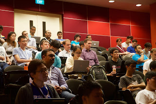

The PSF is happy to report that the third annual PyCon Singapore took place June 17 to 19, 2015. This event, organized by the Python User Group Singapore, is a testament to the robust presence of the Python community in the Asia-Pacific region. In addition to three PyCons Singapore, PUGS has held three PyCons Asia-Pacific. Congratulations to Ivan Zimine and the organizing committee for a successful conference. According to Ivan, “Feedback from the participants was mostly positive. Out of 18 responses, 7 people gave 4 out of 5 stars, and 6 people gave 5 out of 5 stars for the “How did you like PyConSG?” question."  Photo Credit Martin Brochhaus CC 2.0 The PSF contributed to the event as a Silver Level Sponsor, and we were proud that keynote speakers included our own PSF Director Lynn Root and former PSF Director Jessica McKellar. Django core developer Andrew Godwin also gave a keynote. The event was attended by 181 people and was held on the campus of [Singapore Polytechnic](http://www.sp.edu.sg/wps/portal/vp-spws). It consisted of one day of tutorials and two days of talks. Tutorials covered topics such topics as unit testing, data stores, and beginning programming with Python and Django, and were attended by 96 people, of whom 64 were students. Lynn Root’s tutorial, “How to Spy with Python,” explained how the NSA and the UK’s Tempora programs can collect data on citizens' search histories, emails, IRC conversations, PGP usage, etc. As Lynn was clear to point out, however, the talk was not an endorsement of spying or a how-to, but rather a “… way of understanding the current political environment, as well as indirectly understanding how to protect one’s privacy” (see [How to Spy](https://pycon.sg/schedule/presentation/36/)). 127 people (of whom 41 were students) attended the two days of conference talks. Featured speakers included Anand Chitipothu, Kristin Nguyen, Ricky Setyawan, Sacha Goedegebure, Colm O'Connor, and others covering a wide range of topics, including interpreters, data processing, educational games, data processing, machine learning, multicore processing, and film production. A first-time feature of the conference was its edu-summit, which was attended by approximately 40 Computer Science teachers. The summit included a talk by Praveen Patil titled Python in my Physics classroomabout how to incorporate computer science into the science curriculum using ExpEYES, an Open Source Pocket Science Lab ([https://pycon.sg/schedule/presentation/59/](https://pycon.sg/schedule/presentation/59/)). Here are some links and pictures of the event: [PyCon Singapore](https://pycon.sg/), [Blog Post](http://pugs.org.sg/2015-pyconsg-thank-you.html), [Group Photo](https://www.flickr.com/photos/mbrochh/18786975678/), [Welcome](https://www.flickr.com/photos/mbrochh/18915725406/). *I would love to hear from readers. Please send feedback, comments, or blog ideas to me at [msushi@gnosis.cx](mailto:msushi@gnosis.cx).*
