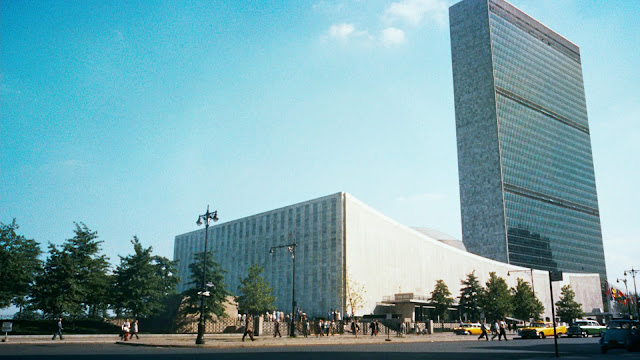
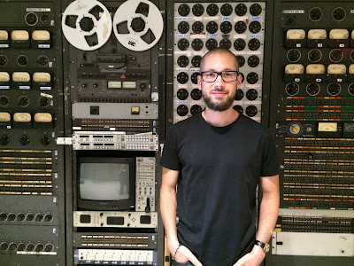

<table align="center" cellpadding="0" cellspacing="0"><tbody><tr><td></td></tr><tr><td><a href="https://commons.wikimedia.org/wiki/File:North_by_Northwest_movie_trailer_screenshot_(13).jpg" target="_blank"><i>United Nations Headquarters</i></a></td></tr></tbody></table>

  
I've never had to take my belt off to get into a Python conference before. This is the fifth year I attended PyGotham, here in New York City. In past years we held the conference in a standard convention center or, memorably, on a couple boats moored in the Hudson River. But this year PyGotham gathered in the United Nations. What first struck me about the new venue was its vigilant security, of course. Guards in blue uniforms sent us through metal detectors and x-rayed our bags. Once I got through security and put my belt on, I entered the UN Conference Building. The lobby is full of inspiring posters about anti-poverty summits, scientific committees, global peace initiatives. In the conference rooms themselves every seat has its own microphone and an earpiece for simultaneous translation. Sound-proof booths surround and overlook each room, with signs in their thick glass windows saying "English", "French", "German". Along a hallway stands old-fashioned gray communications gear. There are rows of plug boards, analog meters, tape-to-tape reels, cathode ray tube screens surrounded by switches, buttons, and dials. I turned my attention from the conference environment to the people there, and I was struck by a second novel impression: demographics! I've come to expect Python conferences to include many women and people of color, but at [PyGotham 2016](https://2016.pygotham.org/) women of color were particularly well-represented, and there were teenage coders and even a few pre-teens. PyGotham is a production of [Big Apple Py](http://bigapplepy.org/). Our spot in the UN is the outcome of a new partnership: PyGotham has joined [Open Camp](http://opencamps.org/about.html), a giant UN-sponsored series of technology conferences that focus on technology's humanitarian uses. I interviewed Big Apple Py's Jon Banafato, and Open Camp coordinator Forest Mars, to learn more about why this PyGotham was so different from the past.

* * *

  
PyGotham started in 2011 as a conference for the New York City Python community. The conference has grown a lot since then. This year, we had over 500 attendees from around the world, but PyGotham still remains a tight-knit community of New Yorkers at heart. The organizing team strives for a diverse speaker list and audience. This year’s conference would not have been the same without the help of the Python Software Foundation, who funded 50 diversity scholarship tickets. A half-dozen community groups helped us get tickets into the right hands: [NYC PyLadies](http://www.meetup.com/NYC-PyLadies/), [Girl Develop It](https://www.girldevelopit.com/), [Django Girls NYC](https://djangogirls.org/nyc/), [Write Speak Code](http://www.writespeakcode.com/), and [Women in Machine Learning and Data Science](http://wimlds.org/). Working with Open Camps and the United Nations this year let us make 2016 the most affordable and largest PyGotham to date. We hope this better accomplishes our goals of promoting open source software and making Python education more accessible to all. — Jon Banafato

* * *

  
Open Camp is a community-organized open source technology conference, which also happens to be one of the largest open source conferences in the world. This year (our 5th) nearly 6,000 individuals attended over the course of 10 days. Open Camps is "mission-driven": we're distinguished from other conferences by our focus on how technology is used, its impact on the world, and its alignment with humanitarian ideals. Rather than proscribe, however, Open Camps provides a forum where these topics can be discussed. At the start we were on the campuses of Columbia University and NYU. For the past three years we've been graciously hosted by the United Nations at their world headquarters in New York. [Open Camps at the UN is a collaboration](http://www.un.org/press/en/2016/pi2160.doc.htm) of the United Nations Open Source Innovation Initiative (Unite Open Source), the Open Camps organizing team and dozens of open-source communities. Open Camps is dedicated to the principles of inclusiveness and diversity, and has always been free for anyone to attend. Our 2013 theme was "Get Off the Island"—we wanted to combat isolationism in communities of technology. Our first year at the UN we chose the theme "Women in Technology" featuring two keynote addresses by influential women in tech, and a panel discussion. Since the beginning, we've included the "Next Generation" initiative for youth in technology. We work with [CSNYC](http://www.csnyc.org/) and [ScriptEd](https://www.scripted.org/). Open Camp speakers have been as young as 11 years old. The Next Gen program is also ongoing, and we have hosted numerous hands-on workshops teaching youth how to use open source technology. Long terms goals for Open Camps include a "tech assembly": we want to bring together thought leaders from around the globe to engage in a broader conversation. We'll discuss consensus-driven tech, and technology transfer of open source tools and best practices between the "technology haves" and the technology "have nots". We care about giving back. Each year we host programs ranging from "Coding for a Cause" to "Hacking for Humanity." Last year we had a ground-breaking event: not just the first Hackathon at the UN, but the first 24 hour hackathon. This year, our Unite For Humanity Hackathon drew 20 teams, again to spend 24 hours building solutions for the UN's 17 Sustainable Development Goals. The winning team will then work with the UN to develop their hackathon project into an application. — Forest Mars

* * *

<table align="center" cellpadding="0" cellspacing="0"><tbody><tr><td></td></tr><tr><td><i>Your correspondent, standing in front of vintage United Nations communications gear.</i></td></tr></tbody></table>
