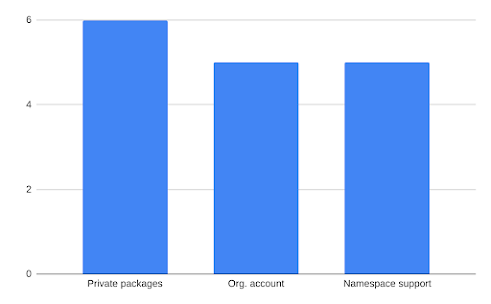
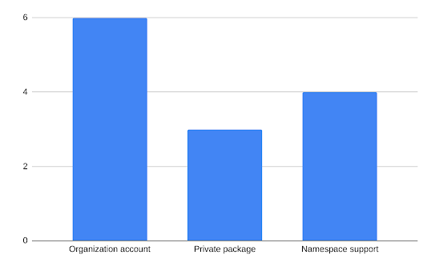
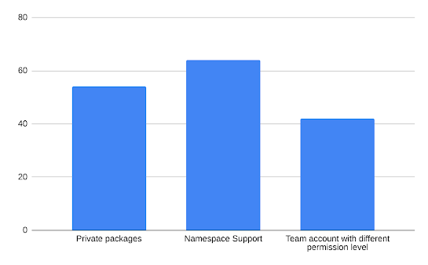

The PSF conducted a series of three surveys to identify key user requirements that have not been addressed so far. We used this round of surveys to engage with the PyPI community and understand ways to support community needs better. This post summarizes the feedback we have received and key decisions we have made based on the feedback.  

## Purpose of the surveys

-   Identify one feature or group of features that would be most useful for users who are part of a corporate or community project
    
-   Identify features that can offered to companies on a subscription basis, and community projects at no cost
    

First Survey

The [first survey](https://docs.google.com/forms/d/e/1FAIpQLScBMtuf6kIQo6OVPmKPgCA3MPFhtrX1UvqrlZA3fAvbvPU7Hg/viewform) was a general survey where PyPI users were invited to submit features they would like PyPI to offer. This survey was targeted at users who used PyPI as a team in their corporate or community project. We also asked permission from survey respondents if we could contact them for more detailed feedback.

Figure 1: Most requested features from the first survey

The first survey received 35 valid responses. Out of this, 12 responses were for community projects. As seen in Figure 1, the most requested feature was private packages. At second place, both organization accounts and namespace support had the same number of requests. Other feature requests are listed [here](https://docs.google.com/spreadsheets/d/1GeG_dORA1j60PqRDO0AELLQIaoUuST9bITuYoX0yffU/edit?usp=sharing).

Second Survey

  

Based on the feedback we received in the first survey, we invited respondents for short interviews. 11 respondents agreed to meet us. At this interview, we asked PyPI users to expand on previously shared feedback. We wanted to know more about problems they faced when using PyPI as a team. We also wanted to know how they used other package managers and which features were most useful in these packaging managers. Of the 11 respondents, 5 respondents represented community projects.

Figure 2: Most requested features in the second survey

As seen in Figure 2, the most requested feature was organization accounts. Other features such as namespace support and private packages were also requested more than once. One common theme that emerged was how useful PyPI is for many teams in different organizations and projects. Other packaging managers such as npm and NuGet were also mentioned to indicate superior features when it comes to managing multiple packages and teams, namespace support and private packages. The minutes of the meetings are available [here](https://docs.google.com/document/d/1RVmVYMTIRK7ce4NlxlgzxOJtYu_FvmGq2wvfi-IfWHc/edit?usp=sharing). The minutes of one meeting cannot be shared publicly.

Third Survey

  

From the second survey, it was clear that features like organization accounts and namespace support would be most useful to users in a team. This team could represent an organization or community project. To confirm this finding, we held another [poll](https://docs.google.com/forms/d/e/1FAIpQLSfuDRH_KucxqHIYWVIMQJS_r6JFGMR0rNWn0KQ4bgMXsTlxhQ/viewform?usp=sf_link) asking users to choose between the three features- organization/team accounts, namespace support and private packages.

Figure 3: Most requested features in the third survey

There were 160 responses from the PyPI community. From Figure 3, it can be seen that namespace support was the most requested feature with 64 requests. There were 42 requests for organization accounts and 54 requests for private packages. Other requested features are listed [here](https://docs.google.com/spreadsheets/d/1GeG_dORA1j60PqRDO0AELLQIaoUuST9bITuYoX0yffU/edit?usp=sharing).

  

We also asked users to share where they got to know about the poll. 81 users saw the poll on Twitter. Another 27 users saw the poll on discuss.python.org and 23 users found the poll in the PSF newsletter. A total of 29 users saw the poll on other outlets such as PyCoder’s weekly, RealPython newsletter, company Slack channel.

  

Key Decisions

  

From the three surveys, it was observed that organizations accounts, namespace support and private packages were the three most important features for users. There were multiple requests for these three features. Based on the feedback we have received so far, we have made these key decisions-

  

-   The PSF will develop organization accounts in the first phase of development. Any feature targeted at organization or community projects will require organization accounts to manage the feature. Hence, it makes sense to develop organization accounts first. This feature will allow organizations to manage multiple users and multiple packages.
    
-   Organizations accounts will be offered on a subscription basis. Private organizations will be charged a fixed amount while community projects will avail this feature free of cost.
    

  

Next Steps

-   Develop the project roadmap for organization account feature. This roadmap will be shared with the community once the Packaging Working Group reviews and approves it.
    
-   Develop and share RfP for organization account feature on PyPI. We will invite developers to build this feature on a contract basis.
    
-   Work with the PyPI community to scope out the namespace support feature. We will invite users to share their feedback to define the requirements, functionalities and behaviour. Once the organization account feature has been developed and delivered, we will develop the namespace support feature.
    
-   Engage with the PyPI community to identify more features that can be offered to organizations and community projects.
    

Thank you for reading this post in its entirety. If you have questions or if you would like to discuss this further, please use this [thread]( https://discuss.python.org/t/pypi-user-feedback-summary/12440). To reach a large part of the community, please RT this [tweet](https://twitter.com/pypi/status/1468994112447819786).
