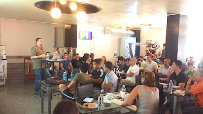
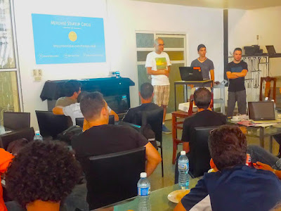

I recently had the amazing opportunity to travel to Havana, Cuba to attend several free software events. My partner, David Mertz, was invited to talk at a meet-up of open-software developers and to present at the [International Conference of Free Software](http://www.cubaconf.org/) sponsored by the [Grupo de Usarios de Technologias Libres](http://gutl.jovenclub.cu/). On my first day in Cuba, I attended the tenth [Encuentro Social de Desarrolladores](http://encuentrodesarrolladores.com/all-esd-events/esd-10). This group, a regular meet-up of open-software developers, just last month held the first "PyDay Havana." At the meeting I attended, approximately 70 people gathered at a local Havana restaurant, La Casa de Potin. I was told that more people were interested in attending, but the space was limited so advance registration was cut off at 70. Several members of the enthusiastic crowd sported PyCon T-shirts--many from PyCon Montreal, perhaps as one could expect, but one from as far back as PyCon Chicago in 2009 (elegance begets simplicity). Clearly, this group has been using Python for quite awhile. I met some wonderful people there: not only Olemis Lang and Medardo Antonio Rodriguez, members of the PSF’s Python-Cuba Work Group with whom I had been in touch previously, but also entrepreneurs and developers who regularly use free software. Justin, a graduate student in Astronomy at Yale, is spending several months in Cuba on a research project using Python. Another new connection I made is Abel Meneses Abad, a Computer Science professor at [Central University of Las Villas in Santa Clara, Cuba.](https://en.wikipedia.org/wiki/University_%22Marta_Abreu%22_of_Las_Villas) He told me about his use of Python with his students in Linguistics and his desire to share his experiences and get input from the larger Python community. We should be hearing more from him in the future. The [agenda](http://encuentrodesarrolladores.com/all-esd-events/esd-10) for the meet-up included talks by Olemis Lang on Brython (and how to sign up for a Brython sprint to be held at the next week’s CubaConf) and by David Mertz on functional programming in Python.

<table align="center" cellpadding="0" cellspacing="0"><tbody><tr><td></td></tr><tr><td>David Mertz talks about functional programming in Python</td></tr></tbody></table>

<table align="center" cellpadding="0" cellspacing="0"><tbody><tr><td></td></tr><tr><td>Medardo and Stripe Atlas reps address the meet-up</td></tr></tbody></table>

But the talk that garnered the most discussion was a presentation given by Medardo Rodriguez from [Merchise Start-Ups](http://www.meetup.com/merchise/) on how to start an online business. He was joined by representatives from the San Francisco-based company [Stripe](https://stripe.com/), which provides payment processing and business services for start-ups. Their newly launched service, [Stripe Atlas](https://stripe.com/atlas/faq), helps foreign online businesses incorporate in Delaware, MD, enabling them to take advantage of the well-developed business infrastructure in the U.S. The overall mood of the meet-up was incredibly optimistic–surely a foreshadowing of the positive changes about to take place for Cuban software developers as more intercourse develops with the rest of the world and especially with the U.S. This is a community poised to grow, and I am beyond thrilled that the PSF will be a part of this. *I would love to hear from readers. Please send feedback, comments, or blog ideas to me at [msushi@gnosis.cx](mailto:msushi@gnosis.cx).*
