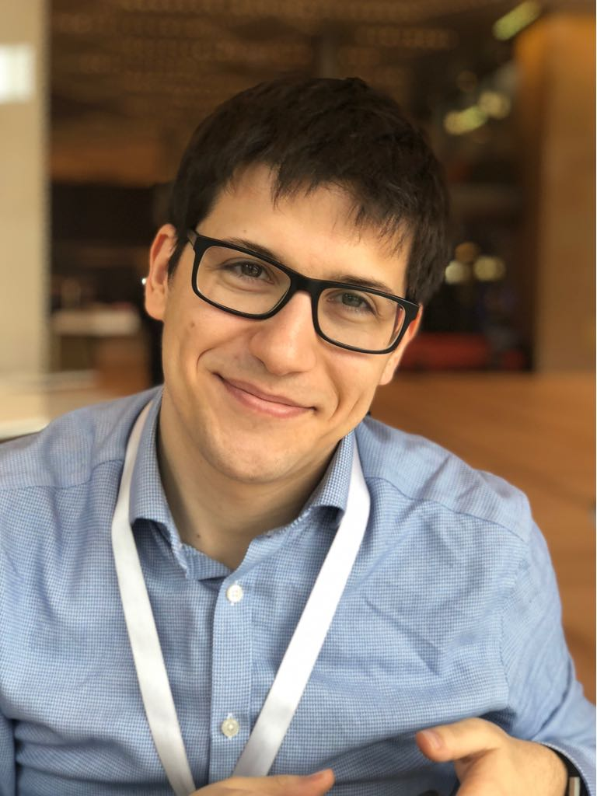
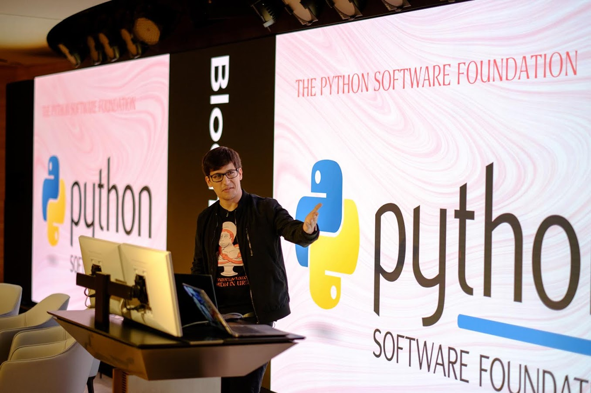
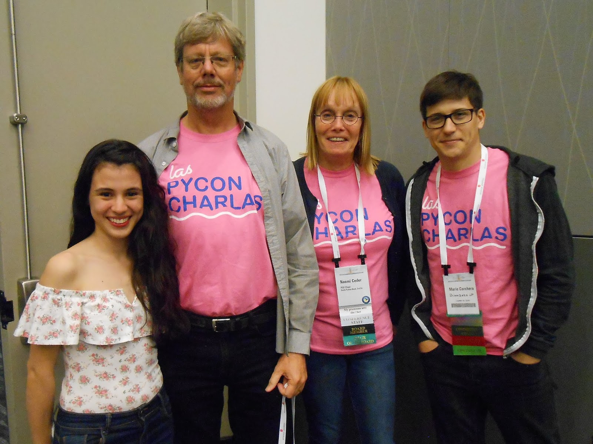

The PSF community service awards go to those individuals whose work and commitment complement and strengthen the PSF mission: to support and facilitate the growth of a diverse global Python community. So when thinking about individuals that go above and beyond to support the global community [Mario Corchero](https://twitter.com/mariocj89) is a name that comes easily to mind.  
Not only is Mario a Senior Software Engineer for Bloomberg but he also devotes incredible amounts of his time to organise [PyCon ES (Spain](https://twitter.com/pycones)), [PyLondinium](https://twitter.com/pylondinium), and more recently, the Spanish speaking track of PyCon: [Las Pycon Charlas](https://twitter.com/pyconcharlas). Mario is the true embodiment of the Python community spirit and for this reason, the Python Software Foundation has awarded Mario Corchero with the Q3 2018 Community Service Award. **RESOLVED, that the Python Software Foundation award the Q3 2018 Community Service Award to Mario Corchero for helping organize PyLondinium, the PyCon Charlas track, and PyCon Spain.** 

### Mario's contributions to the Python Community

  

#### PyConES

  
With the growing popularity and global adoption of Python there also comes the need to bring together diverse community groups. Although large events such as PyCon US are incredibly important in bringing these groups together, these are not always accessible to the whole community. Smaller, localized events such as Python ES, France, Namibia, Colombia, and many many others help with the goal of bringing cohesion to the global community. According to [David Naranjo](https://www.linkedin.com/in/davidnaranjob/) (co-organiser of PyConES), PyConES was the first event of this kind that he and Mario attended together. They loved it so much that while at PyConES16 they decided to submit an application to organise and bring this event to their region: Extremadura. On top of the many challenges that come with organising an event of this type (i.e. drafting the programme, getting talks accepted, running the event on the day), they have faced an additional layer of complexity: neither of them lives in the region anymore. This has made the organisation of PyConES a true community effort: from the organising committee to the sponsors and the volunteers that work together to make this a huge success. PyConEs is now a staple Python event in Europe with more than 600 attendees every year, and it owes its success in a great deal to Mario’s efforts.

#### PyLondinium

  
A year after organising his first PyConES, Mario embarked on yet another journey: the organisation of [PyLondinium](https://pylondinium.org/). An event focused on showcasing the many use cases of Python as opposed to other events such as the PyData events.  
PyLondinium is not only focused on bringing together the Python community but also to raise money for the PSF and its programmes around the world. In this particular case, Bloomberg, a long-time Python supporter, has played an important role in the success of the event. Not only do they host the event at their Europe headquarters in the heart of London but they also help to cover some of the costs as the main event sponsor, keeping the ticket prices at an affordable level.

<table align="center" cellpadding="0" cellspacing="0"><tbody><tr><td></td></tr><tr><td><a href="https://photos.google.com/share/AF1QipMemcP07dGKnXgeCQf9J4xiPC_rbKImGoZj9Beemxsx3BJJOmO2fhXmHn2HQhNtsA/photo/AF1QipNujEEYIGg0jR7wJNlWtuOM9l0zMVfC5PPyQ5y3?key=d1lkVHV5MTg0SlNuM1RDQ2tVMXRrM0FHZmZrd3d3">Pylondinium 2018</a></td></tr></tbody></table>

  

#### Accessibility for the wider community

As a passionate community builder, from a non-English speaking country, localization and accessibility of the Python language is something that matters to Mario. Most of the coding resources out in the world are written in English, which can be a barrier to those whose primary language is not English or simply do not speak the language at all. That is why when he was presented with the opportunity to chair the Spanish track of PyCon US 2017 ([Las PyCon Charlas](https://twitter.com/pyconcharlas)) he did so wholeheartedly, embarking into yet another community journey alongside PSF Director Naomi Ceder. Again, like his other endeavours, Las Charlas was an absolute success. It gathered people from all over from Latin America and Spain for a full day of talks in Spanish on such topics as machine learning, astronomy and security. In fact, it was such a success that the Charlas is back this coming year and the organisers are already receiving talks submissions (for more details visit [https://us.pycon.org/2019/speaking/](https://us.pycon.org/2019/speaking/)).

<table align="center" cellpadding="0" cellspacing="0"><tbody><tr><td></td></tr><tr><td>PyCon Charlas 2018   </td></tr></tbody></table>

When asked why he organises all of these events, his answer is rather simple and honest. It is usually driven by a ‘how come no one is doing this yet?’" says Mario. But when digging deeper it becomes evident that Mario’s motivations lie in bringing the community together and nurturing it. Mario is extremely dedicated to the community and helping others to get involved. From creating Spanish tracks for PyCon USA or creating events serving specific areas or regions, Mario is constantly finding ways to bring Pythonistas together.
