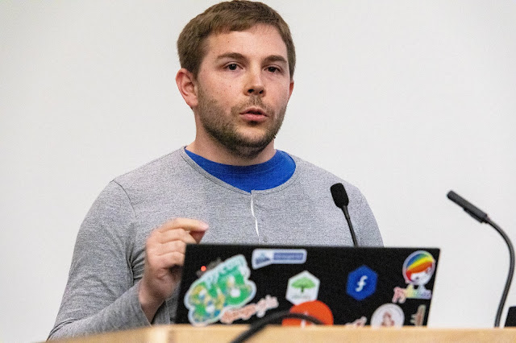
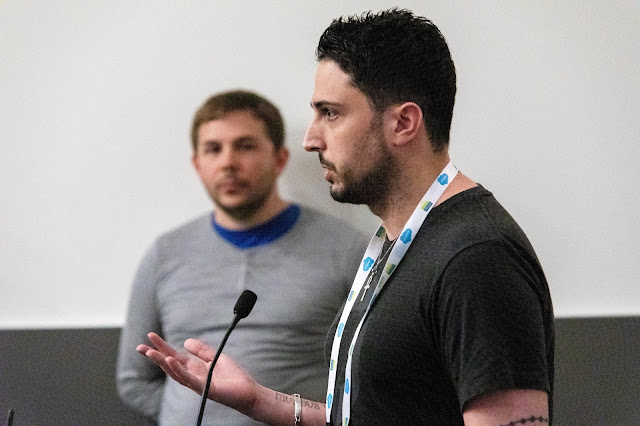
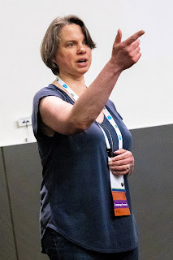

  
Core developer Victor Stinner described to the Language Summit his method of mentoring potential new core developers. His former apprentices Pablo Galindo Salgado and Cheryl Sabella, who have both been promoted to core developer in the last year, recounted their experiences of the mentorship program. **[Read more 2019 Python Language Summit coverage](https://pyfound.blogspot.com/2019/05/the-2019-python-language-summit.html).**  
  

# Barriers To Entry

  
Python needs more core developers now, according to Stinner, to spread the burden of maintaining the code and reviewing contributions. Regular contributors can be promoted to the core team, but this process can take up to five years and few contributors stay engaged for long enough, because contributing to the Python project is discouraging. Contributors’ main frustration is that pull requests can languish for months or years without a review, so they give up and seek a responsive project instead. Python is caught in a Catch-22, where the core team’s understaffing makes the project unwelcoming to potential recruits, which means the team stays understaffed. But there are other hurdles for contributors: The code base is 30 years old, with some dusty corners and complex parts, and it supports a wild variety of platforms. Python’s popularity can also be a barrier; it is frightening to modify code used by millions of people.

# The Fast Path To The Core Team

  
Stinner described how core developers can overcome the Catch-22 by personally mentoring prospective teammates, as he does. He identifies promising coders who contribute frequently, and contacts them to offer mentorship. Stinner said that a mentor must follow the apprentice’s progress closely over a period of many months, at least. Not all worthwhile effort results in a Git commit: an apprentice must spend time learning the workflow, the codebase, and so on. With close attention, a mentor will know that the apprentice is making progress even during quiet periods. Once an apprentice submits a pull request, the mentor’s job is to provide a prompt, thorough review, or recruit the appropriate expert to do so. Stinner admitted that it is difficult to prioritize among the many items on his to-do list, so he dedicates time on his schedule for mentoring to ensure he is available for his apprentice. It is particularly important to ask regularly, "What are you doing? Are you stuck? Do you need some help?" The main goal of the mentorship is to keep the apprentice motivated to contribute to Python. Compared to the usual contributor’s experience of submitting a patch and getting no response for months, an apprentice with a committed mentor will have reliable feedback and encouragement. If the mentor and apprentice stay engaged for long enough, the apprentice can earn the mentor’s trust and be nominated for promotion to the core team. In Stinner’s view, mentorship must happen in private, so the apprentice can be comfortable asking “dumb” questions. The mentorship should also be secret, at least at the beginning. Core developer Ned Deily commented that it would be helpful to know who is being mentored so he could prioritize reviewing their patches and answering their questions. But Stinner said he does not announce when he begins mentoring someone, to avoid pressure. “It can be very scary to see many people looking at your work.” Mentors should provide a series of rewards for apprentices to earn. Stinner said that he initially considered gamifying the mentorship process with badges, but rejected this idea. Instead, contributors are rewarded with ever greater responsibilities. Bug triage is a good first responsibility, since the cost of mistakes is trivial: a bug closed in error can be reopened, a mislabelled bug can be labelled correctly. In Stinner’s experience, apprentices are eager to gain more responsibility and they take each new task seriously. “They understand what it means and they do their best not to make mistakes.” Stinner invited two recently promoted core developers to describe their experience as apprentices.

# Pablo Galindo Salgado

  
  
Pablo Galindo Salgado was promoted to core developer in June 2018. He told the Language Summit that one of a mentor’s most important roles is as a source of tribal knowledge. Many tasks as a core developer require knowledge of undocumented behaviors, or the historical context for a piece of code, or who is the current expert about a certain aspect of Python. Apprentices have an advantage over other contributors because they have someone to ask these questions. According to Galindo, there must be a moment in the mentorship where the core developer encourages the apprentice to embrace failure. “I committed some mistakes in the beginning,” he said. “When you don't have context, you think you broke the world.” Victor Stinner and Yury Selivanov explained gently that everyone is human, and shared stories about their own past mistakes.

# Cheryl Sabella

  
Cheryl Sabella became a core developer in February 2019. When she began working on CPython two years earlier, it was the first open source project she had contributed to. “So I knew nothing,” she told the Language Summit. Fortunately, she said, the community supported her as she learned git, the Python development workflow, and the codebase itself. Her first pull request was a documentation change. When Mariatta Wijaya approved it and commented with the “Ta-da” emoji, says Sabella, “I was over the moon.” Sabella contributed for some time, especially to IDLE, and one day Stinner wrote to say that he’d granted her bug triage authority. As she recounted to the Language Summit, this new power made her nervous; she would never have asked for it. The next year, when Stinner invited her to become a core developer, she hesitated for so long that Stinner eventually told her, "Okay, I'm not going to bother you anymore about this." Then he invited her again in January 2019, saying, "Well, I told you I wasn't going to but I'm bothering you again." Sabella said she had not begun the mentorship program with the intent of becoming a core developer, she only wanted to contribute. It was the core team’s regular guidance and cheerleading that motivated her to join.

# Victor Stinner

  
Victor Stinner returned to the podium to share his insights as a mentor. He said mentors should choose apprentices who represent not only diverse nationalities and genders, but also diverse skill levels. The core team spends much of their time reviewing contributors’ pull requests, and they need a variety of skills and personalities to review them all: some patches are documentation, some are in Python or C, some require specialized knowledge, some are just very tedious. Stinner said that mentors should accept a range of outcomes. “It's not a failure if, at the end of some mentoring, the mentoree doesn't become a core developer.” Mentorships are often interrupted by professional duties or events in either participant’s life, or the mentor and apprentice turn out to be a poor match. There is value from the relationship nevertheless. The apprentice becomes a better Python contributor and a better programmer. The mentor learns, by observing the apprentice’s difficulties, about barriers to entry on the Python project, such as gaps in the documentation or tooling. Mentoring is a small burden, Stinner told the Language Summit. Apprentices are only available one day a week, typically, because Python competes with a regular job or university program, thus they can only consume a few hours of the mentor’s time. The mentorship program is efficient and effective: In the previous twelve months, five apprentices have been promoted to core developer. Stinner told the Language Summit, “I think everybody in this room can do more mentoring.”
