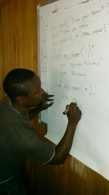

It is always a pleasure to report on the success of PSF funded projects. Recently we’ve heard from Ngangsi Richard about the Python Cameroon initiative. As you may recall, last March the PSF sponsored a one-day workshop in Bamenda, [PyCon Cameroon](http://pyfound.blogspot.com/2015/03/pycon-cameroon.html), for the purpose of exposing women and girls to the power of Python programming. This latest project further extends programming accessibility to those previously denied the opportunity. Python Cameroon was a month-long intensive course offered in August, free of charge, to beginners, and largely funded by the PSF. According to Ngangsi, Program Coordinator and Instructor, there were 18 students in this first session: three men and fifteen women. An additional ten people could not be accommodated. All were total beginners. As Ngangsi describes them,

> Most of them had no idea about programming. Most of them have never been taught anywhere how to write programs. Some of them were not even familiar with a computer.

Because of this lack of basic computer skills, Ngangsi had to adapt the course to allow students enough time to absorb and practice what they were learning. By the second week, he had settled on a schedule that allotted two days to introducing new material in lectures, two days for the students to practice the exercises, and an extra day for questions and review.

<table cellpadding="0" cellspacing="0"><tbody><tr><td></td></tr><tr><td>Ngangsi at the board Photo credit: Ngangsi Richard</td></tr></tbody></table>

Additional challenges that had to be contended with included frequent power outages, a too-small classroom that was shared with other groups (resulting in some loss of property), and a shortage of computers and even chairs. Since there was one computer for every two students, the time needed for exercises and practice was also increased. Ngangsi, as the only instructor, bore the entire burden of preparation and teaching. Those of us who are or who have been teachers know how exhausting full days in the classroom can be. But, amazingly, given the obstacles, the students succeeded in learning. Ngangsi taught them many standard introductory topics (including data-types, statements, lists, tuples, variables, and expressions). Of course, some concepts, like functions, proved challenging; still, the students persevered and made it through to the complexities of dictionaries, recursion, classes, modules, and exceptions.

> After the first day of lecture, I saw some improvement. Most of them started figuring how to do some of the basic stuff like writing very simple programs with the Python interpreter.

By the end of the month there were some real successes, including two women Ngangsi mentioned who were writing more complex programs and planning to continue to learn more.

<table cellpadding="0" cellspacing="0"><tbody><tr><td></td></tr><tr><td>Some of the students Photo credit: Ngangsi Richard </td></tr></tbody></table>

  
Ngangsi recently expressed his thanks to the PSF for funding this instruction so that it can be offered to the students free of charge. This fact has surprised and excited the students and has generated a great deal of interest.

> Just this week I had another six girls who heard about the program and they came to find out. They were excited about joining, but I had to tell them to wait since we don’t have enough space and resources.

He also reconfirmed his commitment and shared his plans to continue and expand this work.

> My vision for this program is to be able to start a new community of women developers from Central Africa using the Python programming language… . With the amount of interest we have already about this course, we should be able to educate 300 girls in two years and possibly even more with Python programming and computer science.

You can see some videos to learn more about this project at: [https://youtu.be/Y4uz5YgTirU](https://youtu.be/Y4uz5YgTirU) [https://youtu.be/XNsmd9Sfsug](https://youtu.be/XNsmd9Sfsug) [https://youtu.be/zdaSGqdYZsg](https://youtu.be/zdaSGqdYZsg) And I’m sure that I speak for the entire PSF in sending a big 'congratulations' and 'thank you' to Ngangsi, his students, and everyone involved with this worthwhile project! *I would love to hear from readers. Please send feedback, comments, or blog ideas to me at [msushi@gnosis.cx](mailto:msushi@gnosis.cx).*
