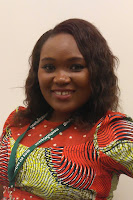
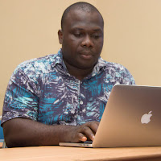

## **Python in Nigeria**

  
In 2015, the PSF sponsored the first Python event in Nigeria - the Codesses Workshop in Lagos. In 2016, the number of events increased to 13, and there have been 28 events funded so far in 2017! What has happened in the last 2 ½ years to create such a demand for learning Python in this part of the world?  

<table cellpadding="0" cellspacing="0"><tbody><tr><td></td></tr><tr><td>Aisha Bello</td></tr></tbody></table>

I spoke with Aisha Bello about this. She serves as vice-chair for the Python Nigeria community. She has helped co-organize and support a number of Django Girls workshops in Namibia and Nigeria, and also co-organizes PyLadies Nigeria. Aisha is enthusiastic about the Python community, with a strong desire and passion for social change, women’s tech education and empowerment in Africa. She currently works as an Associate Systems Engineer for Cisco Systems.

<table cellpadding="0" cellspacing="0"><tbody><tr><td> </td></tr><tr><td>Chukwudi Nwachukwu</td></tr></tbody></table>

Sharing his thoughts as well, is Chukwudi Nwachukwu, PSF Board Director, and Team Lead Integrations, TechAdvance. He is also a volunteer member of the PSF Grants Work Group, helping to review requests from Africa and all over the world. He has also been invited to speak at PyCon NG in September. When I asked why he’s passionate about Python, he said, “Python is easy on the brain and I thank Guido \[van Rossum\]for such a concept.”

**Python + Community**  

<table cellpadding="0" cellspacing="0"><tbody><tr><td></td></tr><tr><td>Smart Girls Project</td></tr></tbody></table>

According to Aisha, Python is popular in Nigeria because it’s one of the easiest ways to learn programming. Knowing how to code opens up many career options. The advantages of open source software are becoming more well-known in this region, and have allowed the community to grow because they’re not tied to any one vendor. She notes: “What we have is community. It means a lot to people that there is a common place or forum where they’re not afraid to share their struggles and ideas with people with like minds. We took the Python language and community and made it our own.”  
  

<table cellpadding="0" cellspacing="0"><tbody><tr><td></td></tr><tr><td>Django Girls Lagos</td></tr></tbody></table>

Chukwudi believes that “the recent urge for more women to be in the workforce of Nigeria through IT has been a huge factor in the growth of Python programming. The Federal Government of Nigeria has also keyed into this drive by choosing Flask as a framework of choice to be taught in their Npower programme.” In addition, Django Girls events nationwide, startup companies incorporating Python as part of their stack, and IT companies training people to code in Python, have all made Python a leading programming language in Nigeria.

  
**Funding for Events**  
  

Aisha and Chukwudi agree that getting funding for events in Nigeria is challenging. Often, it’s startups that come forward to help sponsor events. Aisha believes that “By creating more awareness and putting ourselves more out there, we’re hopeful things will change. Organizations like Github, the PSF, and the Django Software Foundation believe in us, and sponsor our events even when no one else will.”  

Fortunately, the Django Girls Foundation offers help through their [Organizer’s Manual](https://organize.djangogirls.org/) and a template for how to run a workshop: the [Coaching Manual](https://coach.djangogirls.org/). These documents provide a framework to help groups get started. Having a professional-looking proposal goes a long way toward convincing organizations to support these events.  

**Positive Outcomes**  

Many of the participants of these workshops have gone into IT careers, received internships, become mentors, organized workshops, and are actively involved in helping out the community. Outreach to girls in primary and high schools is working too. Girls are learning to program in Python, and most importantly, they’re learning how to use the tools to continue in their journey toward a career.  

One very real example is what [Abocoders](http://abocoders.org.ng/) did in collaboration with DjangoGirls in Lagos. Girls who had been displaced from their homes due to Bokoharam in the North were able to learn about computers and programming. In addition, they each got a refurbished computer to use during and after the workshop.  

#GirlCodersRock came out of one of the events. An attendee of a Django Girls event in Nigeria is now an intern at TechAdvance, where Chukwudi works. She’s now coding Python full time. There are many Python-related jobs being advertised right now in Nigeria - Google Nigeria and Upperlink are hiring, and Alljobs.ng has 40+ listings. It looks like the trend will continue.  

Chukwudi has seen a large increase in members both on slack channels and mailing lists. The community is very excited about the first PyCon Nigeria, September 15-16, 2017, in Lagos. It’s the largest gathering for the Python community in Nigeria, and is organised by members of the Python Users Nigeria Group, a nonprofit organisation dedicated to advancing and promoting the use of the Python programming language in the country.  

<table align="center" cellpadding="0" cellspacing="0"><tbody><tr><td></td></tr><tr><td>Django Girls Lagos</td></tr></tbody></table>

Chukwudi suggested that I speak with a woman he mentors, Hamdalah Adetunji, about her road to a career in programming. She explained: “It is all a step towards growth and progress, but I hope one day in the near future, I get to do more than wish I wasn't the only female on the team. I hope to mentor women to give back the amazing support I have received all through my journey, and also let them know they can be anything they want to be as long as they are focused and determined."
