[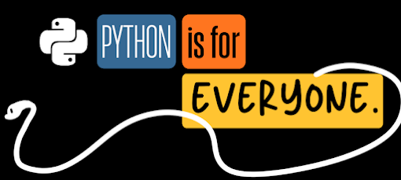](https://blogger.googleusercontent.com/img/a/AVvXsEjkhgqUDZF7BIsaWJIMrfgV07w_awVOFJdKoIwf2gcrjinWZidBj0W4qNvYDyskySUTJzqGXYkH8gRDhVcyIWzBhJWicGPXxNQg_6NJMzi7QnSUtEF8Z8ZEjUW7uAk2sMChj8wXro1BWmEvMtqJJSqSPuWIZfQU24JroQwb_ng56s0zw_Vr2Q) We are living in a moment where diversity and inclusion work is being actively undermined. From policy changes to corporate rollbacks, the gains we’ve fought for are being questioned and dismantled. Having lived in different countries and been part of many diverse communities, I’ve seen firsthand what happens when people feel excluded from spaces they want to be part of. As the chair of the Python Software Foundation’s Diversity & Inclusion Work Group for the past two years, I want to share what we’ve been doing, why it matters, and the incredible people making it happen. When I took on this role, I realized how much work the workgroup has already invested in that nobody knew about. This article is a reflection on our journey, the challenges we face, and where we’re heading. I want to share our story because I believe it matters.

### Why This Matters

You might be asking yourself: Why invest so much energy in diversity and inclusion work, especially now when it’s being questioned and de-prioritized?

But we all know the truth: barriers exist everywhere. A meetup announcement only in English. Documentation that assumes reliable internet. Examples that reference things unfamiliar to most of the world. Code of conduct violations without clear guidance for organizers. Communities wanting to start but not knowing where to begin.

Because the Python community is global, and it should feel that way. When someone discovers Python in Nigeria, Brazil, India, or anywhere else in the world, they should see a community that welcomes them. They should find resources in their language, examples that reflect their context, and people who understand their challenges.

Diversity isn’t just about representation. It’s about making Python better. More approachable. More accessible. Different perspectives lead to better solutions, more creative problem-solving, and software that works for more people. When we only hear from one type of voice, we miss opportunities to improve.

Right now, when diversity and inclusion efforts are being rolled back in many places, it’s tempting to stay quiet. But that’s exactly why we need to speak up about the work we’re doing. The Python Software Foundation made a commitment: to support a diverse and international community of Python programmers. The D&I Work Group exists to make that commitment real, tangible, and actionable.

* * *

### How The Diversity and Inclusion Workgroup Started

The PSF Board created the Diversity & Inclusion Work Group in 2020 with a clear purpose: to amplify the Python Software Foundation’s mission of supporting a diverse and international community. It was a good idea. People wanted to join.

Members came from different regions around the world, excited to be part of the group and looking forward to creating an impact because all of us, in one way or another, felt something was missing: the need to amplify and embrace diversity through more inclusion.

Most discussions related to diversity and how we could spread awareness. The chats on our Slack channel were active with people sharing different opinions and resources.

### PyConUS D&I Panel Discussions

We held interesting annual D&I panels where we discussed important topics which are often set aside. In 2022 and 2023 at PyCon US, we spoke about the lack of representation on the board, why the board lacked global representation, the lack of representation from core developers in other parts of the world apart from the US and Europe despite the huge representation of Pythonistas around the world, and how people could contribute to changing that representation.

PyConUS 2022 D&I Panel Discussion

<iframe src="https://www.youtube.com/embed/WcbnJA2ah6U" width="560" height="315" frameborder="0" allowfullscreen style="max-width:100%;"></iframe>

Participating D&I Workgroup members: [Georgi Ker](https://georgiker.com/), [Reuven Lerner](https://lerner.co.il/), [Anthony Shaw](https://tonybaloney.github.io/), [Lorena Mesa](https://lorenamesa.com/)

#### PyConUS 2023 D&I Panel Discussion

<iframe src="https://www.youtube.com/embed/RkvCK4fDSnQ" width="560" height="315" frameborder="0" allowfullscreen style="max-width:100%;"></iframe>

Participating D&I Workgroup members: [Marlene Mhangami](https://marlenemhangami.com/), [Débora Azevedo](https://deboraazevedo.github.io/), [Iqbal Abdullah](https://iqbalabdullah.net/), [Georgi Ker](https://georgiker.com/)

PyConUS 2024 D&I Panel Discussion

<iframe src="https://www.youtube.com/embed/WGJu1LggIms" width="560" height="315" frameborder="0" allowfullscreen style="max-width:100%;"></iframe>

In 2024, we invited different Python community leaders: [Abigail Mesrenyame Dogbe](https://github.com/mesrenyamedogbe/), [Dima Dinama](https://dinama.id/),[Jules Juliano Barros Lima](https://bento.me/julesbrlm/), [Jessica Greene](https://github.com/sleepypioneer/), and [Mason Egger](https://github.com/sleepypioneer/), who shared about their work, their involvement, and their challenges as community leaders.

Participating D&I Workgroup members: [Débora Azevedo](https://deboraazevedo.github.io/), [Georgi Ker](https://georgiker.com/)

  

PyConUS 2025 D&I Panel Discussion

<iframe src="https://www.youtube.com/embed/SQAX4P59u8w" width="560" height="315" frameborder="0" allowfullscreen style="max-width:100%;"></iframe>

In 2025, due to political changes happening around the world, we invited [Cristián Maureira-Fredes](https://maureira.dev/), [Jay Miller](https://kjaymiller.com/), and [Naomi Ceder](https://www.naomiceder.tech/) to the D&I Workgroup panel to talk about “The Work Still Matters: Inclusion, Access, and Community in 2025.”

Participating D&I Workgroup members: [Alla Barbalat](https://allabarbalat.com/), [Keanya Phelps](https://www.linkedin.com/in/keanyaphelps/)

  

The panels were great. The discussions in our workgroup were great. But something was still not going right.

* * *

### Building a Global Work Group

In 2024, when I took on the role of chair, the D&I Work Group was at a crossroads. The PSF Board had created it to amplify the Foundation’s mission, and there was genuine interest from the community, but without a clear direction or structure, momentum had faded. People wanted to join, but they didn’t know what the group would actually *do*.

I knew we needed two things: a clear purpose and genuine diversity in our membership. Not just diversity as an abstract goal, but real representation from the regions where Python communities were thriving.

I started by doing research that I could share with the rest of the workgroup members. I went through the Python.org calendar, cataloging events and projects happening around the world. What I found was that Python communities were active everywhere (as expected), but they weren’t really represented in our Work Group’s leadership. I identified regional gaps and proposed a structure that would ensure fair representation: North America, South America, Africa, Asia, Oceania, the Middle East, and Europe.

The current representation as of October 2024 across regions is as follows:

-   North America: 3
-   South America: 3
-   Asia: 3
-   Europe: 3
-   Africa: 3
-   Oceania: 1
-   Middle East: 2

It is important to note that each member has the freedom to choose which region they represent. As a D&I Workgroup, we do not dictate regional representation. This decision is entirely up to the individual, ensuring that members represent the region where they feel most connected or comfortable. We also shared which countries would be represented in which region to be explicit for interested parties.

We launched a public outreach campaign to the community. People applied, and the group voted to bring in new members. For the first time, we had a WorkGroup that truly reflected the global Python community.

But diverse perspectives meant many different ideas. In two workshop sessions, we listed every initiative people wanted to pursue, grouped them by theme, discussed priorities, and filtered down to three focused initiatives we could realistically accomplish with volunteer time and resources.

### These three initiatives are:

1.  Concentrate on Outreach to Communities - Creating resources and templates to help communities improve their D&I efforts
2.  How to Setup a Local Python Community - A comprehensive guide for organizers starting new user groups
3.  Continue Collecting Survey Feedback from the Python Community - Gathering data to understand where we need to focus

The three initiatives we’re working on aren’t abstract goals. They’re about giving people the tools and support they need to build inclusive communities where they are. And of course, there are many other things we would like to work on. But filtering down to what we can concentrate on right now will give us better results, and we will continue to move on and work on the others as we progress.

We meet twice monthly across different time zones. We noticed that monthly meetings aren’t frequent enough, coordination is challenging, and volunteer time is limited. But we’re learning and adapting.

This wasn’t just about having good ideas. It was about creating a sustainable framework where a volunteer group could actually make progress.

* * *

### Meet the Members of the Workgroup

The heart of the D&I Work Group is the people who show up, month after month, to do this work. They come from different regions, different backgrounds, and different parts of the Python ecosystem. We have 19 active members representing all regions and a PSF staff member included.

#### Welcoming New Members

We’re excited to welcome our five new members: [Kalyan Prasad,](https://www.linkedin.com/in/itskpflow/) representing Asia, [Julio Batista Silva](https://juliobs.com/) representing Europe, [Abhijeet Mote](https://www.linkedin.com/in/abhijeet-mote/) representing North America, [Theresa Seyram Agbenyegah](https://seyramtheresa.medium.com/) and [Emmanuel Ugwu](https://www.linkedin.com/in/emmanuel-ugwu-b58b80223) representing Africa. They will bring fresh perspectives and energy to our work.

#### Thanking our Former Members

We also want to acknowledge and thank our former members who have contributed to the D&I Work Group: [Miguel Johnson](https://github.com/guel-codes), [Marlene Mhangami](https://marlenemhangami.com/) , [Tereza Iofciu](hhttps://www.terezaiofciu.com/), [Iqbal Abdullah](https://iqbalabdullah.net/),Cynthia Xin, Mariam Haji and Boluwaji Akinlade. Their dedication helped shape what this group has become, and we’re grateful for everything they contributed.

Our current members:

#### South America (3 members)

|  |  |  |
| --- | --- | --- |
| 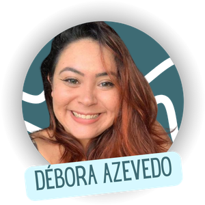 | 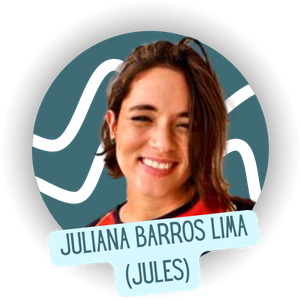 | 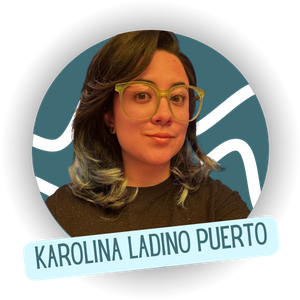 |

-   [Débora Azevedo](https://github.com/deboraazevedo)
-   [Juliana Barros Lima (Jules)](https://bento.me/julesbrlm)
-   [Karolina Ladino Puerto](https://www.linkedin.com/in/karobotco/)

#### North America (4 members)

|  |  |  |  |
| --- | --- | --- | --- |
| 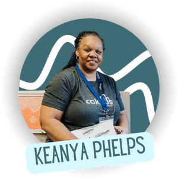 | 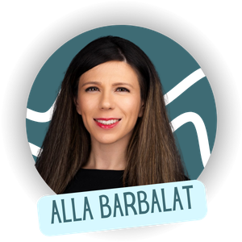 | 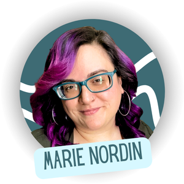 | 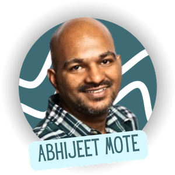 |

-   [Keanya Phelps](https://www.linkedin.com/in/keanyaphelps/)
-   [Alla Barbalat](https://allabarbalat.com/)
-   [Marie Nordin - PSF Staff](https://www.linkedin.com/in/mariecnordin/)
-   [Abhijeet Mote - New member!](https://www.linkedin.com/in/abhijeet-mote/)

#### Asia (3 members)

|  |  |  |
| --- | --- | --- |
|  | 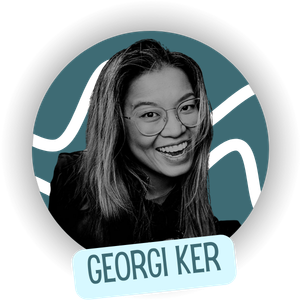 | 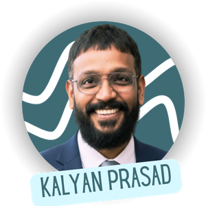 |

-   [Sayantika Banik](https://github.com/sayantikabanik)
-   [Georgi Ker](https://georgiker.com/)
-   [Kalyan Prasad - New member!](https://www.linkedin.com/in/itskpflow/)

#### Europe (3 members)

|  |  |  |
| --- | --- | --- |
|  | 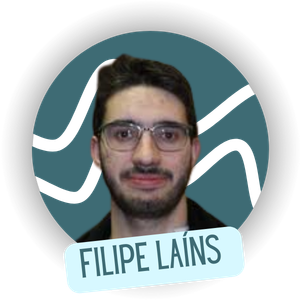 | 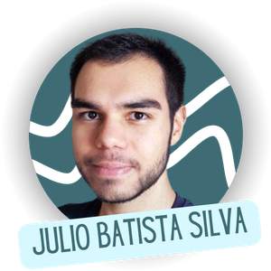 |

-   [Jimena Escobar Bermúdez](https://www.getmanfred.com/perfil/jimena)
-   [Filipe Laíns](https://ffy00.github.io/)
-   [Julio Batista Silva - New member!](https://juliobs.com/)

#### Middle East (2 members)

|  |  |
| --- | --- |
| 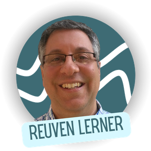 | 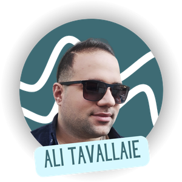 |

-   [Reuven Lerner](https://lerner.co.il/)
-   [Ali Tavallaie](https://github.com/tavallaie)

#### Africa (3 member)

|  |  |  |
| --- | --- | --- |
| 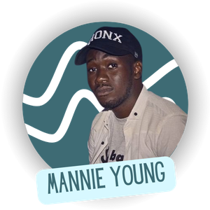 | 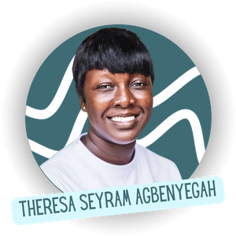 | 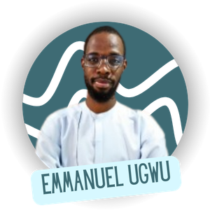 |

-   [Mannie Young](https://www.mannieyoung.com/)
-   [Theresa Seyram Agbenyegah - New member!](https://seyramtheresa.medium.com/)
-   [Emmanuel Ugwu - New member!](https://www.linkedin.com/in/emmanuel-ugwu-b58b80223)

#### Oceania (1 members)

|  |  |  |
| --- | --- | --- |
| 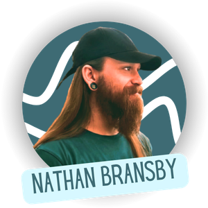 |  |  |

-   [Nathan Bransby](https://github.com/Nathan-Bransby-NMT)

####   

#### PSF Staff Member

We also have [Marie Nordin - PSF Staff](https://www.linkedin.com/in/mariecnordin/) from the PSF staff as a voting member of the workgroup. Marie provides crucial support and coordination, helping bridge our initiatives with the broader PSF mission and ensuring our work has the resources and visibility it needs to succeed. Her dedicated support and active participation have been instrumental in helping us move from discussion to action.

* * *

### Looking Forward

The D&I Work Group can’t do this work alone. Real change happens when every Python developer, every community organizer, every person writing documentation or teaching a workshop thinks about inclusion in their own context.

You don’t need to join a work group to make a difference. You can:

-   In your local community: Start a Python meetup in your area. Make it beginner-friendly. Announce it in multiple languages if your region is multilingual. Choose accessible venues.
-   In your workplace: Mentor someone from a different background. Share knowledge with junior developers. Advocate for diverse hiring and inclusive team practices.
-   In your open source projects: Write clear documentation. Add examples that reflect different use cases. Make your contribution guidelines welcoming to newcomers. Consider what barriers might prevent someone from contributing.
-   In your daily work: Question assumptions. When you write code examples, ask: “Would this make sense to someone who doesn’t share my context?” When you organize an event, ask: “Who might feel excluded, and how can I change that?”

We all know that Python’s success isn’t just about the language. It’s about the community. And that’s the hard truth. The more diverse that community is, the more use cases we discover, the more creative solutions we find, the more people benefit from what we build together.

Diversity and inclusion work isn’t a side project or a “nice-to-have”. It’s how we ensure Python remains a language for everyone, everywhere. It’s how we make sure the next generation of developers (wherever they are, whatever their background) sees Python as a community they can be part of.

The work is hard. The progress is slow, and it’s often invisible. But it matters. Every small action compounds. Every person who chooses to be intentional about inclusion makes it easier for the next person.

That’s what keeps us going in the workgroup. That’s why we show up every month. If you want to learn more about the D&I Work Group, get involved, or share your own experiences with building inclusive communities, you can write to us at [diversity-inclusion-wg@python.org](mailto:diversity-inclusion-wg@python.org).

We’re always learning, and we’d love to hear from you.
