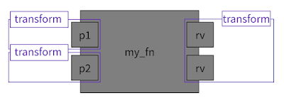

The final talk of the main schedule of the Python Language Summit was delivered by Jason R. Coombs on using annotations for transforms. The presentation was accompanied by a [GitHub repository](https://github.com/jaraco/transformers/blob/main/Annotations%20as%20transforms.md) and [Jupyter notebook](https://github.com/jaraco/transformers/blob/main/Annotations%20as%20transforms.ipynb) illustrating the problem and proposed solution.

Jason is interested in a method for users to "transform their parameters in a reusable way". The motivation was to avoid imperative methods of transforming parameters to "increase reusability, composition, and separation of concerns". Jason imagined transformers which could be "packaged up in a library or used across multiple functions" and would "be applied at the scope of individual parameters".

Python already has a language feature that's *similar* to this concept with [decorators](https://docs.python.org/3/reference/compound_stmts.html#function-definitions), which allow wrapping a function or class with another function in a syntactically concise way.

Jason noted that "return values can be handled by decorators fairly easily, so \[the proposal\] is more concerned with input parameters". For a decorator to affect parameters, the decorator "would have to inspect the parameters" and "entangle itself with the function signature".

<table align="center" cellpadding="0" cellspacing="0"><tbody><tr><td></td></tr><tr><td>Diagram from Jason's presentation showing transforms being applied to individual parameters of a function. </td></tr></tbody></table>

Jason's proposal would use type annotations due to type annotations already specifying the desired type, the proposal being to add behavior "this is the type I want to make this" and perform transforms. Below is some example code of the proposal: def transformer(val: float | None) -> float:  
return val if val is not None else 0 def make\_str(val: float) -> str:  
return str(val) def my\_fn(  
p1: transformer,  
p2: transformer  
) -> make\_str: return (p1 \*\* 2) + p2

Jason went on to show that [Pydantic](https://docs.pydantic.dev) was offering something similar to his proposal by having functions called on parameters and return values using the [pydantic.BeforeValidator](https://docs.pydantic.dev/latest/concepts/validators/) class in conjunction with typing.Annotated, though this use-case "wasn't being advertised by Pydantic":

from typing import Annotated  
import pydantic def transformer(val: float | None) -> float:  
return val if val is not None else 0 @pydantic.validate\_call(validate\_return=True)  
def my\_fn(  
p1: Annotated\[float, pydantic.BeforeValidator(transformer)\],  
p2: Annotated\[float, pydantic.BeforeValidator(transformer)\]  
) -> Annotated\[str, pydantic.BeforeValidator(str)\]: return (p1 \*\* 2) + p2

Jason didn't like this approach though due to the verbosity, requiring to use a decorator and provide annotations, and needing an extra dependency.

Eric V. Smith asked if Jason had seen [PEP 712](https://peps.python.org/pep-0712/), which Eric is the sponsor of, that describes a "converter" mechanism for [dataclass](https://docs.python.org/3/library/dataclasses.html) fields. This mechanism was similar in that "the type you annotated something with became different to the type you passed". Eric remarked it was "pretty common thing that people want to pass in different types when they're constructing something than the internal types of the class".  

Jason replied that he had seen the PEP but "hadn't incorporated it into a larger strategy yet". Steering council member Barry Warsaw noted that he "didn't know what the solution is, but it is interesting... that the problems are adjacent".

There was skepticism from the room, including from typing council member Guido van Rossum, on using type annotations as the mechanism for transformers. Type annotations today don't affect the runtime behavior of the code and this proposal would be a departure from that, Guido noting "process-wise, that's going to be a difficult hurdle".

If type annotations weren't the way forwards, Jason had also considered proposing new syntax or a new language feature and wanted feedback on whether "there's viability" in that approach and if so, "\[he\] could explore those options".

There were questions about why decorators weren't sufficient, citing [PEP 318](https://peps.python.org/pep-0318/) motivation section containing examples similar to the ones Jason had presented. Transformers could be assigned to parameters by name, passing in the transformer as a key-value parameters into the decorator like so:

def transformer(val: float | None) -> float:  
return val if val is not None else 0  

@apply(p1=transformer, p2=transformer)  
def my\_fn(  
p1: float,  
p2: float  
) -> float: return (p1 \*\* 2) + p2

Jason found this pattern "discouraging" and "less elegant" because the variable name needs to mentioned in multiple places and that he was "hoping for something that was more integrated into the language, to not feel like a second-class feature".

Łukasz Langa commented on the case for removing the "None" type from a union, could already be done with a [type guard](https://typing.readthedocs.io/en/latest/spec/narrowing.html#typeguard) and drew attention to work being done to allow more complicated type guards. Łukasz was "sympathetic to conciseness, but type checkers already handle this".

Steering Council member Gregory Smith was hesitant to make any change in this area. He agreed that "as a language, we're missing something", but "wasn't sure if we've got a way forward that doesn't make the language more complicated".
