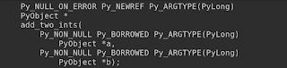
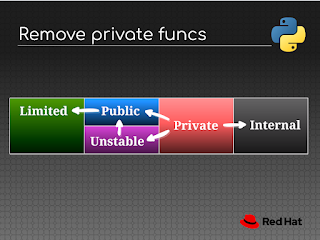
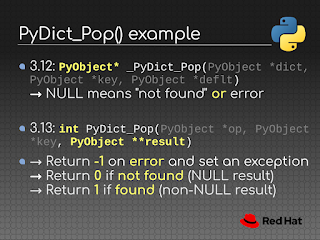
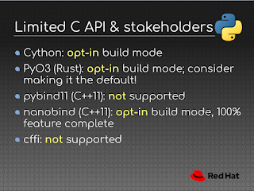

Back in October 2023, [PEP 731](https://peps.python.org/pep-0731/) proposed a new [C API working group](https://github.com/capi-workgroup) [charged](https://peps.python.org/pep-0731/#motivation) with overseeing and coordinating the development and maintenance of the Python C API. This working group spawned from a [series of discussions on the C API](https://pyfound.blogspot.com/2023/05/the-python-language-summit-2023-three.html) from the Language Summit in 2023 and creation of an [inventory of problems with the C API](https://github.com/capi-working-group/problems) at the 2023 core developer sprint.

Two inaugural C API working group members, Petr Viktorin and Victor Stinner, presented back-to-back talks on the C API and gave context on what's been happening in the past year.  

### What does the C API working group do?

The first of the two C API talks was given by Petr Viktorin on the "Native Interface" and some of the first steps towards an idealized C API.

Petr started off by explaining that the [C API working group](https://github.com/capi-workgroup) makes two types of decisions: what functionality to expose via the C API and how to expose it. Petr also explained that the C API working group keeps two separate issue trackers, one for incremental "[evolution](https://github.com/capi-workgroup/api-evolution/issues)" of the C API and another for "[revolution](https://github.com/capi-workgroup/api-revolution/issues)", a place where more "radical" ideas are discussed.  

The existing C API wasn't designed with the knowledge, context, and needs of today (like free-threading), but there are many good parts of the C API. Petr explained that one of the more impactful things the working group has done is to formalize "guidelines to get consistency with the good parts of the existing API".  

Petr gave an example of what can go wrong with the PyLong\_GetSign() function. This API has a baked-in type check that can't be avoided due to its function signature and thus incurs a performance penalty *even when the caller has already checked whether the object is the correct type*.

This extra performance penalty means that CPython itself uses its own private API which avoids the type check, but this extra private API only for CPython isn't a great experience. Other languages and projects want access to the more performant API, too.

Petr went on to reference Mark Shannon's [proposal for a New C API](https://github.com/markshannon/New-C-API-for-Python) which Petr called "close to perfect" with caveats around not dropping existing APIs and the name, instead suggesting "Native Interface" for the name of the new C API.

"Unfortunately we need to keep the old API around. We can't just remove a chunk of the existing API just because it's old", Petr lamented. Petr also noted that not being able to remove parts of the existing API might mean that the [Faster CPython](https://github.com/faster-cpython/) project loses some incentive to work on the new C API.

C API decisions are made on three axes: performance, safety, and convenience. Petr argued that of the three, "performance should be prioritized", because a convenient and safe layer can be built on top of a performant API with the right amount of context.

### Annotating the existing C API  

Petr noted that we have experience within Python for adding a safety layer on top of APIs in Python: **type hints**! Type hints in Python provide context into an API's inputs and outputs that can be checked using external tooling without incurring a performance penalty on runtime.  

Petr proposed adding annotations to C function signatures for function behaviors like "returns a null pointer on error" or "never returns a null pointer" which can then be used in other contexts like documentation or borrow checking. Among the proposed annotations were some about whether references were borrowed, stolen, or a new reference, which can be used to check consistency of references.

<table align="center" cellpadding="0" cellspacing="0"><tbody><tr><td></td></tr><tr><td>List of possible annotations for C API functions </td></tr></tbody></table>

  

Petr also noted that many of these annotations apply not only to new APIs but to existing APIs as well. Implementing these annotations as empty C macros means that behavior and performance isn't impacted but can be parsed from header files.

<table align="center" cellpadding="0" cellspacing="0"><tbody><tr><td></td></tr><tr><td>Petr's slides showing the annotations in use as C macros </td></tr></tbody></table>

  

To go along with these new annotations, Petr proposed writing a tool similar to [Argument Clinic](https://devguide.python.org/development-tools/clinic). Argument Clinic is a tool maintained by the CPython team which automatically generates boilerplate code like function signatures and argument unpacking based on input instructions.

Mark Shannon asked to clarify whether the priority was to improve the C API or document existing behavior. Petr's plan was to add annotation information to the existing API and to wait on implementing the new Native Interface until later. This plan wouldn't change the behavior of any existing API, but APIs which aren't conforming would receive a new variant that conforms to the new C API standards.

Victor Stinner asked whether the annotation information would be stored in a separate file. Petr noted that a separate file is the plan to make it easier to wrap the API and to avoid needing to parse header files directly.  

[PyO3](https://github.com/PyO3/pyo3) maintainer David Hewitt asked whether the plan was to include variations that avoid type checks for all C API functions to dodge the performance penalty for C API wrappers. David noted that PyO3 implemented many C API function calls as methods on wrapped objects. This means that the type check was implicit and thus could avoid having types checked again by the C API function. David also clarified that these extra checks "aren't a major performance drag" but would be great to remove the inefficiencies if possible.

Petr answered that wrappers will need to wait for the Native Interface to be implemented to expose the underlying C API functions which don't include type checks.

There was enthusiastic agreement from the room about using annotation information for documentation and automatically generating boilerplate code and checks along with being able to do borrow checking using annotation information.  

### Limited C API

The second C API talk was given by Victor Stinner on the status of the [Limited C API](https://docs.python.org/3/c-api/stable.html#limited-c-api). The Limited C API is a subset of the Python C API that's consistent across different versions of Python. The Limited C API can be opted-in to using #define Py\_LIMITED\_API, by doing so only **public** functions of the limited C API can be used.

Victor started off by listing his long-term goals for the Python C API, which mostly focused on reducing friction both for maintainers of the Python C API and for third parties using the API or updating to support new Python versions. One possibility to achieve this would be to "move to using the Limited C API by default and use the [Stable ABI](https://docs.python.org/3/c-api/stable.html#stable-abi) for everybody" but Victor noted this is a "very long term goal".

Getting to this goal is challenging because it's difficult to know how a given change will affect the ecosystem of Python projects, both for finding affected projects and how widespread breakage would be for users. Victor explained that each change typically only requires "1-10 lines of code changed per impacted project" to fix issues.

<table align="center" cellpadding="0" cellspacing="0"><tbody><tr><td></td></tr><tr><td>Trying to move all functions from private to either public or internal </td></tr></tbody></table>

  

Victor's biggest project currently is to remove private functions from the C API, specifically functions which begin with an underscore "\_" by convention. Victor explained that he removed all 300 private functions starting with "\_Py" for 3.13.0-alpha1 to discover how and where private APIs are used by downstream projects. Victor and team anticipated that this mass-removal would cause breakages, so after the initial round of discovery the removed functions causing the most issues have been re-added in 3.13.0-alpha2.

As of 3.13.0-beta1, 264 functions of the over 300 functions are still removed. The functions which have been added back are not simply left as-is either: once a private function is discovered the C API working group gets a chance to design a *new public C API function* for projects to use instead.

"The goal isn't to annoy people, the goal is to provide better functions for everybody" -- Victor Stinner  

These new public C API functions would have documentation, tests, backwards compatibility guarantees, and can benefit from the new C API working group guidelines around API design. Victor gave an example of the PyDict\_Pop() API which previously required checking for an error condition using PyErr\_Occurred() to disambiguate between a key not being in the dictionary or if any other error occurred.

The new PyDict\_Pop() function returns -1, 0, and 1 for the "error", "not found", and "found" cases respectively in accordance with new C API guidelines meaning a call to PyErr\_Ocurred() is avoided.  

<table align="center" cellpadding="0" cellspacing="0"><tbody><tr><td></td></tr><tr><td>New PyDict_Pop() public function with improvements </td></tr></tbody></table>

The [pythoncapi-compat project](https://pythoncapi-compat.readthedocs.io), which Victor is a maintainer of, provides backfills for these new 3.13 APIs for Python 3.12 and older. This means that projects can immediately start taking advantage of new APIs which are better designed and return strong references. Victor highlighted in particular PyDict\_GetItemRef() and others which are new in 3.13 and are important for free-threading due to PyDict\_GetItem() returning a borrowed reference instead of a new strong reference.

<table align="center" cellpadding="0" cellspacing="0"><tbody><tr><td></td></tr><tr><td>Slide from Victor's presentation on current Limited C API adoption </td></tr></tbody></table>

  

The biggest users of the Python C API like Cython, PyO3, pybind, and more are at various stages of supporting the Limited C API, most of which require an opt-in for builds.

Victor's top project in coming months and years will be to move the C API away from using structures ("C structs") like PyFrameObject, PyThreadState, and PyTypeObject. Victor noted that projects like Cython, greenlet, gevent, and more have to access directly into structure members which can cause breakages when upgrading to new Python versions. Victor explained that there is no way to handle this with the Limited C API today. "We already provide many helper functions like getters and setters, but we need to provide even more" said Victor as a way forwards on this issue.

Petr questioned the approach of "breaking current projects so that future Python versions don't break them", saying that it'd be better to warn projects about using private API functions that aren't supported and wait to introduce breaking changes when it's necessary to progress the C API.

Victor replied that he'd already started work on a PEP to opt-in for build errors when a project is using deprecated functions, "like a strict mode for the C API". Victor agreed that the current plan isn't great in this way, "we ask people to update their code and the timeline is very short, we expect people to update in one years time" noting the circumstances where this can be difficult such as unmaintained projects or solo-maintainers.

Petr also added here that the opt-in would need to be versioned per Python version, so users can have control over when they want to do the work to move to new C API functions.  

Eric Snow and Mark Shannon remarked on a more incremental strategy. This strategy would see deprecated functions moved structurally into a separate file ("legacy.c" and "legacy.h") but with the behavior preserved to have a clearer idea of what functions Python developers want to remove. After being moved the functions would be implemented using newly designed APIs where possible. Others noted that this would only be a convenience for core developers and projects that are interested in internals like PyO3 and Cython.

David Hewitt commented on the long feedback cycles, as downstream projects of the Stable ABI are still using Python 3.7 as a target, so any changes to the Stable ABI may not receive feedback until many years later. Victor responded that he's working on a new project that implements new functions of Python for old Python versions.  

Overall, the work and proposals presented by both Petr and Victor were well-received by the room. It's clear that the Python C API is in good hands with the C API working group and is moving in the right direction to solve tomorrow's problems.
