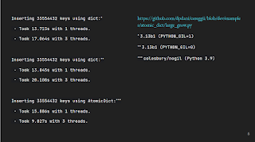

Following [years of excitement](https://pyfound.blogspot.com/2023/05/the-python-language-summit-2023-making.html) around the removal of the Global Interpreter Lock (GIL), Python without the GIL is coming soon. [Python 3.13 pre-releases](https://www.python.org/downloads/release/python-3130b1/) already have support for being built without the GIL using a new --disable-gil compile-time option:

\# Download  
wget https://www.python.org/ftp/python/3.13.0/Python-3.13.0b2.tgz  
echo "c87c42aa8137230a15a02ed90a6600610ba680cb5b54c0fbc57581a0d032e0c4 ./Python-3.13.0b2.tgz" | sha256sum --check  
tar -xzvf ./Python-3.13.0b2.tgz # Build  
cd Python-3.13.0b2/  
./configure --disable-gil  
make # Run with no GIL!  
./python -X nogil -c "import sys; print(sys.\_is\_gil\_enabled())"  
False But simply having GIL-less Python is not enough, code needs to be written that is safe and performant without the GIL using both the C and Python APIs.  

This year at the Language Summit, Daniele Parmeggiani gave a talk about ways Python can enable safe and performant concurrent code without *locking* CPython into a specific implementation or [memory model](https://en.wikipedia.org/wiki/Memory_model_\(programming\)).

### Don't leak the details  

Daniele started his talk, like many Python users, with cautious enthusiasm about the prospect of free-threading in Python:  

> "Given the [acceptance notes](https://discuss.python.org/t/pep-703-making-the-global-interpreter-lock-optional-in-cpython-acceptance/37075) to PEP 703, one should argue for caution in discussing the prospects of new multi-threading ecosystems after the release of Python 3.13 — with a hopeful spirit I will disregard this caution here."
> 
> \-- Daniele Parmeggiani

Daniele detailed a [feature request](https://github.com/python/cpython/issues/113920) he had opened to create a public function for the private C API function "\_Py\_TRY\_INCREF()". Daniele wanted to use this function to increment an object's reference count safely in a truly multi-threaded Python where a reference count might be decremented concurrently to an increment.  

Daniele continued, "\[Sam Gross\] [responded](https://github.com/python/cpython/issues/113920#issuecomment-1995563002) as thoughtfully and thoroughly as he usually does that the function shouldn't be public, and I agree with him".  

The semantics of \_Py\_TRY\_INCREF() today are tied to the specific implementation of free-threading and without a guarantee that the underlying implementation won't change Daniele does not think the function "should ever be made public".

But without this functionality Daniele's problem still stands, where do we go from here?  

### Higher-level APIs to the rescue  

"At a higher-level it's possible to write further guarantees without constraining what's under the hood". Daniele started a single step up in abstraction, detailing an atomic reference API:

PyObject \*AtomicRef\_Get(AtomicRef \*self)  
{  
PyObject \*reference;  
reference = self->reference;  
while (!\_Py\_TRY\_INCREF(reference)) {  
reference = self->reference;  
}  
return reference;  
}  

This would be "trivial to implement" with the new garbage collection scheme in Python 3.13 ("quiescent state-based reclamation" or QSBR), "but what if \[Python 3.14\] were to change this scheme radically? Or what if 3.15 decides to do away with it entirely?"

Daniele eschewed making guarantees about low-level APIs at this stage of development, but concluded that "an API for atomically updating a reference to a PyObject seems like a high-level use-case worth guaranteeing, regardless of any implementation of reference counting".  

### Atomic data structures  

Daniele continued exploring higher-level concepts that Python could provide at this stage of free-threading by looking to what other languages are doing.  

Java provides a [java.util.concurrent](https://docs.oracle.com/javase/8/docs/api/java/util/concurrent/package-summary.html) package containing some familiar faces for Python concurrency users like [Semaphores](https://docs.python.org/3/library/threading.html#semaphore-objects), [Locks](https://docs.python.org/3/library/threading.html#lock-objects), and [Barriers](https://docs.python.org/3/library/threading.html#barrier-objects), but also some other atomic primitives that map to Python classes like dicts, lists, booleans, and integers. Daniele asked whether Python should provide atomic variations for primitives like numbers and dictionaries.  

Daniele explained that many atomic data structures use the "compare-and-set" model to synchronize read and write access to the same space in memory. Compare-and-set requires the caller to specify an expected value, if the value in memory matches the expected value then the value is updated to the passed value, and the call returns whether the operation was successful or not.

Daniele explained that compare-and-set establishes a "[happens-before](https://jenkov.com/tutorials/java-concurrency/java-happens-before-guarantee.html)" ordering between concurrent writes to the same memory location, joking that the phrase "happens-before" may spark thoughts of memory models which he wished to avoid.

Today Python doesn't have any method of reordering memory accesses which would require thinking about the memory model. Daniele noted that may come one day from the new [just-in-time compiler](https://docs.python.org/3.13/whatsnew/3.13.html#whatsnew313-jit-compiler) (JIT).  

Daniele was already developing an [atomic dictionary class](https://github.com/dpdani/cereggii/tree/dev/src/cereggii/atomic_dict) and had seen performance gains over the existing standard library dictionary with the GIL disabled (with lower single-threaded performance):

<table align="center" cellpadding="0" cellspacing="0"><tbody><tr><td></td></tr><tr><td>Performance comparison of dict with and without the GIL and Daniele's AtomicDict </td></tr></tbody></table>

  

Daniele observed that the free-threading changes actually *decreased* the performance for write-heavy workloads on builtin types like dictionaries because "Python programs will now actually be subject to memory contention". When multiple threads attempt to mutate a list or dictionary, "it will be as if the GIL is still there, \[the threads\] will all be contending for one lock", offering that "new concurrent data structures would alleviate this performance issue".  

Daniele wanted to know what primitives Python should offer for C extension developers targeting free-threaded builds, or asked if it's still too early to make guarantees:  

"As the writer of a [C extension](https://github.com/dpdani/cereggii) looking to implement concurrent lock-free data structures for Python", Daniele asked of the room, "does CPython eventually wish to incorporate... either high-level atomics or low-level routines?"

Daniele continued, "if not the atomics, then new low-level APIs like \_Py\_TRY\_INCREF() will be necessary in order not to force the abuse of locks in external efforts towards new free-threading ecosystems".

### Discussion  

Thomas Wouters, channeling the Steering Council's past intent from accepting PEP 703 last October said, "we don't know yet what users will actually need" and the Steering Council didn't want to "prematurely optimize" and mandate features be implemented without that knowledge.  

Thomas recommended building solutions to "production use-cases" as PyPI packages or separate projects before the deciding to pull those solutions into Python, summarizing the sentiment with, "we need to take our time and make sure we're doing the right thing".  

Steering Council member Barry Warsaw agreed with Thomas on strategy, also adding that "\[atomic references\] might be something \[Python\] needs to make sure the interpreter doesn't crash with some of our own C code". Barry was interested in how to "ensure that the interpreter stays safe in the face of free-threading without necessarily thinking about the right APIs for the higher-level data structures".

Sam Gross, author and main implementer of PEP 703 to make the GIL optional in CPython, commented on making additional guarantees to standard library collections, saying "we're going to find situations that are ambiguous where no one's promised thread-safety or \[the lack of thread-safety\]".  

Sam would also like to see "scalable collections" on PyPI (and "would love to see in Python eventually too") that are "designed not just to be thread-safe, but to scale well with certain workloads". Sam noted that builtin data classes like dict and list "can only make so many trade-offs" and tend to "focus on single-threaded performance" or "multi-threaded read-only access".

Eric Snow wanted to see immutable data structures be considered, too, noting the benefits to performance and shareability that Yury Selivanov was seeing when using them with sub-interpreters.  

Gregory Smith sympathized with Daniele on wanting to avoid thinking about memory models, but "had a sneaking suspicion we kinda have to anyway". Greg was concerned about other stacks like data science and machine learning "re-interpreting Python code and transforming it into other things that run on other hardware". Without a clear definition, people "make their own assumptions" and get confused when code runs differently in different places.

Replying to Greg, Daniele offered that there's already a mechanism for determining whether an object is shared between threads "which might be a first-step", but that this "was a detail of the implementation, and not a part of the language".  

Guido van Rossum began by being "wary of looking to Java for examples", stating that many APIs that Python borrowed from Java were eventually deprecated and removed.  

Guido commented that "there will be other people with much higher-level ideas on concurrency" and recommended "to wait as long as we can before we build anything into the language explicitly or implicitly". Guido also felt it was "important that we have sub-interpreters as well as free-threading, so people can play with different models before we commit to anything".

Overall, the group seemed interested in Daniele's work on atomics but didn't seem willing to commit to exact answers for Python yet. It's clear that more experimentation will be needed in this area.
