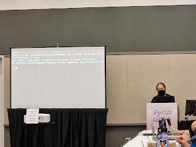
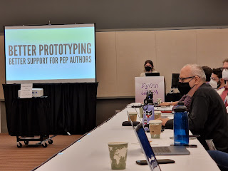
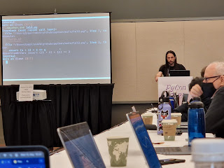
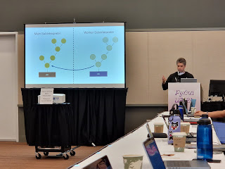

The Python Language Summit 2024 closed off with six lightning talks which were all submitted during the Language Summit. The talks were delivered by Petr Viktorin, David Hewitt, Emily Morehouse, Łukasz Langa, Pablo Galindo Salgado, and Yury Selivanov.

## Petr Viktorin: Unsupported build warning

Do you know what happens when you build Python on an unsupported platform?

"... *It works!*" -- Thomas Wouters  

Petr gave a short presentation on a warning that many folks using Python (and even developing Python!) may have never seen before: the unsupported build warning. This warning appears when building on a platform that's [not officially supported by CPython](https://peps.python.org/pep-0011/#support-tiers), for example "riscv64-unknown-linux-gnu".

<table align="center" cellpadding="0" cellspacing="0"><tbody><tr><td></td></tr><tr><td>"The platform is not supported, use at your own risk" (Photo credit: Hugo van Kemenade) </td></tr></tbody></table>

Just because a platform isn't officially supported by CPython doesn't mean it won't work on that platform, and indeed it's likely that CPython may work fine on the platform or a subset of features may be subtly or not-so-subtly broken or unavailable.  

Petr wanted to get a temperature check from the group on whether this warning could be further improved or changed, such as by hiding the warning after the user had executed the test suite or showing the number of tests that had failed.  

The room seemed mostly uninterested in exploring this topic further and was in favor of keeping the warning as-is.  

## David Hewitt: Rust in Python: panic!

David Hewitt maintains the project PyO3 which offers Rust bindings for the Python C API. David explained that these bindings require mapping concepts in the Rust programming language to Python and the topic of today's talk is the [panic!](https://doc.rust-lang.org/std/macro.panic.html) macro.

In Rust, the panic! macro will generate a panic, unwind the stack, and then terminate the program while providing feedback to the caller of the program. David showed that there were [two methods of handling errors](https://doc.rust-lang.org/std/macro.panic.html#when-to-use-panic-vs-result) in Rust programs, [panic!](https://doc.rust-lang.org/std/macro.panic.html) and [Result](https://doc.rust-lang.org/std/result/index.html).

Python functions implemented in Rust use the [PyResult](https://docs.rs/pyo3/latest/pyo3/prelude/type.PyResult.html) type to contain the return value or raised exception which uses the Rust Result type. But what if a Rust function panics, what should PyO3 do?

Today PyO3 raises a separate exception for panics, [pyo3\_runtime.PanicException](http://pyo3_runtime.PanicException) to be exact. This exception inherits from [BaseException](https://docs.python.org/3/library/exceptions.html#BaseException), typically reserved for exceptions that users won't want to catch like [KeyboardInterrupt](https://docs.python.org/3/library/exceptions.html#KeyboardInterrupt) and [SystemExit](https://docs.python.org/3/library/exceptions.html#SystemExit).  

David has been receiving feedback from some users that the PanicException inheriting from BaseException is annoying to work with. This is because everywhere that exceptions are caught now needs to also catch PyO3's PanicException, giving the example case of logging exceptions.  

David wanted feedback on whether the original choice to inherit from BaseException was appropriate or if there was a better answer.

Pablo Galindo Salgado asked whether an AssertError or RuntimeError would be more appropriate. David replied that he felt that not inheriting from BaseException would "cheapen" the Rust aspect of a panic.

Guido van Rossum offered that he thinks "BaseException is the correct choice", to which there was much agreement from the room.  

## Emily Morehouse: Formalizing the PEP prototype process

Python Steering Council Member and Language Summit chair, Emily Morehouse, spoke to the group about the PEP prototype process and how formalizing can better support PEP authors.  

<table align="center" cellpadding="0" cellspacing="0"><tbody><tr><td></td></tr><tr><td>(Photo credit: Hugo van Kemenade)</td></tr></tbody></table>

  

Emily started off the talk stating "We all agree that we should be doing more testing and prototyping outside of CPython". She also referenced prior talks like pdb improvements and subinterpreters where this approach was recommended.

Emily noted that the Steering Council has pronounced this as a requirement for PEP authors. She acknowledged that this "can feel a bit bad as a PEP author to be put out into the dark world of figuring out how to gather feedback from the community" and how to manage and distribute a project.

Emily's proposal for improving the PEP process borrows from the [TC39 process](https://tc39.es), which is the process for making changes and improvements to JavaScript. The proposal would see the prototype process be made an "official optional step of the PEP process" which would then allow creating a separate GitHub repository within the "[python](https://github.com/python/)" GitHub organization.

This would allow the project to house its own code, issue tracker, and packages would be distributed by the Python organization instead of on someone's personal account. Emily also suggested providing a template for the repository to handle distributions to PyPI.

Emily's theory is that PEPs would see more adoption and get more feedback if they came from an official channel. This approach provides additional support to PEP author and lets the author start gathering community feedback quicker before waiting for PEP pronouncement.

The room was in agreement for moving forward with the process improvement.

Carol Willing thought the improvement would be great but called back to pattern matching for CPython where the work was done in a feature branch of the CPython repository rather than a separate repository. Carol thought using a feature branch worked well for pattern matching and wanted to know how this process might work for future language changes.

Emily replied that the process would be case-by-case depending on the feature whether it's a branch, fork or something else. Thomas Wouters agreed, saying that this proposal appears to be specifically for projects which could be distributed on the PyPI instead of language features.  

## Łukasz Langa: Python for iOS, finally

Harking back to the previous talk on mobile support for Python, Łukasz wanted to know if the Python team should have a more official presence on phone application stores like the Apple App Store (and maybe the Google Play Store, but Łukasz declined to speak on it since he is an iOS user).

Łukasz noted that there already exists today multiple applications on his phone that "are Python". These applications are useful for trying out Python code, learning Python, and writing small programs.

However Łukasz noted that by not having an official Python application on mobile meant the user experience today is sub-optimal. Some applications are publishing old versions of Python and aren't reachable when being asked to upgrade to newer versions so users can take advantage of new features. Others have suddenly changed from being free to being paid applications. Should the Python development team do something about this?  

The response from the room appeared positive, but acknowledged the amount of effort that creating and maintaining such an application would be.

Russell Keith-Magee, the author of BeeWare which is leading the charge to bring Python to mobile platforms, said "Sure, but I'm not building it". After much laughter from the room, Russell noted that the project is "an entirely achievable goal but not a small one".

Ned Deily, macOS release expert, agreed and offered that "implementing a terminal would get us most of the way there".  

## Pablo Galindo Salgado: Making asserts cooler in 3.14

<table align="center" cellpadding="0" cellspacing="0"><tbody><tr><td></td></tr><tr><td>You'll have to imagine the iconic Pablo "✨ woooooow ✨" (Photo credit: Hugo van Kemenade)</td></tr></tbody></table>

Pablo took the term "lightning talk" to heart and gave a 90 second presentation (demo included!) on his plans to improve asserts in Python in version 3.14. The problem statement was summarized as "asserts are kinda sad", after which Pablo showed how when an assert statement fails there isn't much indication about *why* the condition failed in the error.

Consider how an assertion error might look today:  

Traceback (most recent call last):  
File "main.py", line 7, in <module>  
bar(x, y)  
\~~~^^^^^^  
File "main.py", line 3, in bar  
assert (x + 1) + z == y  
^^^^^^^^^^^^^^^^^  
AssertionError  

Pretty opaque! In the above example you'll notice that we can't see the values of x, y, or z which makes evaluating what went wrong difficult. Instead, with Pablo's proposed changes the traceback would look like so:  

Traceback (most recent call last):  
File "main.py", line 7, in <module>  
bar(x, y)  
\~~~^^^^^^  
File "main.py", line 3, in bar  
assert (x + 1) + z == y  
^^^^^^^^^^^^^^^^^  
AssertionError: assert ((1 + 1) + 11) == 2

With this change the values are visible for the asserted statement. Similarly being able to inspect containers to show where their contents differ, a-la pytest:

Traceback (most recent call last):  
File "main.py", line 2, in bar  
assert x == y  
AssertionError: assert Lists differ: \[1, 2, 3, \[1, 2\]\] != \[1, 2, 3, \[1, 3\]\] First differing element 3:  
\[1, 2\]  
\[1, 3\] - \[1, 2, 3, \[1, 2\]\]  
? ^ + \[1, 2, 3, \[1, 3\]\]  
?

Pablo intends to put together a PEP for this feature, including asking questions like whether the process should be hookable and whether user code should be able to provide custom formatters. Stay tuned for that!

<table align="center" cellpadding="0" cellspacing="0"><tbody><tr><td></td></tr><tr><td></td></tr></tbody></table>

## Yury Selivanov: Efficient data sharing between subinterpreters

The final talk of the Language Summit was from Yury Selivanov on [Memhive](https://github.com/edgedb/memhive), a new "highly experimental" project which adds support for structured data sharing between Python subinterpreters.

[Per-Interpreter GIL](https://docs.python.org/3/whatsnew/3.12.html#pep-684-a-per-interpreter-gil) is a newer feature to Python that allows running multiple "interpreters" in a single instance of Python each with their own Global Interpreter Lock (GIL). Per-interpreter GIL allows for true multi-core parallelism, previously using threads in a Python process would only allow a single Python instruction to execute at a time due to the GIL being shared across all threads.

Being in the same process means that each subinterpreter is sharing the same memory space, and if instructions are executing truly concurrently we run into problems with that shared memory space. PEP 684 which specifies per-interpreter GIL [calls out this issue](https://peps.python.org/pep-0684/#memory-allocators) and for now keeps memory allocators using global locking mechanisms.

Yury started the talk by discussing immutable data structures and their properties, the most interesting being how quickly they can be copied in memory. Deep copies are fast for immutable data structures because they are implemented as a single copy-by-reference.

An immutable mapping collection, specifically a [hash-array mapped trie](https://en.wikipedia.org/wiki/Hash_array_mapped_trie) (HAMT), has already been implemented in Python for the [contextvars module](https://docs.python.org/3/library/contextvars.html). Context variables need to be copied for *every new asynchronous task*, so being efficient is important to not impact performance of all async Python workloads.

<table align="center" cellpadding="0" cellspacing="0"><tbody><tr><td></td></tr><tr><td>Yury explaining how to replant a trie 🌲 (Photo credit: Hugo van Kemenade)</td></tr></tbody></table>

  

HAMTs work by transparently updating the trie structure in background of the mapping allowing for structured sharing while minimizing overhead to create new copies.

The invariant for this to work across subinterpreters is that the immutable collection in the main interpreter must not be garbage collected. Maintaining this invariant will require reliable reference counting across subinterpreters ("remote IncRef"). The proposed implementation would have every subinterpreter maintain multiple queues for tracking local and remote reference counts.

Yury explained that similar to how HAMTs provide an immutable mapping collection there is another data structure for immutable list collections which is "just another 5,000 lines of C" (which received some chuckles) and "luckily we won't be the first ones to implement this collection".

After comparing the performance of pickling mappings or using mappings with immutable data structures showed that immutable data structures were much more performant. The performance was better for immutable mappings for both small and large numbers of keys, between 6x and a "ridiculous" 150,000x faster.

"I believe these are the missing components for subinterpreters", Yury noted with many thanks to Eric Snow who has been working on subinterpreters and per-interpreter GIL for years. Yury concluded that this work is being done with a practical use-case in mind so will be completed and usable for others including CPython.

For folks looking for more on this topic, Yury also [gave a talk at PyCon US 2024](https://us.pycon.org/2024/schedule/presentation/67/) about his work on Memhive.
