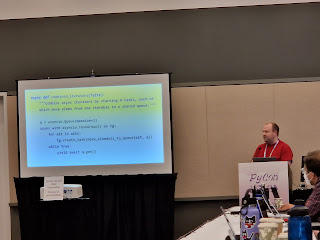

Zac Hatfield-Dodds came to the Language Summit to present on a fundamental incompatibility between the popular async programming paradigm "[structured concurrency](https://vorpus.org/blog/notes-on-structured-concurrency-or-go-statement-considered-harmful)" and [asynchronous generators](https://peps.python.org/pep-0525/), specifically when it came to exception handling when the two were mixed together.

### Structured Concurrency  

Structured concurrency is becoming more popular for Python async programming like with [Trio](https://trio.readthedocs.io) "nurseries" and in the Python standard library with the addition of [asyncio.TaskGroup](https://docs.python.org/3/library/asyncio-task.html#task-groups) in Python 3.11.

When using structured concurrency, active tasks can be thought of as a tree-like structure where sub-tasks of a parent task have to exit before the parent task itself can proceed past a pre-defined scope. This exit can come through all the tasks completing successfully or from an exception being raised either internally or externally (for example, in the case of a timeout on time-bounded work).

The mechanism which allows a parent task and its sub-tasks to cooperate in this way is called a "cancel scope" which Trio makes a [top-level concept](https://trio.readthedocs.io/en/stable/reference-core.html#trio.CancelScope) but is implicitly used in asyncio.TaskGroup and asyncio.timeout.

Async programs that are structured with this paradigm can rely on exceptions behaving in a much more recognizable way. There's no more danger of a spawned sub-task silently swallowing an exception because all sub-tasks are guaranteed to be checked for their status before the parent task can exit.  

### The problem with yields  

The fundamental issue is that [yields](https://docs.python.org/3/reference/expressions.html#yield-expressions) suspend the current call frame, in effect "returning" a value, and then the generator needs to be "called" again for execution to be resumed. This suspension doesn't play well with structured concurrency because execution can't be suspended in the same call frame as a cancel scope, otherwise that scope can't process exceptions from its child tasks.

<table align="center" cellpadding="0" cellspacing="0"><tbody><tr><td></td></tr><tr><td>Zac leading a "fun game of 'why is this code broken?'" (Photo credit: Hugo van Kemenade) </td></tr></tbody></table>

Zac presented some innocuous looking code samples that suffered from the described issue:  

async def iter\_with\_timeout(ait, max\_time):
    try:
        while True:
            with asyncio.timeout(max\_time):
                yield await anext(ait)
    except StopAsyncIteration:
        return

async def fn():
    async for elem in iter\_with\_timeout(ait, max\_time=1.0):
        await do\_something\_with(elem)

In this example, asyncio.timeout() could expire while the yield had suspended the generator and before the generator was resumed. This scenario would result in the cancellation exception being raised *in the outer task* outside of the asyncio.timeout() cancel scope. If things had gone to plan and the generator wasn't suspended the cancellation would be caught by asyncio.timeout() instead and execution would proceed.

Zac presented the following fix to the iter\_with\_timeout() function:

async def iter\_with\_timeout(ait, max\_time):
    try:
        while True:
            with asyncio.timeout(max\_time):
                tmp = await anext(ait)  
            yield tmp  # Move yield outside the cancel scope!  
 except StopAsyncIteration:
        return

By moving the yield outside the cancellation scope it means that the suspension of the frame isn't happening when execution is inside a cancellation scope. This means that propagation of cancellation errors can't be subverted by a suspended call frame for this program.  

If you're still having trouble understanding the problem: you are not alone. There was a refrain of "still with me?" coming from Zac throughout this talk. I recommend looking at the [problem statement](https://peps.python.org/pep-0789/#problem-statement) and [motivating examples](https://peps.python.org/pep-0789/#motivating-examples) in the PEP for more information.  

### Where to go from here  

Zac and Nathaniel Smith have coauthored [PEP 789](https://peps.python.org/pep-0789) with their proposed solution of disallowing yield statements within context managers that behave like cancel scopes. Attempting to yield within these scopes would instead raise a RuntimeError.  

The mechanism would be using a new function "sys.prevents\_yields()" which would be used by authors of async frameworks to annotate context managers which can't be suspended safely. Users of async frameworks wouldn't need to change their code unless it contained the unwanted behavior.

The language would need to support this feature by adding metadata to call frames to track whether the current frame should allow yields to occur.  

Mark Shannon was concerned that the solution was "lots of machinery to handle the exception being raised in the wrong place" and sought clarification that there would be overhead added to every call and return. Zac confirmed this would be the case, but that it could be done with "one integer \[member on call frames\] that you increment and decrement, but it would do some operation on every frame call and return".  

Irit Katriel asked why a "runtime error" was being used "instead of something static". Zac explained that users might define their own context managers which have a "cancel scope property" and the runtime "wouldn't know statically whether a given context manager should raise an error or not".

Łukasz Langa asked whether adding a type annotation to context managers would be sufficient to avoid adding runtime overhead. Zac responded that "there are still many users that don't use static type checking", and that "there's no intention to make it required by default". Łukasz was concerned that the proposal "would be contentious for runtime performance" due to the impact being "non-trivial".

Pablo Galindo Salgado wanted to explore other big ideas to avoid the performance penalty like adding new syntax or language feature, such as "with noyield" to provide a static method of avoiding the issue. Zac agreed that changing the context manager protocol could also be a solution.  

Guido van Rossum lamented that this was "yet another demonstration that async generators were a bridge too far. Could we have a simpler PEP that proposes to deprecate and eventually remove from the language asynchronous generators, just because they're a pain and tend to spawn more complexity".

Zac had no objections to a PEP deprecating async generators¹. Zac continued, "while static analysis is helpful in some cases, there are inevitably cases that it misses which kept biting us... until we banned all async generators in our codebase". ¹ Editors note: after the summit [an update to PEP 789](https://peps.python.org/pep-0789/#deprecate-async-generators-entirely) would describe how the problem doesn't exist *solely* in async generators and thus removal of the feature wouldn't solve the problem, either.
