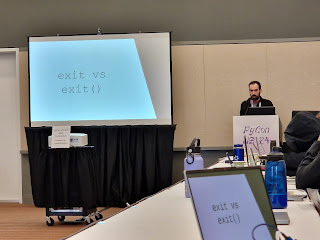
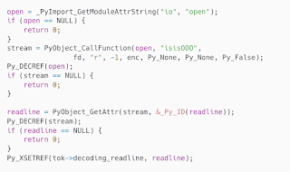
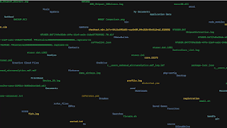
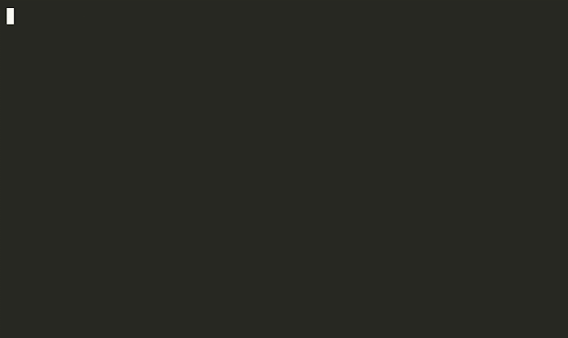

<table align="center" cellpadding="0" cellspacing="0"><tbody><tr><td></td></tr><tr><td>Lysandros showing the mistake we've all made, no longer a problem in the new REPL (Photo credit: Hugo van Kemenade) </td></tr></tbody></table>

  

One of the [headline features of Python 3.13](https://docs.python.org/3.13/whatsnew/3.13.html#whatsnew313-better-interactive-interpreter) is the new interactive interpreter, sometimes known as a "REPL" (Read-Evaluate-Print-Loop) which was [contributed](https://github.com/python/cpython/issues/111201) by Pablo Galindo Salgado, Łukasz Langa, and Lysandros Nikolaou and based on the [PyPy project](https://www.pypy.org/)'s own interactive interpreter, PyREPL. Pablo, Łukasz, and Lysandros all were at the Language Summit 2024 to present about this new feature coming to Python.  

### Why does Python need a new interpreter?

Python already has an interactive interpreter, so why do we need a new one? Lysandros explained that the existing interpreter is "deeply tangled" to Python's tokenizer which means adding new features or making changes is extremely difficult.

To lend further color to this point, Lysandros dug into how the tokenizer had changed since Python was first developed. Lysandros noted that "for the first 12 years \[of Python\], Guido was the only one who touched the tokenizer" and only later after the parser was replaced did anyone else meaningfully contribute to the tokenizer.

<table align="center" cellpadding="0" cellspacing="0"><tbody><tr><td></td></tr><tr><td>Terse example code for Python's tokenizer </td></tr></tbody></table>

Meanwhile, there are other REPLs for Python that "have many new features that \[Python's\] interpreter doesn't have that users have grown to expect", Lysandros explained. Some basic features that were listed as examples included lack of color support meaning no syntax highlighting, the ergonomics issues around exit versus exit(), no support for multi-line editing and buffer history, and poor ergonomics around pasting code into the interpreter.

### Why PyREPL?  

"We've settled on starting our solution around PyREPL", Pablo explained, "our reasoning being that maintaining terminal applications is hard. Starting from scratch would have a much higher risk for users". Pablo also noted that "most people who would interact with the REPL wouldn't test in betas", because Python pre-releases are generally used for running automated tests in continuous integration and not interactively tested manually.

Pablo explained that there are many different terminals and platforms which are all sources of behaviors and bugs that are hard to get right the first time. "\[PyREPL\] provided us with a solid base that we know works and we can start modifying".  

<table align="center" cellpadding="0" cellspacing="0"><tbody><tr><td></td></tr><tr><td>Tasteful modern art or bug in the REPL? </td></tr></tbody></table>

Another major contributing factor was that PyREPL is written in Python. Pablo emphasized that "now people that want to start contributing to the REPL can actually contribute because it's written in Python".  

Finally, Pablo pointed out that because the implementation is now partially shared between CPython and PyPy that both implementations can benefit from bug fixes to the shared parts of the codebase. Support for Chinese characters in the REPL was fixed in CPython and is being contributed back to PyPy.

Łukasz noted that adopting PyREPL wasn't a straightforward copy-paste job, there were multiple ideas in PyPy's PyREPL that don't make sense for CPython. Notably, PyPy is written to also support Python 2, so the code was simplified to only handle Python 3 code. PyREPL for PyPy also came with support for PyGame which wasn't necessary for CPython.  

Type hints and strict type checking using [mypy](https://mypy-lang.org/) were also added to PyREPL, making the PyREPL module the [first in the Python standard library](https://github.com/python/cpython/tree/main/Lib/_pyrepl) to be type-checked on pull requests. Adding type hints to the code immediately found bugs which were fixed and reported back to PyPy.

### What are the new features in 3.13?  

Pablo gave a demonstration of the new features of PyREPL, including:

-   Colored prompts
-   F1 for help, F3 for bracketed paste
-   Multi-line editing and history
-   Better support for pasting blocks of code  
    

Below are some recreated highlights from the demo. Pasting code samples into the old REPL that contain multiple newlines would often result in SyntaxErrors due to multiple newlines in a row resulting in that statement being evaluated. Multi-line editing also helps modifying code all in one place rather than having to piece a snippet together line-by-line, modifying what you want as you go:  

<table align="center" cellpadding="0" cellspacing="0"><tbody><tr><td></td></tr><tr><td>Demo of multi-line paste in Python 3.13</td></tr></tbody></table>

And the "exit versus exit()" paper-cut has been bothering Python users for long enough. This error was especially taunting because the REPL clearly knows what your intent is with it's helpful message to "Use exit() to exit":  

<table align="center" cellpadding="0" cellspacing="0"><tbody><tr><td></td></tr><tr><td>"exit" without parenthesis just works, finally! </td></tr></tbody></table>

### Windows and terminals

Support is already available for Unix consoles (Linux and macOS) in Python 3.13.0-beta1 and the standout feature request so far for PyREPL has been Windows support. Windows was left out because "historically the console on Windows was way different than Unix consoles". Łukasz continued, saying that "they don't intend to support right now" offering a "yes, but..." for users asking for Windows support.

Windows has two consoles today, cmd.exe of yore and the new "Windows Terminal" which supports many of the same features as Unix consoles including [VT100 escape codes](https://en.wikipedia.org/wiki/ANSI_escape_code). The team's plan is to support the new Windows Terminal, and "to use our sprints here in Pittsburgh to finish". Windows support will also require removing CPython dependencies on the [curses](https://en.wikipedia.org/wiki/Curses_\(programming_library\)) and [readline](https://en.wikipedia.org/wiki/GNU_Readline) libraries.

### What's next for PyREPL?

The team already has plans cooking up for what to add to the REPL in Python 3.14. Łukasz commented that "syntax highlighting is an obvious idea to tackle". Łukasz also referenced an idea from Tania Allard for accessibility improvements similar to those in [IPython](https://ipython.org/).

Łukasz reiterated that the goal isn't to make an "uber REPL" or "replace IPython", but instead to make a REPL that core developers can use while testing development branches (where dependencies aren't working yet).

Łukasz continued that core developers aren't the only ones that these improvements benefit: "many teachers are using straight-up Python, IDLE, or the terminal because the computers they're using don't allow them to install anything else."

Given the applause from the room during the demos, it's safe to say that this work has been received well. There were only concerns about platform support and rollout for the new REPL.

Gregory Smith informed the team that functionality that requires a "Function" key (ie F1, F2, etc) must also be supported without Function keys due to some computers lacking them, like Chromebooks.  

Carol Willing was concerned about releasing PyREPL without support for Windows Terminal, especially from a teaching perspective, describing that potential outcome as "painful". Carol wanted clear documentation on how to get the new REPL on Windows. "Positioning \[the new REPL\] for teaching without clear Windows instructions is a recipe for disaster".

Pablo assured that the team wants to add support for Windows Terminal in time for the first 3.13 release candidate. Pablo could not make guarantees due to a lack of Windows expertise among the three, saying "the reason I'm not saying 100% is because none of us are Windows experts. We understand what needs to be done... but we need some help."

Łukasz named Steve Dower, the Windows release expert for Python, who is "very motivated to help us get Windows Terminal support during sprints". Łukasz reiterated they're "not 100%, but we are very motivated to get it done".

Gregory Smith shared Carol's concern and framed the problem as one of communication strategy, proposing to "not promise too much until it works completely on Windows". By Python 3.14 the flashy features like syntax highlighting would have landed and the team would have a better understanding of what's needed for Windows. The team can revise the 3.13 "What's New in Python" depending on what gets implemented in the 3.13 timeline.

Ned Deily sought to clarify what the default experience would be for users of 3.13. Pablo said that "on Windows right now you will get the \[same REPL\] that you got before" and "on Linux and macOS, if your terminal supports the features which most of them do, you get the enhanced experience". "What we want in the sprints is to make Windows support the new one, if we get feature parity, then \[Windows\] will also get the new \[REPL\]".

Carol also asked to document how to opt-out of the new REPL in the case that support wasn't added in time for 3.13 to avoid differences between educational material and what students were seeing in their terminal. Kushal Das confirmed that differences across platforms is a source of problems for students, saying that "if all \[students\] have the same experience it's much better than just improving only macOS and Linux" to avoid students feeling bad just due to their operating system.  

Pablo said that the opt-out mechanism was already in place with an environment variable and will discuss other opt-out mechanisms if needed for educators.

Emily Morehouse, speaking as a Steering Council member added that the Steering Council has requested an informational PEP on the new REPL. "Hearing concerns about how \[the new REPL\] might be rolled out... it sounds like we might need something that's more compatible and an easier rollout", leaving the final discussions to the 3.13 release manager, Thomas Wouters. Carol replied that she believes "we could do it in documentation".
