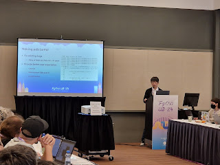
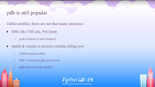

Tian Gao came to the Language Summit 2024 to talk about improving [pdb](https://docs.python.org/3/library/pdb.html), short for "Python debugger", a module and command line tool for debugging Python.

<table align="center" cellpadding="0" cellspacing="0"><tbody><tr><td></td></tr><tr><td>Tian Gao presenting on how to improve pdb </td></tr></tbody></table>

There are not many command-line debugger alternatives to pdb for Python. Tian mentioned a few, including PuDB, pdb++, and ipdb, but those alternatives are all themselves based on either [pdb](https://docs.python.org/3/library/pdb.html) or another standard library module '[bdb](https://docs.python.org/3/library/bdb.html)'.

<table align="center" cellpadding="0" cellspacing="0"><tbody><tr><td></td></tr><tr><td>pdb is the only "standalone" command-line-based Python debugger </td></tr></tbody></table>

  

Tian presented a laundry list of desirable new features that could be added to pdb, including:  

-   Showing more lines of code around the current breakpoint.
-   Colors in the terminal, syntax highlighting.
-   Customization, with defaults being safe.  
    
-   Handling of more scenarios (threads, asyncio, bytecode, remote debugging)  
    

### Performance and backwards compatibility  

The biggest issue according to Tian, which he noted had been discussed in the past, was the performance of pdb. "pdb is slow because sys.trace is slow, which is something we cannot change", and the only way forward on making pdb faster is to switch to sys.monitoring to avoid triggering unnecessary events.

Switching to sys.monitoring would give a big boost to performance. According to Tian, "setting a breakpoint in your code in the worst case you get a 100x slowdown compared to almost zero overhead with sys.monitoring". Unfortunately, switching isn't so easy, Tian noted there are serious backwards compatibility concerns for the standard library module [bdb](https://docs.python.org/3/library/bdb.html) if pdb were to start using sys.monitoring.  

"If we're not ready to \[switch to sys.monitoring\] yet, would we ever do this in the future?", Tian asked the group, noting that an alternative is to create a third-party library and encourage folks to use that library instead.

Thomas Wouters started off saying that "bdb is a standard library module and it cannot break user code" and cautioned that core developers don't know who is depending on modules. bdb's interface can't have backwards incompatible changes without long deprecation periods. In Thomas' mind, "the answer is obvious, leave pdb as it is and build something else".

Thomas also noted "in the long-term, a debugger in the standard library is important" but that development doesn't need to happen in the standard library. Thomas listed the benefits for developing a new debugger outside the standard library like being able to publish outside the Python release schedule and to use the debugger with older Python versions. Once a debugger reaches a certain level of stability it can be added to the standard library and potentially replace pdb.

Tian agreed with Thomas' proposal in theory, but was concerned that a third-party debugger on PyPI wouldn't see the same levels of adoption compared to being in the standard library and thus would struggle to meet a threshold of "stability" without a critical mass of users. Or worse yet, maintainers wouldn't be motivated to continue due to a lack of use, resulting in a "dead project". (Some foreshadowing, Steering Council member Emily Morehouse [gave a lightning talk on this topic](https://pyfound.blogspot.com/2024/06/python-language-summit-2024-lightning-talks.html) later on in the Language Summit)

Łukasz Langa noted that Python now has support for "[breakpoint()](https://docs.python.org/3/library/functions.html#breakpoint)" and that "what breakpoint() actually does, we can change. We can run another debugger if we decide to", referencing if a better debugger was added in the future to CPython that it could be made into a new default for breakpoints.  

Russell Keith-Magee from BeeWare, was interested in what Tian had said about remote debugging, noting that "remote debugging is the only way you can debug \[on mobile platforms\]". Russell would be interested in pdb or a new debugger supporting this use-case. Tian noted that unfortunately remote debugging would be one of the more difficult features to implement.

Pablo Galindo Salgado, commenting on existing Python "attach-to-process" debuggers, said that the hacks in use today are "extremely unsafe". Pablo said that "we'd need something inside CPython \[to be safe\], but then you have another problem, you have to implement that feature on \[all platforms\]". Pablo also mentioned that attach-to-process debugging is usually a bad model because it can't be enabled by default for security reasons but "you won't know when you'll need to debug".

Anthony Shaw asked about the scope of the project and was interested in whether there could be a framework for debugging in CPython that pdb and others could build on. Anthony pointed out that many other debuggers "needed to do a bunch of hooks and tricks" to do debugging because it's "not provided out of the box by CPython".

Tian responded that "bdb is supposed to do that, but it was written 30 years ago so is too old to support new things that a debugger wants". Others mentioned that [sys.monitoring](https://docs.python.org/3/library/sys.monitoring.html) (new in Python 3.12) was meant to be a framework for debuggers to build on.

Gregory Smith, Steering Council member, said he "wants all of these things" and agreed with Thomas to "develop this as much as you can... outside of the standard library", telling Tian that "you're going to end up in a better state that way". Greg's primary concern was whether CPython needed to do anything to enable Tian's proposal. He continued, "it sounds like we (CPython) have most of what we need, but if we don't let's get that planned so we can enable a successful separate project before we ship it with Python in the future".
