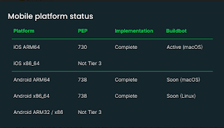
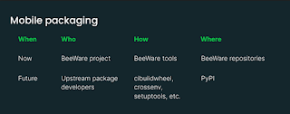
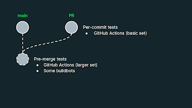

Malcolm Smith from BeeWare presented on the status and direction of Python on mobile platforms like iOS and Android. BeeWare has been working on bringing Python to mobile for a few years now. Previously Russell Keith-Magee gave a talk at the [Language Summit in 2023 on BeeWare](https://pyfound.blogspot.com/2023/05/the-python-language-summit-2023-python.html) to announce plans for [Tier 3 support](https://peps.python.org/pep-0011/#tier-3) for Python on Android and iOS in Python 3.13 along with Anaconda's funded support for the project.  

Now we've arrived at Python 3.13 pre-releases, and things are going well! Malcolm reported that "the implementations are nearly complete" along with thank-yous to the core developers who helped with the project.  

<table align="center" cellpadding="0" cellspacing="0"><tbody><tr><td></td></tr><tr><td>Overview of current Python mobile platform support </td></tr></tbody></table>

The other platforms listed in the table "iOS x86\_64 and Android ARM32/x86", don't have any plans to be implemented. There aren't any actual physical devices for iOS on x86\_64 as the architecture is only used for development simulators.  

For Android the ARM32 and x86 platforms are being phased out due to being 32-bit architectures and today represent less than 10% of devices. For these reasons, Malcolm and team have decided not to implement support for this architecture.  

Malcolm also reported that there is a buildbot for iOS and in the coming weeks there will be buildbots added for Android ARM64 and x86\_64 platforms.

### Let's talk packages!  

Python is well-known for its rich package ecosystem, and the BeeWare team is working on bringing Python packages to mobile Python, too. "It's not enough just to have support for CPython", Malcolm said on this topic, "we also need to support the packaging ecosystem". As with many new platforms for Python, pure Python packages work without much issue and "the difficulty comes in with anything which contains native compiled components".

<table align="center" cellpadding="0" cellspacing="0"><tbody><tr><td></td></tr><tr><td>The current and future approach for mobile-friendly Python packages </td></tr></tbody></table>

The BeeWare team's approach so far has been to bootstrap packages with native components on their own by creating tools and "building wheels for popular packages like numpy, cryptography, and Pillow". Malcolm reported that the current approach of rebuilding individual packages isn't scalable and the team would need to help upstream maintainers build their own mobile wheels. Malcolm said the team plans to focus this year on "making it as easy as possible to produce and release \[mobile\] wheels within existing workflows" and contributing to tools like cibuildwheel, setuptools, and PyO3.

Malcolm also hopes that "by the end of this year some of the major packages will be in position to start releasing mobile wheels to the Python Package Index". The team has already specified a format for the wheel tags for iOS ([PEP 730](https://peps.python.org/pep-0730/#packaging)) and Android ([PEP 738](https://peps.python.org/pep-0738/#packaging)). "The binary compatibility situation is pretty good", Malcolm noted that iOS and Android both come from a single source in Apple and Google respectively meaning "there's a fairly well-defined set of libraries available on each version".

Python today provides an embeddable package for the Windows platform. Malcolm requested from the group that more official Python embeddable packages be created for each of the mobile platforms with headers and libraries to ease building Python packages for those platforms. Having these artifacts available would provide a reference for binary compatibility on those platforms.

Ned Deily, the macOS release expert for CPython, agreed that having more binary releases for macOS and iOS is something we "should definitely do in the 3.14 timeframe".  

### Challenges with keeping mobile buildbots green  

Malcolm provided the core developer team some tips on writing Python code with these new and constrained platforms in mind. He warned that there is little to no support for spawning subprocesses, but "multi-threading on the other hand is perfectly fine on both of these platforms".

Mobile platforms also tend to be constrained in terms of security. iOS only allows loading libraries from specific folders and Android has restrictions like not being able to read the root directory or create hard links.

Given these differences, "it's reasonable to expect that mobile platforms will have more frequent failures as development proceeds, so how do we go about testing them?" The full CPython test suite is running on both mobile platforms with buildbots, but today there's no testing done before a pull request is merged. This situation leads to mobile buildbots starting to fail without the contributing developer necessarily noticing.

This problem is exacerbated by limited continuous integration (CI) resources in GitHub Actions, especially for macOS which limits virtualization on ARM64 processors. Malcolm suggested evaluating [GitHub's Merge Queue feature](https://docs.github.com/en/repositories/configuring-branches-and-merges-in-your-repository/configuring-pull-request-merges/managing-a-merge-queue#about-merge-queues) as a potential way to solve this issue by requiring a small amount of testing on mobile platforms without blocking development of features.

<table align="center" cellpadding="0" cellspacing="0"><tbody><tr><td></td></tr><tr><td>Malcolm's proposal for better visibility of test failures for mobile </td></tr></tbody></table>

  

Łukasz Langa agreed that CI was an issue, one that he's actively looking improving, but wasn't convinced that using a merge queue would decrease the number of jobs required to run. Malcolm clarified that he is proposing only running a smaller subset of jobs per-commit in pull requests and the complete set, including some buildbots, as a part of pre-merge testing.  

Many folks expressed concern about adding buildbots as a part of pre-merge or per-commit checks, because buildbots have no high-availability SLA and often suffer occasional outages, some buildbots not being reliable and therefore preventing merging of commits, and concerns about security of unreviewed changes running on buildbots.  

Thomas Wouters, Python 3.13 release manager, was "unconvinced" on adding pre-merge testing for Tier 3 platforms, something that is [usually reserved for Tier 1 platforms](https://peps.python.org/pep-0011/#support-tiers).

Ned Deily recommended doing iOS builds as a part of existing macOS builds in GitHub Actions. This would catch build errors for the platform and would likely find some issues early without much additional investment.
