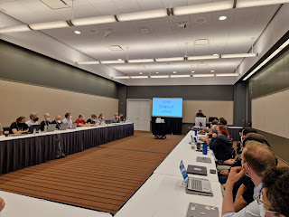
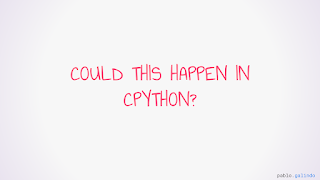

<table align="center" cellpadding="0" cellspacing="0"><tbody><tr><td></td></tr><tr><td>Pablo Galindo Salgado describing the xz-utils backdoor (Photo credit: Hugo van Kemenade) </td></tr></tbody></table>

The backdoor of the popular compression project xz-utils was [discovered](https://www.openwall.com/lists/oss-security/2024/03/29/4) on Friday, March 29th 2024, by Andres Freund. Andres is an engineer at Microsoft who noticed performance issues with SSH while contributing to the Postgres project. Andres wasn't looking for security issues, but after digging into the problem further had discovered an attempt to subvert SSH logins across multiple Linux distros.  

This was a social engineering attack to gain elevated access to a project, also known as an "insider threat". An account named "Jia Tan" had begun contributing to the xz-utils project soon after the original maintainer had announced on the mailing list that they were struggling with maintenance of the project. Through the use of multiple sock-puppet accounts pressuring the maintainer and over a year of high-quality contributions, eventually Jia Tan was made a release manager for the project.

> "Jia Tan may have a bigger role in the project in the future. He has been helping a lot off-list and is practically a co-maintainer already. :-)" — xz-utils maintainer, Lasse Collin  

Over time a series of small subversive changes were made to the project all culminating in a tainted release artifact that put the backdoor in motion. Luckily for all of us, Andres discovered the attack before the new version was deployed more widely.  

## How is Python similar to xz-utils?  

Pablo Galindo Salgado, Steering Council member and the release manager for Python 3.10 and 3.11, brought this topic to the Language Summit to discuss what could be done to improve Python's security model in the wake of the xz-utils backdoor.

Pablo noted the similarities shared between CPython and xz-utils, referencing the previous Language Summit's talk on [core developer burnout](https://pyfound.blogspot.com/2023/05/the-python-language-summit-2023-burnout.html), the number of modules in the standard library that have one or zero maintainers, the high ratio of maintainers to source code, and the use of [autotools](https://en.wikipedia.org/wiki/GNU_Autotools) for configuration. Autotools was used by Jia Tan as part of the backdoor, specifically to obscure the changes to tainted release artifacts.

Pablo confirmed along with many nods of agreement that indeed, CPython could be vulnerable to a contributor or core developer getting secretly malicious changes merged into the project.

<table align="center" cellpadding="0" cellspacing="0"><tbody><tr><td></td></tr><tr><td>"Could this happen in CPython? Yes!" -- Pablo </td></tr></tbody></table>

  

For multiple reasons like being able to fix bugs and single-maintainer modules, CPython doesn't require reviewers on the pull requests of core developers. This can lead to "unilateral action", meaning that a change is introduced into CPython without the review of someone besides the author. Other situations like release managers backporting fixes to other branches without review are common.  

There was also an emphasis on "binary files", like wheels, images, certificates, and test data that is checked into the CPython repository. Today some of this data doesn't have a known "upstream" or source where it was generated from making introspection difficult. Part of the xz-utils backdoor utilized binary test data in order to smuggle code into the release artifacts without being reviewed by other developers.

## So what can be done?

There aren't any silver bullets when it comes to social engineering and insider threats. Barry Warsaw and Carol Willing both emphasized the importance having an action plan in advance for what to do if something similar to the xz-utils backdoor were to happen in order to promptly fix the issue and alert the community.

Thomas Wouters asked the group whether the xz-utils backdoor was a serious enough event to force a new workflow to be adopted by core developers. Thomas noted that mandatory review of all pull requests had been [discussed previously](https://discuss.python.org/t/sc-poll-should-we-require-reviews-to-merge-all-prs/29410) and wasn't adopted at the time, but also wasn't discussed as a security issue like it is today. There's been a hesitance to break peoples' workflows or make it impossible to get bugs fixed. This change would also require a cultural change to make asking for code reviews more common amongst core developers to be effective.

Carol Willing concurred, noting that almost every other project she's contributing to requires reviews for all pull requests.  

Guido van Rossum was less convinced that having additional review would help much for security. Guido was more concerned about who is given "commit bit" (write access) in the first place, asking for a higher bar such as whether someone had met the person in real life, at a conference, or over a video call.

Mariatta agreed with verifying identities of core developers, including requiring updates to reconfirm the identities of individuals noting that this is commonplace for employment. Mariatta noted that the contributions being done by CPython core developers is of equal or more importance than any individuals' employment.

Some doubt was thrown on verifying identities, especially via video call, as it's now not unheard of for someone being interviewed for employment over a video call to be different from the person who shows up on the first day of work.  

Hugo van Kemenade remarked on removing inactive core developers, noting that it's already documented in the [CPython developer guide](https://devguide.python.org) that inactive or unreachable core developers can be removed with or without notice. There was agreement within the group that this should be done more actively to reduce the chances that unattended privileged accounts are resurrected by malicious actors.  

There was some discussion about removing modules from the standard library, especially modules which are not used or have no maintainers. Toshio Kuratomi cautioned that moving modules out of the standard library only pushes the problem outwards to one or more projects on PyPI. Łukasz Langa concurred on this point referencing specifically the "[chunk](https://docs.python.org/3.12/library/chunk.html)" module removed via [PEP 594](https://peps.python.org/pep-0594/#chunk) and feeling unsure whether the alternative project on PyPI should be recommended to users given the author not being reachable.

Overall it was clear there is more discussion and work to be done in this rapidly changing area.
