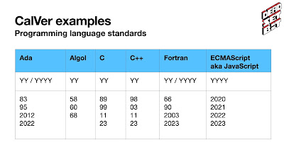

Hugo van Kemenade, the newly announced Release Manager for Python 3.14 and 3.15, started the Language Summit with a proposal to change Python's versioning scheme.

<table align="center" cellpadding="0" cellspacing="0"><tbody><tr><td></td></tr><tr><td>Hugo's view of kicking off the language summit! (Photo credit: Hugo van Kemenade) </td></tr></tbody></table>

  

The goal of Hugo's proposal was to make expectations around versioning, backwards compatibility, and support timelines clearer for Python users.

On the surface, Python's versioning might appear to be [Semantic Versioning](https://semver.org/) (SemVer) due to its three-part version and infamous set of backwards incompatible changes known as Python 3. Hugo noted that the publication of Python 1.0.0 (1994) and what would become the Python versioning scheme predates the publication of SemVer by at [around 15 years](https://github.com/semver/semver.org/releases/tag/v0.1.0) (2009).  

The perception of Python using semantic versioning is a source of confusion for users who don't expect backwards incompatible changes when upgrading to new versions of Python. In reality almost all new feature releases of Python include backwards incompatible changes such as the removal of "dead batteries" where [PEP 594](https://peps.python.org/pep-0594/) marked 19 modules for removal in [Python 3.13](https://docs.python.org/3.13/whatsnew/3.13.html).  

[Calendar Versioning](https://calver.org/) (CalVer) encompasses a wide array of different versioning schemes that have one property in common: using the release date as part of a release's version. Calendar-based versions vary quite widely, but typically include a two or four digit year (YY or YYYY) and sometimes a month or day (MM and DD).

Using years in versions is quite common amongst other programming languages, operating systems like Ubuntu, and tools like Black, pip, and PyCharm.

<table align="center" cellpadding="0" cellspacing="0"><tbody><tr><td></td></tr><tr><td>Slide from Hugo's presentation showing programming languages using calendar-based versioning like Ada, Algol, C, C++, Fortran, and JavaScript</td></tr></tbody></table>

Since 2019, Python has made releases according to the new yearly cadence from [PEP 602](https://peps.python.org/pep-0602/). Moving to annual releases made it possible for downstream distributors to rely on when a new Python version appears, which brings newer Python versions to users faster.  

Each minor release receives 5 years of security fixes. Using the release year of 2026 as an example, users could add 5 years and know they'll receive security fixes on that minor release until 2031. Figuring out this information from "3.15" in the existing versioning scheme would require another lookup, typically to the release schedule PEP.

If the year were baked into the version, one wouldn't need to see the release schedule to know when support was ending, instead one could add 5 years to the year encoded in the version (e.g. for "3.26", 26 + 5 = 31, therefore security support ends in 2031).  

Hugo offered multiple proposed versioning schemes, including:

-   Using the release year as minor version (3.YY.micro, "3.26.0")
-   Using the release year as major version (YY.0.micro, "26.0.0")
-   Using the release year and month as major and minor version (YY.MM.micro, "26.10.0")

There were discussions about other options beyond these amongst attendees.  

Thomas Wouters, release manager for 3.12 and 3.13, questioned the value-add for adopting a new versioning system. Thomas noted that while the current system is confusing, changing the system in any way also adds confusion for users. Hugo responded that clarity, especially support for security fix and end-of-life dates, was the biggest motivation.

Barry Warsaw wondered if there was a way to test potential new versioning scheme ahead of time to find potential problems. Hugo referenced the [deadsnakes project](https://github.com/deadsnakes) which builds distributions of CPython for Ubuntu. The deadsnakes project previously created a build of Python 3.9 that modified the version to be "3.10" to help discover breakages in projects assuming a single-digit minor version. Hugo also had experience using static code analysis to find other version assumptions in Python projects.

"Python 3 is a brand at this point, and we should stick to it" said Guido van Rossum after sharing concerns that changes to the major version would break the ecosystem more than changes to the minor version. Others voiced concerns about changing the major version "3" including in the "python3" binary and for packaging such as "abi3" tag.  

Carol Willing noted that many projects are relying on Python's versioning system and already have those versions "baked in" to warnings in existing releases. Hugo confirmed this is a problem, including Python itself, which had a few deprecation warnings and messages that reference future Python versions like 3.15. Hugo's plan would be to update these versions for Python, give plenty of time before the new versioning scheme took affect.

Donghee Na offered up Rust's use of "[yearly editions](https://doc.rust-lang.org/nightly/edition-guide/editions/index.html)" in the branding of their releases, where the version number is completely separate from the branding of the release. Hugo was concerned that this would add another layer of confusion and would mostly repeat information already found in the release schedule.  

Overall the proposal to use the current year as the minor version was well-received, Hugo mentioned that he'd be [drafting up a PEP](https://github.com/python/peps/pull/3834) for this change.

Carl Meyer cautioned against making any changes to the version scheme before 2026 in order to preserve the 3.14 "π"-thon release which received approval and laughter from the room. Sounds like whatever happens we'll get to have our pie and eat it too. 🥧
