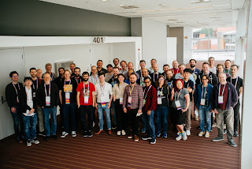

The Python Language Summit occurs every year just before PyCon US begins, this year occurring on May 15th, 2024 in Pittsburgh, Pennsylvania. The summit is attended by core developers, triagers, and Python implementation maintainers for a full day of talks and discussions on the future direction of Python.

This years summit included talks on the C API, free-threading, the security model of Python post-xz, and Python on mobile platforms.

This year's summit was attended by around 45 people and was covered by Seth Larson.

<table align="center" cellpadding="0" cellspacing="0"><tbody><tr><td></td></tr><tr><td>Attendees of the Python Language Summit 2024 (Photo credit: Kushal Das) </td></tr></tbody></table>

-   [Should Python adopt Calendar Versioning?](https://pyfound.blogspot.com/2024/06/python-language-summit-2024-should-python-adopt-calver.html): talk by Hugo van Kemenade  
    
-   [Python's security model after the xz-utils backdoor](https://pyfound.blogspot.com/2024/06/python-language-summit-2024-python-security-model-after-xz.html): talk by Pablo Galindo Salgado  
    
-   [Native Interface and Limited C API](https://pyfound.blogspot.com/2024/06/python-language-summit-2024-c-api.html): talks by Petr Viktorin and Victor Stinner  
    
-   [Free-threading ecosystems](https://pyfound.blogspot.com/2024/06/python-language-summit-2024-free-threading-ecosystems.html): talk by Daniele Parmeggiani  
    
-   [Python on Mobile](https://pyfound.blogspot.com/2024/06/python-language-summit-2024-python-on-mobile.html): talk by Malcolm Smith
-   [PyREPL -- New default REPL written in Python](https://pyfound.blogspot.com/2024/06/python-language-summit-2024-pyrepl-new-default-repl-for-python.html): talk by Pablo Galindo Salgado, Łukasz Langa, and Lysandros Nikolaou
-   [Should we make pdb better?](https://pyfound.blogspot.com/2024/06/python-language-summit-2024-pyrepl-new-pdb.html): talk by Tian Gao  
    
-   [Limiting yield in async generators](https://pyfound.blogspot.com/2024/06/python-language-summit-2024-limiting-yield-in-async-generators.html): talk by Zac Hatfield-Dodds
-   [Annotations as Transforms](https://pyfound.blogspot.com/2024/06/python-language-summit-2024-annotations-as-transforms.html): talk by Jason R. Coombs  
    
-   [Lightning Talks](https://pyfound.blogspot.com/2024/06/python-language-summit-2024-lightning-talks.html), featuring talks by Petr Viktorin, David Hewitt, Emily Morehouse, Łukasz Langa, Pablo Galindo Salgado, and Yury Selivanov
