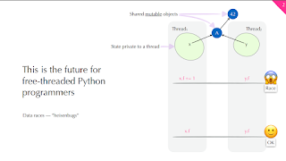
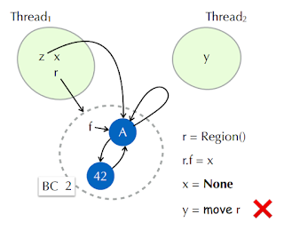
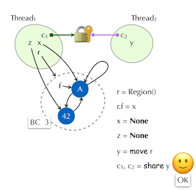

Tobias Wrigstad, Matthew Parkinson, and Fridtjof Stoldt attended their first Python Language Summit to talk about some new concurrency concepts with core developers. Their slides have great diagrams, so I recommend checking them out. Tobias delivered the presentation to core developers, opening with a “potentially contentious statement” that “\[data races and concurrency bugs\] were the future that free-threaded Python programmers would see if free-threading was adopted for Python programs”.

<table align="center" cellpadding="0" cellspacing="0"><tbody><tr><td></td></tr><tr><td>“Off to the data races!”</td></tr></tbody></table>

The issue is when a value, such as “A” in the above diagram, is shared across multiple threads and written concurrently. “There is no easy way to tell when an object is shared. In the worst case, you have to read the whole program”.

These data-race bugs are also difficult to resolve using existing tools like “ChatGPT or StackOverflow,” which are only able to solve “syntax-driven problems,” and only after drawing the object graph do we see problems. Tools like ThreadSanitizer (TSan) can help, “but you first need to understand that you need to use a tool”. “As a Python programmer, I’m assuming this is not in your typical toolchain”.

Tobias continued, “The PEP 703 work has shown that it’s costly for the runtime to protect itself against racing code. Can we lift this problem up and talk about this problem at the Python level and make Python data-race free? Can we get an exception instead of a race?”

## Deep Immutability

Referencing the “freezing” proposal that Mark Shannon had spoken about just hours ago in his Language Summit talk “An Uncontentious Talk about Contention”, “deep immutability” is one option for resolving data races in Python. Some performance improvements could be gained by adopting this model.

This model makes “all shared data immutable” so “there can be no data races” and is “trivial to check at runtime”. However, to do so would require sacrificing mutability, which is “common in Python programs”. “More immutability is great, but it’s not a solution to all our problems.”

## Rust’s ownership model

“If we squint a little bit, we can explain Rust’s ownership model as ‘objects with a reference count greater than 1 cannot be mutated’”, Tobias explained. Rust’s ownership model allows for mutable objects as long as an object isn’t referenced more than once.

Adopting Rust’s model would require a “move operator” which, when used, “torches the original reference” and moves the reference to a new owner. This operator provides a safe transfer of mutable objects when a reference count is exactly 1.

However, “the same rule that prevents Y being assigned to X prevents nice things that people like to do”. This approach would “massively restrict which object graphs are valid” and “many Python object graphs in practice don’t look like this”, instead usually containing “reference loops”. Adopting the Rust ownership model in Python would “require rewriting most existing Python programs”.

## Region-based ownership model

The group proposed instead a “region-based model” they had designed called “Lungfish” that is “more permissive than Rust’s data model” but is “still data-race free”.

Regions are “namespaces for data”. Regions are a group of mutable objects that are isolated from the outside, and all contained objects are shared, transferred, or frozen altogether. Regions can be nested within other regions, too.

<table align="center" cellpadding="0" cellspacing="0"><tbody><tr><td></td></tr><tr><td>Can’t move Region “r” to thread “2” because the borrow count is not 1.</td></tr></tbody></table>

Regions are “an enclosure of objects” that is tracked by their “borrow count”, which is the number of references that are “pointing into a region”. Objects are “slurped” (technical term) into a Region, and the borrow count increases for each reference pointing into the region. Regions can only be “moved” when the borrow count is 1, and any moves that don’t have a borrow count of 1 indicate a data race and should raise an exception.

  

<table align="center" cellpadding="0" cellspacing="0"><tbody><tr><td></td></tr><tr><td>Threads 1 and 2 share region r, where thread 1 holds the lock with access to the referenced region r, and has two references from X to A and Z to 42. Hence, the borrow count of 3.</td></tr></tbody></table>

Another option is to share the ownership of a region between two or more threads. Doing so would “move the ownership of the region within a lock shared between threads”. “When a thread owns the lock, then that thread can create points within the region and access the data, and the borrow count increments”. This borrow count increment needs to happen to track when the thread can release the lock safely, meaning there are the correct number of references to objects within the region.

## What’s next for Lungfish and “Fearless Python”?

The group has a plan to introduce Lungfish and its concepts to Python through a “series of four Python Enhancement Proposals (PEPs)”. The order and current status of each PEP is the following:

-   The first PEP is for “deep immutability” and was “almost finished with 99% of tests passing on Python 3.12”. The team plans to upgrade to 3.13 and then submit the PEP.
-   The second PEP would propose “cyclic immutable garbage with reference counting” and also “adding atomic reference counting for the new immutable objects”. This PEP is around 80% done.
-   The third PEP would be for “sharing immutable data between threads and subinterpreters (PEP 734). Tobias added that “subinterpreters can be a good delivery model for some concurrency model on top of \[subinterpreters\]”. This PEP and project are around 50% done.
-   The fourth PEP would add sharing mutable data between threads and subinterpreters using Regions.

Tobias closed by sharing why the project was named “Lungfish”: “the project can be used with or without GIL(s)” (pronounced “gills”), which was received with equal parts laughter and groans at the pun.

## Discussion

Barry Warsaw asked, “Would regions be a first-class data object in Python? Tobias answered “yes”, the proposal included a “Region()” object that can be assigned names like so:

r = Region()  
r.f = 42

Thomas Wouters wondered “whether regions would get used ubiquitously”, asking “which region does the sys module live in?” as a particularly difficult example. The group answered that they “are not sure what the answer is” and that there “are some concurrency issues there” and “that you want \[the sys module\] to be in a REPL thread”. “People in this room probably have better ideas here”.

David Hewitt, maintainer of the Rust PyO3 project, contrasted the proposed Region object with Rust’s “mutex” type and Python’s “Lock” type. Python’s Lock type doesn’t protect any data inside the lock, whereas Rust’s mutex type does protect data within the mutex. Rust’s mutex allows taking the data out of the mutex if you own the mutex, changing the mutability, and more, similar to Regions. David “has become familiar with the mutexes in Rust, and coming back to Python’s locks feels like a bit of a paper cut”.

David asked whether, instead of “introducing a new concept with Regions,” the three would introduce the concept more similar to a Rust mutex instead. Tobias answered that the protection mirrors the mutex, but that Regions uniquely allow nesting “to build a tree of regions” and a “notion of transitive closure of state in the object graph” that “transcends its use within a mutex, such as when the region is transferred or how freezing propagates within a region”. “Mutexes are one use of a Region, but not the only use”.

Donghee Na asked about the stability of existing behavior. Fridtjof answered that the three “had added tests specifically for the new behavior of immutability”, saying that the “immutability and freezing feature branches are really solid” and that the region feature branch is “more experimental”.

Donghee continued and asked whether the community would need to modify its code. Tobias answered, “Yes, if they want to take advantage of the benefits”. Matthew answered, “Pure Python can directly support regions, if you have a C library, then you’d need to add some modifications to your code to benefit”.

“C libraries would be an opt-in model at the module level”. This is similar to free-threading, where modules need to opt in; otherwise, the runtime doesn’t run with free-threading. “When you freeze an object graph, if \[the runtime\] encountered an object that doesn’t implement freezing, then you backtrack the freezing”. “You would need to register your types as freezeable”.

Martin DeMello asked whether freezing a region was a “one-way operation,” noting that freezing a region removes the object graph. Tobias answered that at the moment, “it does not allow \[frozen objects\] to be mutated until \[the frozen objects\] hit the finalizer, which turns objects back to be mutable again”. “We could do something like you’re proposing, I’m just worried,” with laughter at the mention of the finalizer. Tobias added a comment about “a potential copy-on-write” type to allow users to enable this use case.

Pablo Galindo Salgado asked about C extensions, “If I incref (increase a reference count), how does the region know whether this is an internal reference or an external reference?” Fridtjof replied that “there are two answers”, first being that “if the C extension had opted in, the system assumes that \[the C extension author\] is doing the right things” which in Pablo’s case would require a PyRegion\_IncRef() function or similar. The second answer is that if the C extension doesn’t opt in, the system would be able to “reestablish the borrow count” for “backwards compatibility” by “leveraging the garbage collection mechanism that’s already there”.

Overall, there was definitely interest in the trio’s proposal from core developers due to the new problems that free-threaded Python will bring to Python users regarding concurrency.
