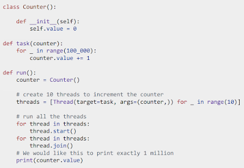
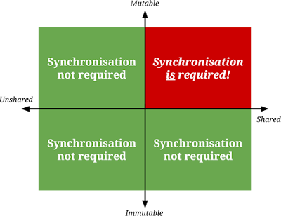

An Uncontentious Talk about Contention

Mark Shannon presented to the Language Summit a talk about contention, noting that the talk had been upgraded from a lightning talk, so warned the audience that there was “now some room for contentiousness”.

<table align="center" cellpadding="0" cellspacing="0"><tbody><tr><td></td></tr><tr><td>
“Is this program thread safe? It depends!” 😱
</td></tr></tbody></table>

“Thread-safety is a property of the program and the implementation! You can’t tell if a program is thread-safe unless you know both.” If the program is running on Python 3.10 and later, the program prints the expected “1 million” because of context-switching in the Global Interpreter Lock (GIL). If the program is run using Python 3.9 or with free-threading enabled, the program prints “random nonsense”.

Mark shared a diagram of the “synchronization quadrants” from Kevlin Henney, where the vertical axes are “Mutable” and “Immutable”, and the horizontal axes are “Unshared” and “Shared”. The top-right quadrant corresponding to “Mutable and Shared” is red and shows that “Synchronization is required,” where all other quadrants show that “Synchronization not required”.

“With sharing and mutability, bad things happen”, and unfortunately, if we want parallelism in Python, “a lot happens in \[the shared mutable\] quadrant”. We need to move stuff either down (towards immutability) or left (towards unshared). So, how can we do that in Python? Mark gave examples:

-   **Data structures that are immutable**, today Python only provides frozenset and tuple. Could add more data structures for immutability.
-   **Data locality**, which means only accessing data from one thread.
-   **Serialization**, which is “locks”, including “the lock” (GIL), which Mark considers “underrated”.
-   **Regions**, which is an area of code or data where there is serial execution. Currently, the only robust way of implementing regions beyond “strong discipline” is using multiple interpreters.
-   **Stop-the-world mutability**, which Mark describes as “switching between the bottom-right (shared and immutable) and the top-left (unshared and mutable). This is already used in some places for free-threading.

Stop-the-world mutability will be relevant in the future as “Python types and modules have to be shared but also break the language if they are immutable”. “There is opportunity for deadlocks and the process is not theoretically sound, but \[stop-the-world mutability\] is reasonably effective in practice”. The biggest downside is that “it’s very slow to mutate these objects, you don’t want to \[mutate\] often”.

Mark then warned the audience that we were leaving the “fact” section of the talk and entering into the “opinion” section with what he believed Python ought to do.

## Short-term: More immutability!

In the short term, Mark posited that “regardless of the concurrency models we have, more immutability is good”. There are C APIs that allow mutation of objects that “really shouldn’t be mutated,” like strings and tuples.

Mark also pointed out places where mutability is allowed today, “because \[the objects\] were mutable before, but not for any good reason,” like functions and [class method resolution order](https://docs.python.org/3/howto/mro.html) (MRO). Mark was “sure that people use \[this mutability property\] because it is possible, but not for good reasons”.

Mark suggested adding “freezing” methods to data structures like bytearrays, lists, and dictionaries to allow sharing these objects without worrying whether another thread would modify them. Barry Warsaw brought up that he had proposed a “freeze protocol,” which was rejected back in 2005. Barry asked whether the PEP should be brought back, which Mark agreed with, although the details as to why the PEP was rejected weren’t immediately clear.

Finally, Mark suggested making modules and classes “stop-the-world mutable”.

## Long-term: Robust model of parallelism

Long-term, Mark wanted to see a “robust model for parallelism” in Python. There are a few models out there, like OCaml, which “is a functional language that has mutability and previously was single-threaded”. OCaml’s model where they have keywords like “local” and “shared” with “well-defined transitions”. Mark’s other example was an upcoming talk at the Language Summit, specifically free-threading.

Mark posited that “by default, code that isn’t safe should raise an exception” and that there “should not be any accidentally unsafe code,” pointing to Rust and Haskell, which allow programmers to explicitly disable safety using specific keywords like “unsafe”. Mark closed by quoting the Zen of Python, “that errors should not pass silently,” where “race conditions are silent errors” and to “avoid guessing” where “race conditions are just guesses”.

Discussion

Thomas Wouters wanted to “push back” on the notion that users shouldn’t be using the mutability of functions, for example. “These are properties that not only are actively used in order to create new things. Rewriting bytecode is how popular packages in the Python community actively work, we can’t break them”. Guido van Rossum countered, saying that rewriting bytecode already “breaks every Python version”, which Thomas agreed with, saying that “this is understood as being part of the deal. Making function objects immutable means they need an entirely different approach”.

Pablo Galindo Salgado called out the importance of understanding how and why people are using (or abusing) an API to provide a better experience. Pablo wanted to understand use-cases because oftentimes users “didn’t want to do what they were doing” and understanding use-cases meant “\[core developers\] can add something better”. He added, “We cannot blanket approve every usage of a language as a feature”.

Sam Gross didn’t think that making functions immutable would make free-threading much better, and that stop-the-world immutability doesn’t seem worth the backwards incompatibility pain.

Martin DeMello asked Mark's proposal for making race conditions into exceptions, to which Mark quickly brought up a slide with a code example that included a “RaceConditionException,” which garnered a chuckle from the room. “This is what it would look like”, replied Mark, “but how \[the exception\] would be implemented depends on the \[parallelism model\], which is why we need those models”. Martin remarked that this seems like it would be difficult, to which Mark agreed, “This is not an easy change”.

Sam added that Rust and other languages don’t prevent race conditions, they only prevent data races, and that “in practice helps catch bugs statically,” it doesn’t actually make Rust code thread-safe. “You still have to think about high-level things, but it doesn’t prevent all bugs and race conditions”.
